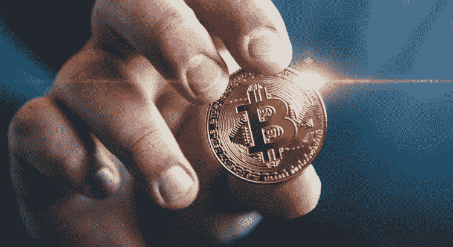

# 什么是平坦的入口匝道和出口匝道通道

> 原文：<https://medium.com/coinmonks/what-are-fiat-on-ramp-and-off-ramp-channels-bd1017a7473e?source=collection_archive---------56----------------------->

读写能力的发展伴随着各种行业中获取知识和技能的大量数字模块和方法。如今，酷孩子是那些对嗡嗡作响的科技词汇有足够了解的人。如果你错过了，极客是新的酷！

不知道什么是热门的流行语言、短语和话题是很糟糕的情况。精通区块链和加密货币等领域的需求是永无止境的。不知何故，总有一些新的东西要学或只是知道。

在加密领域，像“菲亚特入口”和“菲亚特出口”这样的术语现在很流行。你可能听说过入口匝道和出口匝道加密通道，但你确定你知道它们意味着什么吗？这两者之间有区别吗？你有可能加入吗？

> 交易新手？试试[加密交易机器人](/coinmonks/crypto-trading-bot-c2ffce8acb2a)或者[复制交易](/coinmonks/top-10-crypto-copy-trading-platforms-for-beginners-d0c37c7d698c)

这一块是给你的，我会解开一切，或者好吧，说几乎所有你需要知道的关于加密货币的入口和出口通道的事情。

所有主要货币，如美元(USD)、尼日利亚奈拉(NGN)、英镑(GBP)和其他货币，都被认为是 FIATS。跨境支付通常以美元或英镑等货币进行。因此，它们成为我们日常生活的一部分。

Crypo 用户需要这种简单性和灵活性来进行交易并在经济中发挥作用。eg 等密码之间的交易关系；比特币和法币可能是通过易用性和灵活性建立起来的。

除了能够使用信用卡和借记卡用当地货币购买加密货币之外，您还可以使用加密货币来支付订阅和电力等公用事业服务。

为了实现这种“简单性”，需要互补的途径来弥合加密货币和法定货币的分歧。因此，广泛采用是不可避免的。这两个加密通道(入口匝道和出口匝道)就是为了完成这个任务而设计的，这就是它们存在的原因。

**入口加密通道允许使用菲亚特购买加密货币**

拥有加密货币有两种方式。加密货币有两种支付方式:要么提供服务，要么出售产品或采矿。我们不会忽视极少数人收到加密货币作为礼物的情况。要挖掘比特币，节点必须提供处理能力。对于他们的努力，他们得到了加密货币的奖励。

入口和出口允许你在法定货币和加密货币之间转换。如果你想快速获得密码，你可以用当地法定货币支付。在 On-ramp 上，尼日利亚人可以通过借记卡或其他替代支付方式用当地货币奈拉支付加密货币。

如果你有借记卡或信用卡，你可以通过在线交易所购买加密货币。此外，您可以使用自动柜员机将现金汇至卖家的加密货币钱包地址。

**下匝道**

使用入口匝道是进入加密货币生态系统的一种方式。人们想要拿回自己的货币并不罕见。

要离开加密生态系统，你需要一个匝道。有可能通过匝道渠道把你的比特币换成钱。因此，你可以随时使用本国货币。

允许你将现金转换成密码的加密渠道和允许你将密码转换成现金的渠道是两回事。加密货币爱好者和采用者直观地将入口加密通道视为一场革命，这将有助于加密货币的广泛接受。比特币和已建立的金融机构将通过匝道方法聚集在一起。

如果你喜欢这篇文章，请考虑订阅源，并向你的社交媒体联系人传播这个消息。