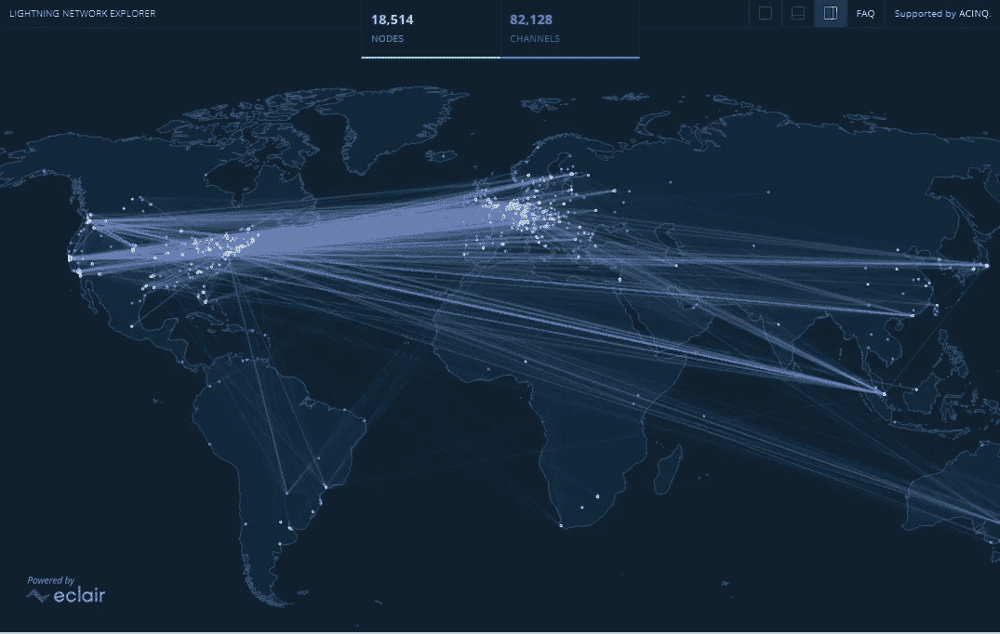

# 什么是“闪电节点”？

> 原文：<https://medium.com/coinmonks/what-are-lightning-nodes-beffe911d741?source=collection_archive---------22----------------------->

## 是什么让闪电节点自成一类？

*Photo:* [https://explorer.acinq.co/](https://explorer.acinq.co/)*, all right reserved.*

# 什么是闪电节点？

虽然你可能知道什么是“挖掘节点”或[“主节点”](/coinmonks/blockchain-in-depth-master-nodes-what-are-they-52088807060f)。闪电节点自成一类，因为它们的目的和功能完全不同。闪电节点是“闪电网络”所独有的，闪电网络是由闪电实验室在…