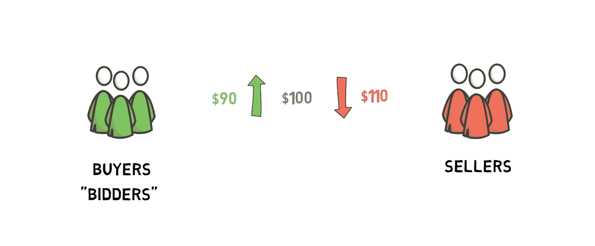
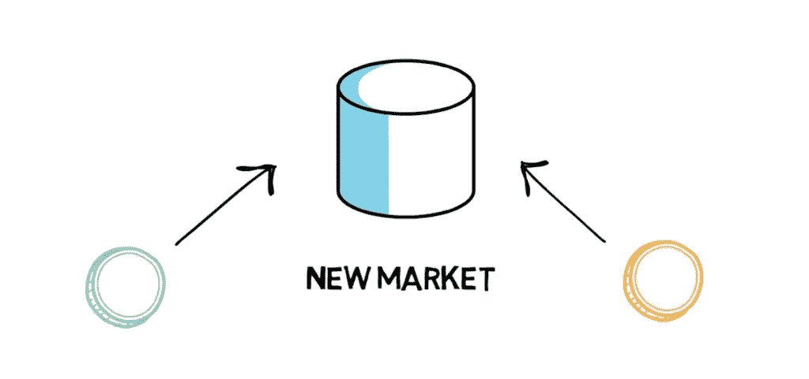
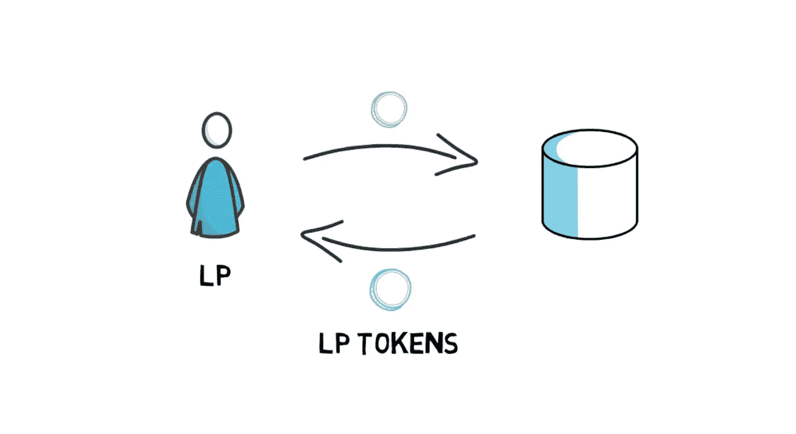
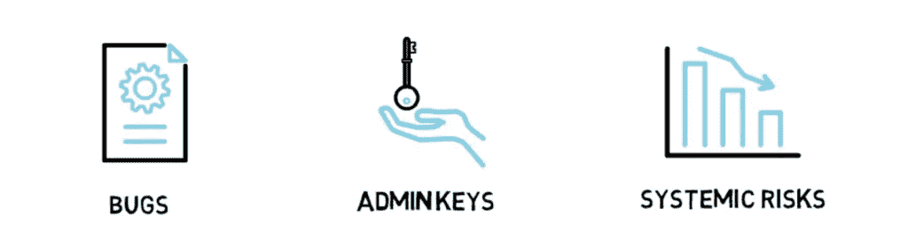

# 什么是流动性池？

> 原文：<https://medium.com/coinmonks/what-are-liquidity-pools-332d8f16a10?source=collection_archive---------50----------------------->

在我们的 YouTube 上观看视频的同时，享受这个流的资源！

YouTube:[https://youtu.be/5D5sUP7tUBI](https://youtu.be/5D5sUP7tUBI)

不和:【https://discord.gg/J73qhkj7kr】T2

推特:【https://twitter.com/CryptoverseDAO】

linktree:[https://linktr.ee/cryptoversedao](https://linktr.ee/cryptoversedao)

-

什么是流动性池？

本质上，流动性池是锁定在智能合约中的代币池。它们通过提供流动性来促进交易，并被一些分散式交易所广泛使用。

Bancor 是引入流动性池的第一批项目之一，但它们因 Uniswap 而得到广泛推广。

为什么我们需要流动性池？

如果你熟悉任何像比特币基地或币安这样的标准加密交易所，你可能会看到他们的交易是基于订单簿模型的。这也是纽约证券交易所或纳斯达克等传统证券交易所的工作方式。

在这个订单簿模型中，买方和卖方走到一起下订单。买方也叫“投标人”，试图以尽可能低的价格购买某种资产，而卖方试图以尽可能高的价格出售同样的资产。

为了进行交易，买卖双方必须在价格上达成一致。这可能是因为买家出价更高或者卖家降低价格。

但是如果没有人愿意以一个公平的价格水平下订单呢？如果你想买的硬币不够多怎么办？这就是做市商发挥作用的地方。

本质上，做市商是通过总是愿意购买或出售特定资产来促进交易的实体。通过这样做，他们提供了流动性，因此用户可以随时交易，而不必等待另一个交易对手的出现。

好吧，那么为什么我们不能在分散金融中复制这样的东西呢？

答案是——我们可以！它真的很慢，很贵，而且总是会导致糟糕的用户体验。

其主要原因是，订单簿模型在很大程度上依赖于有一个或多个做市商愿意始终“做市”某项资产。没有做市商，交易所立刻变得缺乏流动性，普通用户几乎无法使用。最重要的是，做市商通常通过不断改变资产价格来跟踪资产的当前价格，这导致大量订单和订单取消被发送到交易所。

以太坊的当前吞吐量约为每秒 12-15 笔交易，阻塞时间在 10-19 秒之间，这对于订单簿交换来说不是一个可行的选择。最重要的是，每一次与智能合约的互动都需要支付汽油费，因此做市商只要更新订单就会破产。

那么第二层缩放呢？像 Loopring 这样的第二层扩展项目看起来很有前景，但即使是它们也仍然依赖于做市商，它们可能会面临流动性问题。最重要的是，如果用户只想进行一笔交易，他们必须将资金移入和移出第二层，这给他们的流程增加了两个额外的步骤。

这正是为什么我们需要发明一些新的东西，能够在去中心化的世界中很好地工作，这就是流动性池发挥作用的地方。

流动性池是如何运作的？

好了，现在我们明白了为什么我们需要分散金融中的流动性池，让我们看看它们是如何工作的。

在其基本形式中，单个流动性池持有 2 个代币，每个池为该特定的代币对创建一个新的市场。DAI/ETH 是 Uniswap 上受欢迎的流动性池的一个很好的例子。

当创建一个新的资产池时，第一个流动性提供者是设定资产池中资产初始价格的人。流动性提供者被激励向池提供两种代币的等值。如果资金池中代币的初始价格偏离当前全球市场价格，就会产生即时套利机会，从而导致流动性提供者的资本损失。这种以正确的比例提供代币的概念对于所有其他愿意在以后向资金池添加更多资金的流动性提供者来说是相同的。

当向资金池提供流动性时，流动性提供者(LP)会收到特殊的代币，称为 LP 代币，与他们向资金池提供的流动性成比例。当池促成交易时，0.3%的费用按比例分配给所有 LP 令牌持有者。如果流动性提供者想要拿回他们的基础流动性，加上任何应计费用，他们必须烧掉他们的 LP 代币。

流动性池促成的每一次代币互换都会导致根据确定性定价算法进行价格调整。这种机制也被称为自动做市商(AMM ),不同协议的流动性池可能使用略有不同的算法。

Uniswap 使用的基本流动性池使用恒定产品做市商算法，确保两种供应代币数量的乘积始终保持不变。最重要的是，由于这种算法，无论交易量有多大，资金池总能提供流动性。其主要原因是，随着期望数量的增加，算法渐进地增加代币的价格。恒定产品做市商背后的数学非常有趣，但是为了确保这篇文章不会太长，我将把它留到下一次。

这里的要点是，池中代币的比例决定了价格，所以如果有人从阿呆/ETH 池中购买 ETH，他们就会减少 ETH 的供应，增加 DAI 的供应，从而提高 ETH 的价格，降低 DAI 的价格。价格波动的幅度取决于交易的规模，与资金池的规模成比例。与交易相比，资金池越大，对价格的影响就越小，也就是说，滑点发生的时间越短，所以大资金池可以容纳更大的交易，而不会对价格产生太大的影响。

因为更大的流动性池产生更少的滑点并导致更好的交易体验，一些协议如 Balancer 开始用额外的令牌激励流动性提供者为某些池提供流动性。这个过程被称为流动性挖掘，我们在产量农业文章中讨论过。

流动性池和自动化做市商背后的概念非常简单，但非常强大，因为我们不再需要集中的订单簿，也不再需要依赖外部做市商不断向交易所提供流动性。

不同类型的流动性池

我们刚刚描述的流动性池由 Uniswap 使用，它们是流动性池的最基本形式。其他项目重复了这个概念，并提出了一些有趣的想法。

例如，Curve 意识到 Uniswap 背后的自动做市机制对价格应该非常相似的资产不太适用，例如稳定的硬币或同一枚硬币的不同味道，如 wETH 和 sETH。曲线池，通过执行一个稍微不同的算法，可以在交换这些代币时提供更低的费用和更低的滑点。

不同流动性池的另一个想法来自 Balancer，它意识到我们不必将自己限制在一个池中只有 2 项资产，事实上 Balancer 允许在一个流动性池中有多达 8 个令牌。

风险

当然，就像 Defi 中的所有东西一样，我们必须记住潜在的风险。除了我们的标准 Defi 风险，如智能合约错误、管理密钥和系统风险，我们还必须添加两个新的风险——非永久性损失和流动性池攻击——在接下来的文章中会详细介绍。

> 加入 Coinmonks [电报频道](https://t.me/coincodecap)和 [Youtube 频道](https://www.youtube.com/c/coinmonks/videos)来了解加密交易和投资

# 另外，阅读

*   [MoonXBT vs Bybit vs 币安](https://coincodecap.com/bybit-binance-moonxbt) | [硬件钱包](/coinmonks/hardware-wallets-dfa1211730c6)
*   [火币交易机器人](https://coincodecap.com/huobi-trading-bot) | [如何购买 ADA](https://coincodecap.com/buy-ada-cardano) | [Geco。一次审查](https://coincodecap.com/geco-one-review)
*   [币安 vs 比特邮票](https://coincodecap.com/binance-vs-bitstamp) | [比特熊猫 vs 比特币基地 vs Coinsbit](https://coincodecap.com/bitpanda-coinbase-coinsbit)
*   [如何购买 Ripple (XRP)](https://coincodecap.com/buy-ripple-india) | [非洲最好的加密交易所](https://coincodecap.com/crypto-exchange-africa)
*   [非洲最佳加密交易所](https://coincodecap.com/crypto-exchange-africa) | [Hoo 交易所评论](https://coincodecap.com/hoo-exchange-review)