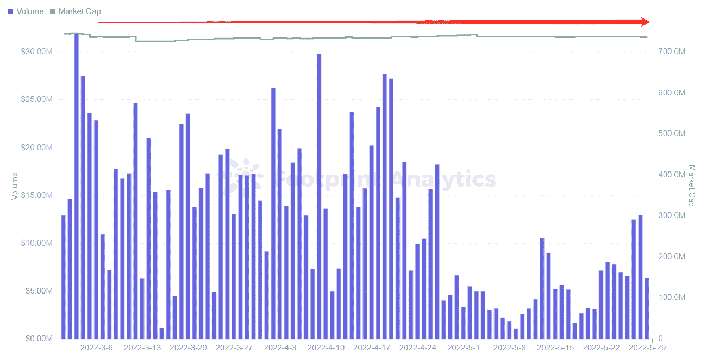
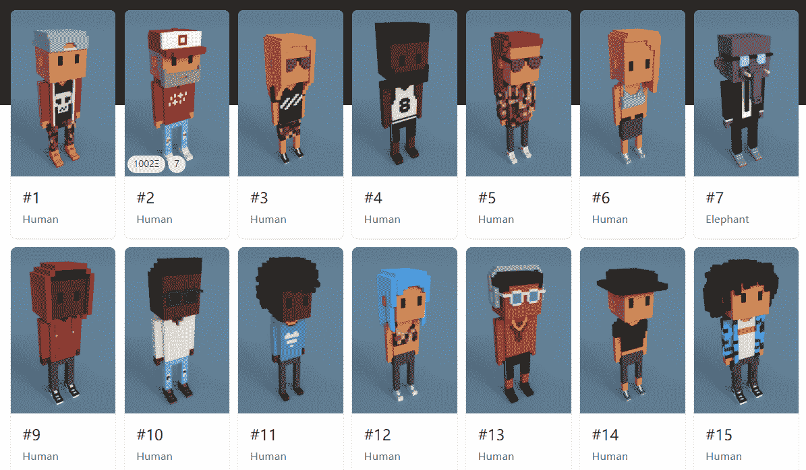
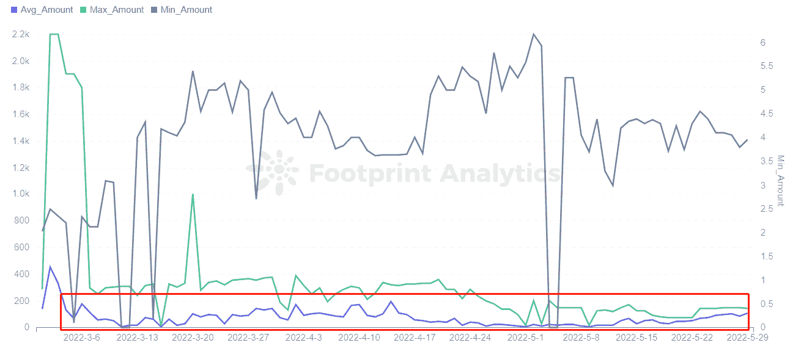

# 什么是 Meebits？简短的解释者

> 原文：<https://medium.com/coinmonks/what-are-meebits-a-short-explainer-92c851540fb4?source=collection_archive---------49----------------------->

五月。2022

数据来源:足迹分析— [Meebits 数据分析](https://www.footprint.network/@KikiSmith/Meebits-Data-Analysis?series_date=past90days&channel=EN-259)

[Meebits](https://www.footprint.network/@KikiSmith/Meebits-Data-Analysis?series_date=past90days&channel=EN-259) 由幼虫实验室于 2021 年 5 月推出，幼虫实验室是[crypto 朋克](https://www.footprint.network/@nsm/CryptoPunks?channel=EN-259) NFT 项目的创造者，该项目目前的市值为 21.8 亿美元。然而，该团队希望用 Meebits 复制 CryptoPunks 的成功。

Meebits 发布一周后，其铸造合同遭到攻击，在 [NFTs](https://www.footprint.network/@SimonJohnson/NFT-Dashboard?channel=EN-259) 中窃取了超过 100 万美元。虽然团队及时暂停了铸币和交易进行制止，但该项目的交易量还是受到了长达半年的影响。直到今年 1 月，Meebits 的交易量才得以恢复。根据 Footprint Analytics 的数据，1 月份的日交易量高达 4 亿美元。

Meebits 攻击如何影响用户的感知？而它和密码朋克有什么关联？

# Meebits 如何在攻击后恢复

## Meebits 由幼虫实验室和宇迦实验室团队品牌支持

Meebits 是 20，000 个独特的 3D 体素角色的集合，是幼虫实验室团队的第三个集合。第一个 CryptoPunks NFT 系列的流行推动了它的发展，并为该团队创造了超过 5.5 亿美元的销售额。

3 月 12 日，BAYC 背后的公司宇迦实验室宣布收购幼虫实验室，开发 CryptoPunks 和 Meebits NFT IP 系列，这基本上是购买无限的商业权利。

这一收购将 Meebits 在二级市场上的平均价格从 3.5 ETH 提高到 7 ETH，而 Meebits 系列在 3 月和 4 月之间的交易量有所增加。此后，由于 5 月份加密市场的动荡，日交易量有所下降，但 Meebits 的市值仍保持在约 7.3 亿美元，同比增长 1，239.9%。

*Footprint Analytics — NFT Market Cap & Volume*

从 2D 升级到 3D

Meebits 更像是加密朋克的升级版。CryptoPunks 是像素化的 2D 图标，而 Meebits 是体素渲染的 3D 角色，从头部贴纸升级为动态体素木偶，由各种不同元素的常用 NFT 收藏品组成。

其中包括:

*   发型
*   眼镜
*   项链
*   文身
*   衬衫颜色
*   裤子颜色
*   鞋子颜色。

*Source Screenshot — Meebits NFT*

此外，Meebits 最大的创新在于，它从静态的 NFT 变成了动态的 NFT，成为了真正的 3D 人物。当然，和密码朋克一样，决定密比特价值的是它们的铸造顺序，早期的密比特通常比晚期的更有价值。

## 米比特的准入门槛比密码朋克低

由于加密朋克是 NFT 地区在线身份的象征，幼虫实验室希望通过创建 Meebits 项目来降低用户购买像素化头像的门槛。货源方面，Meebits 是 crypto punk 的两倍，crypto punk 是 1 万，Meebits 是 2 万。

足迹分析显示，在 2022 年上半年，即使 NFT 加密市场出现波动，Meebits NFTs 的平均价格仍保持相对稳定。

*Footprint Analytics — Meebits NFT Amount*

截至 5 月 29 日，Meebits 的底价为 4.19 ETH，而 CrytoPunks 的底价为 45.3 ETH。这也意味着对于想要拥有像素化头像的玩家来说，Meebits 更便宜也更容易获得。然而，按照上面所说的铸造顺序，隐朋克是更早也更有价值的收藏。

这篇文章由[足迹分析](https://www.footprint.network/?channel=ENG-258)社区提供。

Footprint 社区是一个世界各地的数据和加密爱好者相互帮助了解和获得关于 Web3、元宇宙、DeFi、GameFi 或区块链新兴世界任何其他领域的见解的地方。在这里，你会发现活跃、多样的声音相互支持，推动着社区向前发展。

> 加入 Coinmonks [电报频道](https://t.me/coincodecap)和 [Youtube 频道](https://www.youtube.com/c/coinmonks/videos)了解加密交易和投资

# 另外，阅读

*   [Bookmap 评论](https://coincodecap.com/bookmap-review-2021-best-trading-software) | [美国 5 大最佳加密交易所](https://coincodecap.com/crypto-exchange-usa)
*   [加密交易机器人](/coinmonks/crypto-trading-bot-c2ffce8acb2a) | [造币评论](https://coincodecap.com/coingate-review)
*   最佳加密[硬件钱包](/coinmonks/hardware-wallets-dfa1211730c6) | [Bitbns 评论](/coinmonks/bitbns-review-38256a07e161)
*   [新加坡十大最佳加密交易所](https://coincodecap.com/crypto-exchange-in-singapore) | [购买 AXS](https://coincodecap.com/buy-axs-token)
*   [红狗赌场评论](https://coincodecap.com/red-dog-casino-review) | [Swyftx 评论](https://coincodecap.com/swyftx-review)
*   [投资印度的最佳密码](https://coincodecap.com/best-crypto-to-invest-in-india-in-2021)|[WazirX P2P](https://coincodecap.com/wazirx-p2p)|[Hi Dollar Review](https://coincodecap.com/hi-dollar-review)