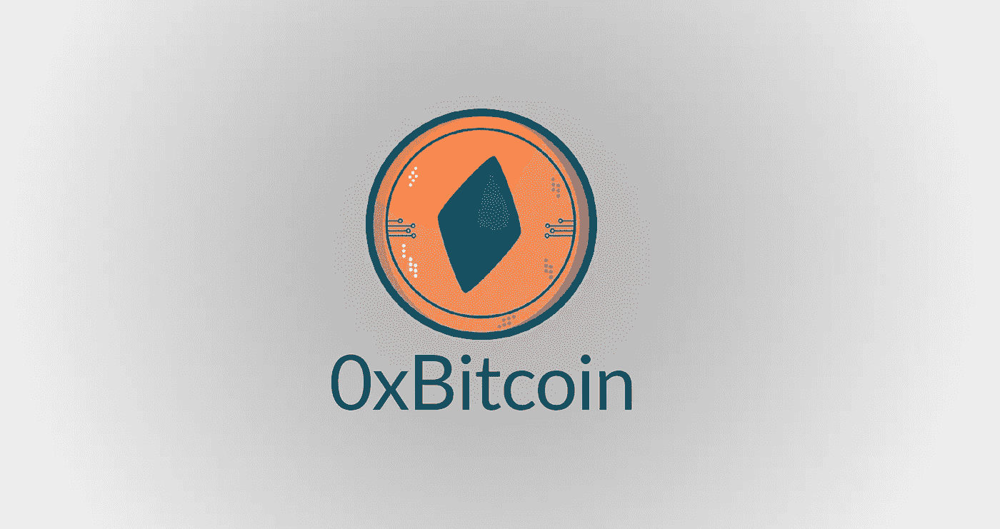
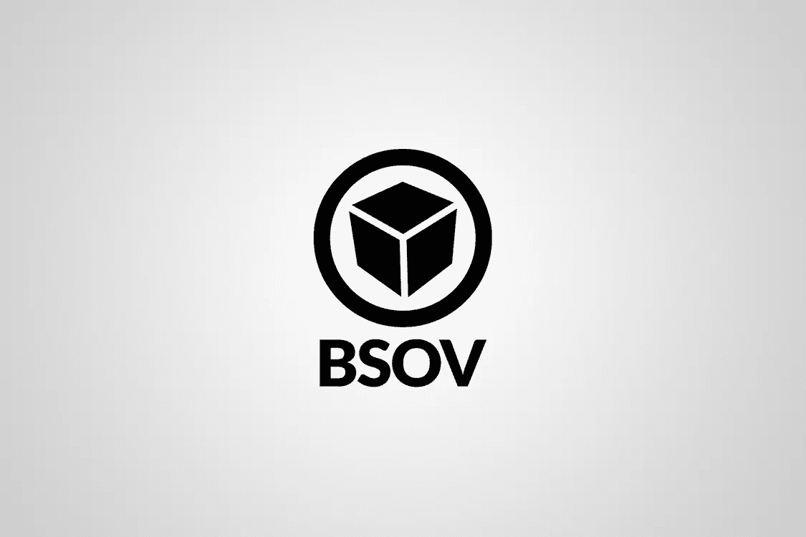
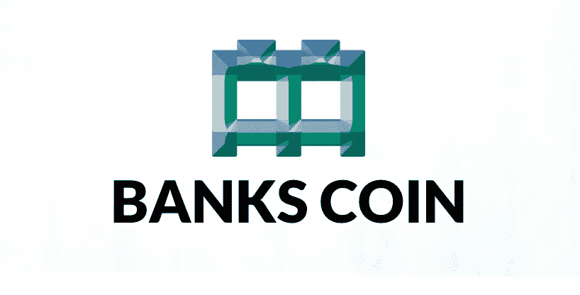
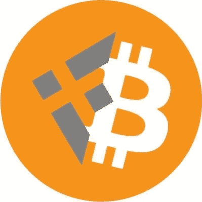

# 什么是可开采代币？

> 原文：<https://medium.com/coinmonks/what-are-mineable-tokens-f290cb3215b2?source=collection_archive---------9----------------------->

## 使用工作证明铸造 ERC20 代币作为以太坊上分散供应分配的方法

可开采令牌是加密货币或加密商品，只能通过使用计算机、GPU、FPGAs 或 ASICs 的 PoW(工作证明)开采来铸造。可开采代币被部署到智能合约平台/区块链，如以太坊(ETH)，任何人都可以铸造代币，只要他们购买设备开始采矿。可开采代币就像其他战俘一样被铸造，但是，不需要开采来验证交易，因为它们已经被以太坊区块链上的矿工保护和验证了。可开采代币对 51%的攻击免疫，并且与当今以太坊生态系统中存在的许多 dApps 和智能合约兼容。

Check out [Mineable Tokens Alliance](https://twitter.com/MineableToken) on Twitter

# EIP-918 标准——可发电的 ERC20 令牌

## 0x 比特币(0xBTC)

[EIP-918](https://eips.ethereum.org/EIPS/eip-918) 是使以太坊的 ERC20 代币可开采的代币标准，由 infernal_toast 于 2018 年首次创建，部署了[0x 比特币(0xBTC)](http://0xbitcoin.org) ，其最大总供应量与比特币(BTC)相同，有 2100 万个代币，8 位小数，大约每 4 年发生一次“比特币减半”。从现在起，第一个 0xBTC 减半将在 2-3 个月内发生。

[0xBitcoin (0xBTC)](http://0xbitcoin.org) - link to website

[0xBTC 网站](http://0xbitcoin.org)

[DexTools](https://www.dextools.io/app/ether/pair-explorer/0xc12c4c3e0008b838f75189bfb39283467cf6e5b3)

[Coingecko](https://www.coingecko.com/en/coins/0xbitcoin)

[以太扫描](https://etherscan.io/token/0xb6ed7644c69416d67b522e20bc294a9a9b405b31)

[采矿和供应统计](https://0x1d00ffff.github.io/0xBTC-Stats/?page=stats)

## BitcoinSoV (BSOV)

2019 年， [BitcoinSoV (BSOV)](http://bsovtoken.com) ，或者说比特币“储值手段”被 Mundo 部署。BSOV 本质上与 0xBTC 相同，但不同之处在于其设计为通货紧缩，这是由于通货紧缩机制会烧毁/摧毁每笔交易 1%的价值；甚至在 Uniswap 这样的 DEXes(去中心化交易所)上交易的时候烧。

[BitcoinSoV (BSOV)](http://bsovtoken.com) — link to website

[BSOV 网站](http://bsovtoken.com)

[DexTools](https://www.dextools.io/app/ether/pair-explorer/0xfac49a3524a99c90defb63571b2dfff70d12b1e2)

[硬币壁虎](https://www.coingecko.com/en/coins/bitcoinsov)

[以太扫描](https://etherscan.io/token/0x26946ada5ecb57f3a1f91605050ce45c482c9eb1)

[采矿和供应统计](https://bsovtoken.com/statspage/?page=stats&)

## 银行硬币(BKC)

2020 年，[班克斯币(BKC)](http://bankscoin.io) 由“班克斯”调配。银行硬币是一种低供给、高难度的可开采代币；这意味着开始和进行开采的难度很高，因此第一批开采者/采用者无法集中代币供应并可能操纵市场。BKC 的最大总供应量为 100 万枚，到目前为止只铸造了 100 多枚 BKC。

[Banks Coin (BKC)](http://bankscoin.io) — link to website

[BKC 网站](http://bankscoin.io)

[DexTools](https://www.dextools.io/app/ether/pair-explorer/0xa2b5f502b86357644f10eb27de158903ec8559fc)

[以太扫描](https://etherscan.io/token/0xbc9d0f9969b4ba0bc7e4f6459b7393fe0e661620)

[采矿和供应统计](https://bankscoin.io/statspage/?page=stats&)

## bn 比特币(BNBTC)

在 2021 年， [BNbitcoin (BNBTC)](https://bnbitcoin.org/) 被部署，本质上与 0xBTC 相同，但部署在币安智能链(BNB)上，与部署在以太坊上的其他可开采代币相比，其交易费用更低，阻塞时间更快。

[BNbitcoin (BNBTC)](https://bnbitcoin.org/) — link to website

[BNBTC 网站](http://bnbitcoin.org)

[DexTools](https://www.dextools.io/app/bsc/pair-explorer/0xfe5efb8d1213fb2f8b9b6864fe7b4ad44bb60f8a)

[货币市场基金](https://coinmarketcap.com/currencies/bnbitcoin/)

[BSCscan](https://bscscan.com/token/0xe7cb24f449973d5b3520e5b93d88b405903c75fb)

[采矿和供应统计](https://stats.bnbitcoin.org/?page=stats&)

# 由可开采代币联盟列出的可开采代币之间的相似性

mineable tokens 联盟选择列出这些 Mineable Tokens，因为它们有一些共同的特征，是真实的，并且是原创的，有足够的生命力，能够从人群中脱颖而出，通过时间的考验。

## 可通过粉末铸造

这些可开采的代币的所有供应都是通过单独的工作证明铸造的。

## 没有奖金，没有 ICO

这些可开采的代币没有为创始人/开发者指定的奖金。令牌的部署给了创始人和早期采用者同样的机会开始采矿。

## 社区驱动

这些可开采的代币是由社区建立的，并不仅仅依靠创始人来创建社区或围绕代币开发生态系统。

## 免疫 51%的攻击

由于不需要共识机制，这些可开采的令牌可以免受矿工的 hashpower 攻击，避免了像比特币和以太坊这样有争议的硬分叉，这两种技术都经历了几次。

## 交易费影响铸造成本和频率

以太坊和币安链的交易费用影响这些代币的生产成本。简单地说，更高的费用=更高的采矿成本，因为这种铸造方法要求采矿者在区块链上创建一个交易。这种成本增加可能会导致更低或延迟的铸造频率，例如:当以太坊费用飙升至 1000gwei 时，生产成本超过了市场价格，因此矿工不再盈利，所以他们停止采矿。这可能会减少抛售压力，降低通胀率。

> 加入 Coinmonks [电报频道](https://t.me/coincodecap)和 [Youtube 频道](https://www.youtube.com/c/coinmonks/videos)了解加密交易和投资

# 在 Twitter 上关注这些令牌

关注 Twitter 上的 [Mineable Tokens 联盟](https://twitter.com/MineableToken)，了解所有这些代币及其社区的更新。

请随意给这篇文章鼓掌，并与你的加密朋友分享。