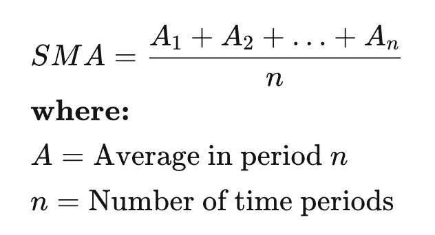
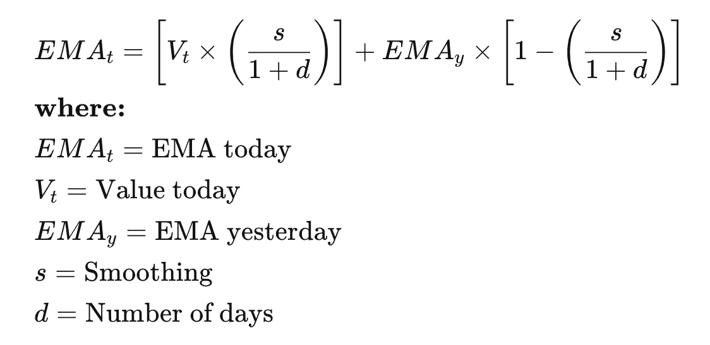
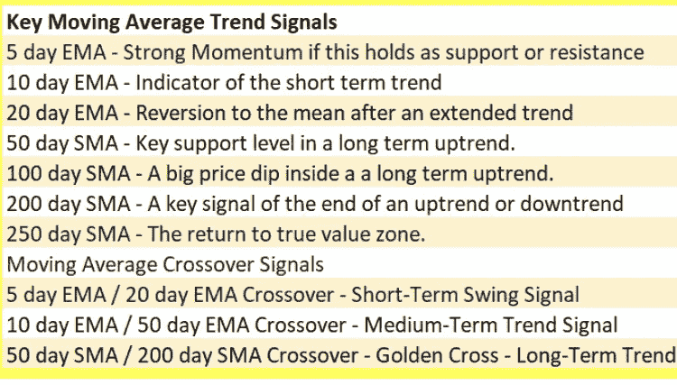

# 什么是均线？外汇和加密

> 原文：<https://medium.com/coinmonks/what-are-moving-averages-forex-crypto-1db33c669aab?source=collection_archive---------52----------------------->

在我们的 YouTube 上观看视频的同时，享受这个流的资源！

YouTube:[https://youtu.be/ZothLigoJy4](https://youtu.be/ZothLigoJy4)

不和:【https://discord.gg/J73qhkj7kr】T2

推特:【https://twitter.com/CryptoverseDAO】

linktree:[https://linktr.ee/cryptoversedao](https://linktr.ee/cryptoversedao)

-

什么是移动平均线？

在统计学中，移动平均是一种通过创建完整数据集的不同子集的一系列平均值来分析数据点的计算方法。在金融领域，均线(MA)是一种常用于技术分析的股票指标。计算股票移动平均线的原因是通过创建一个不断更新的平均价格来帮助平滑价格数据。

通过计算移动平均线，可以减轻特定时间范围内随机的短期波动对股票价格的影响。

均线(MA)是技术分析中常用的股票指标。
计算股票移动平均线的原因是通过创建一个不断更新的平均价格来帮助平滑指定时间段内的价格数据。
简单移动平均线(SMA)是一种计算方法，采用过去特定天数内一组给定价格的算术平均值；例如，过去 15 天、30 天、100 天或 200 天。
指数移动平均线(EMA)是一种加权平均线，对最近几天的股票价格给予更大的重视，使其成为对新信息更敏感的指标。

理解移动平均线(MA):

均线是一种简单的技术分析工具。移动平均线的计算通常是为了确定股票的趋势方向或确定其支撑位和阻力位。它是一个趋势跟踪(或滞后)指标，因为它是基于过去的价格。

均线的时间周期越长，滞后越大。所以，200 日均线比 20 日均线有更大的滞后，因为它包含了过去 200 天的价格。股票的 50 日和 200 日移动平均线数据受到投资者和交易者的广泛关注，被认为是重要的交易信号。

均线是一个完全可定制的指标，这意味着投资者在计算均线时可以自由选择他们想要的时间框架。移动平均线最常用的时间周期是 15、20、30、50、100 和 200 天。用于创建平均值的时间跨度越短，它对价格变化就越敏感。时间跨度越长，平均值越不敏感。

投资者可以根据他们的交易目标选择不同的时间段来计算均线。较短的均线通常用于短期交易，而较长的均线更适合长期投资者。

设置均线时没有正确的时间框架。找出哪一个最适合你的最好方法是尝试不同的时间段，直到你找到一个适合你的策略。

预测股票市场的趋势不是一个简单的过程。虽然不可能预测特定股票的未来走势，但使用技术分析和研究可以帮助你做出更好的预测。

上升的移动平均线表明该证券处于上升趋势，而下降的移动平均线表明其处于下降趋势。类似地，上涨的势头被多头交叉所证实，当短期均线越过长期均线时，就会出现多头交叉。相反，当短期移动平均线低于长期移动平均线时，就会出现下跌趋势。

均线的类型:

简单移动平均线

移动平均线的最简单形式称为简单移动平均线(SMA ),它是通过在一段特定时间内对一组给定的值进行算术平均来计算的。换句话说，一组数字——或者金融工具的价格——相加，然后除以这组数字中的价格数。计算证券简单移动平均值的公式如下:

指数移动平均线(EMA):

指数移动平均线是一种移动平均线，它给予最近的价格更多的权重，试图使其对新的信息更敏感。要计算均线，你必须先计算特定时间段的简单移动平均线(SMA)。接下来，必须计算加权均线的乘数(称为“平滑因子”)，通常遵循公式:[2/(所选时段+ 1)]。因此，对于 20 天移动平均线，乘数应该是[2/(20+1)]= 0.0952。然后你用平滑因子结合之前的均线得出当前值。因此，均线给最近的价格一个更高的权重，而均线给所有的价格一个相等的权重。

简单移动平均线(SMA)与指数移动平均线(EMA):

对均线的计算更强调最近的数据点。因此，EMA 被认为是加权平均计算。

下图中，每个均线使用的时间周期是一样的，都是 15 个，但是均线比均线对价格变化的反应更快。你还可以在图中观察到，当价格上涨时，均线的值比均线高(当价格下跌时，均线比均线跌得快)。这种对价格变化的反应是一些交易者喜欢用均线而不是均线的主要原因。

移动平均线的示例:

移动平均线的计算方式不同，取决于类型:SMA 或 EMA。下面，我们来看一种证券的简单移动平均线(SMA ),其 15 天的收盘价如下:

第一周(5 天):20、22、24、25、23
第二周(5 天):26、28、26、29、27
第三周(5 天):28、30、27、29、28

10 天移动平均线将计算出作为第一个数据点的前 10 天的收盘价的平均值。下一个数据点将删除最早的价格，添加第 11 天的价格，然后取平均值。

移动平均指标示例

布林线技术指标的波段通常位于简单均线的两个标准差处。一般来说，向高波段移动表明资产正在超买，而向低波段移动表明资产正在超卖。由于标准差被用作波动性的统计指标，该指标会根据市场情况进行自我调整。

均线意味着什么？

移动平均值是一种统计数据，它反映了一段时间内数据序列的平均变化。在金融领域，技术分析师通常使用移动平均线来跟踪特定证券的价格趋势。移动平均线的上升趋势可能意味着证券价格或势头的上升，而下降趋势将被视为下跌的迹象。今天，有各种各样的移动平均线可供选择，从简单的措施到复杂的公式，需要计算机程序有效地计算。

均线有什么用？

移动平均线广泛用于技术分析，这是投资的一个分支，旨在了解证券和指数的价格运动模式并从中获利。一般来说，技术分析师会使用移动平均线来检测一种证券的趋势是否发生了变化，例如一种证券的价格是否突然下跌。其他时候，他们会使用移动平均线来证实他们的怀疑，变化可能正在进行中。例如，如果一家公司的股价升至 200 天移动平均线以上，这可能被视为看涨信号。

有哪些均线的例子？

许多不同类型的移动平均线被开发出来用于投资。例如，指数移动平均线(EMA)是一种移动平均线，对最近的交易日给予更大的权重。这种类型的移动平均线可能对短线交易者更有用，因为对他们来说，长期的历史数据可能不太相关。另一方面，简单移动平均线的计算方法是对一系列价格进行平均，同时对涉及的每一个价格给予相等的权重。

> 加入 Coinmonks [电报频道](https://t.me/coincodecap)和 [Youtube 频道](https://www.youtube.com/c/coinmonks/videos)了解加密交易和投资

# 另外，阅读

*   [Bookmap 点评](https://coincodecap.com/bookmap-review-2021-best-trading-software) | [美国 5 大最佳加密交易所](https://coincodecap.com/crypto-exchange-usa)
*   最佳加密[硬件钱包](/coinmonks/hardware-wallets-dfa1211730c6) | [Bitbns 评论](/coinmonks/bitbns-review-38256a07e161)
*   [新加坡十大最佳加密交易所](https://coincodecap.com/crypto-exchange-in-singapore) | [购买 AXS](https://coincodecap.com/buy-axs-token)
*   [红狗赌场评论](https://coincodecap.com/red-dog-casino-review) | [Swyftx 评论](https://coincodecap.com/swyftx-review) | [CoinGate 评论](https://coincodecap.com/coingate-review)
*   [投资印度的最佳密码](https://coincodecap.com/best-crypto-to-invest-in-india-in-2021)|[WazirX P2P](https://coincodecap.com/wazirx-p2p)|[Hi Dollar Review](https://coincodecap.com/hi-dollar-review)
*   [加拿大最佳加密交易机器人](https://coincodecap.com/5-best-crypto-trading-bots-in-canada) | [库币评论](https://coincodecap.com/kucoin-review)