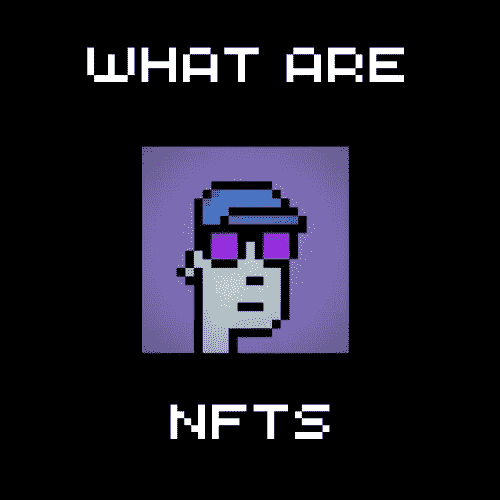

# 什么是 NFT？

> 原文：<https://medium.com/coinmonks/what-are-nfts-28ec3efe053f?source=collection_archive---------55----------------------->

**NFT 代表不可替代令牌**。

不可替代意味着某样东西不能与另一样东西交换，因为它是独一无二的。例如，一件艺术品不等于另一件。两者都有独特的属性。

另一方面，可替代物品可以互相交换。
就像比特币中的一美元总是等于另一美元。

NFT 是区块链上的代币，代表唯一物品的所有权。

**这为什么有用？**

嗯，追踪谁拥有一个数字文件是棘手的，因为它可以毫不费力地复制和分发。

那么，当每个人都有一份完全相同的文件副本时，你如何证明谁是原始所有者呢？

**NFT 解决了这个问题。**

想象一下，你在电脑上制作了一件数字艺术品，本质上是一幅 JPG。你可以用它来创造或铸造一个 NFT。代表您的作品的 NFT 包含一些相关信息，例如文件的唯一指纹、令牌名称和符号。这个令牌然后被存储到一个区块链上，而你，艺术家，成为所有者。

现在，您可以通过在区块链上创建交易来出售该令牌。区块链确保这些信息永远不会被篡改。它还允许您跟踪谁是代币的当前所有者，以及它在过去卖了多少钱。

值得注意的是，艺术品本身并不存放在 NFT 或区块链。只有其属性，如文件的指纹或哈希、令牌名称和符号，以及指向托管在 IPFS 上的文件的可选链接。

这就是 NFT 变得奇怪的地方。

当你购买一件代表艺术品的 NFT 时，你并没有得到它的实体复制品。见鬼，大多数时候，每个人都可以免费下载一份。NFT 只代表所有权，这是记录在区块链，所以没有人可以篡改它。有人说 NFT 给了你数字吹牛的权利。

更奇怪的是:虽然代币所有者拥有原始艺术品，但 NFT 的创造者保留版权和复制权。所以一个艺术家可以将他的原创作品作为 NFT 出售，但他仍然可以出售印刷品。

除了数字艺术，NFT 的还可以用来出售音乐会门票，域名，稀有的游戏物品，房地产，以及基本上任何独特的和需要所有权证明的东西。

例如，Twitter 的创始人以 NFT 的身份出售了他的第一条推文。任何人都可以在他的个人资料上看到这条推文，但现在，只有一个人可以拥有它。那个人为此支付了 290 多万美元。

我甚至可以用这个帖子做一个 NFT。你可以买下它，成为这篇文章的主人，尽管它对每个人都是免费的。

感谢您的阅读，许多教育材料即将推出。

NFT 材料公司。

> 加入 Coinmonks [电报频道](https://t.me/coincodecap)和 [Youtube 频道](https://www.youtube.com/c/coinmonks/videos)了解加密交易和投资

# 另外，阅读

*   [3 商业评论](/coinmonks/3commas-review-an-excellent-crypto-trading-bot-2020-1313a58bec92) | [Pionex 评论](https://coincodecap.com/pionex-review-exchange-with-crypto-trading-bot) | [Coinrule 评论](/coinmonks/coinrule-review-2021-a-beginner-friendly-crypto-trading-bot-daf0504848ba)
*   [莱杰 vs n rave](/coinmonks/ledger-vs-ngrave-zero-7e40f0c1d694)|[莱杰 nano s vs x](/coinmonks/ledger-nano-s-vs-x-battery-hardware-price-storage-59a6663fe3b0) | [币安评论](/coinmonks/binance-review-ee10d3bf3b6e)
*   [Bybit Exchange 审查](/coinmonks/bybit-exchange-review-dbd570019b71) | [Bityard 审查](https://coincodecap.com/bityard-reivew) | [Jet-Bot 审查](https://coincodecap.com/jet-bot-review)
*   [3 commas vs crypto hopper](/coinmonks/3commas-vs-pionex-vs-cryptohopper-best-crypto-bot-6a98d2baa203)|[赚取加密利息](/coinmonks/earn-crypto-interest-b10b810fdda3)
*   最好的比特币[硬件钱包](/coinmonks/hardware-wallets-dfa1211730c6) | [BitBox02 回顾](/coinmonks/bitbox02-review-your-swiss-bitcoin-hardware-wallet-c36c88fff29)