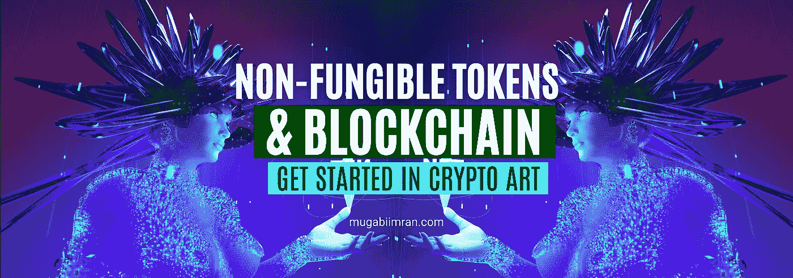
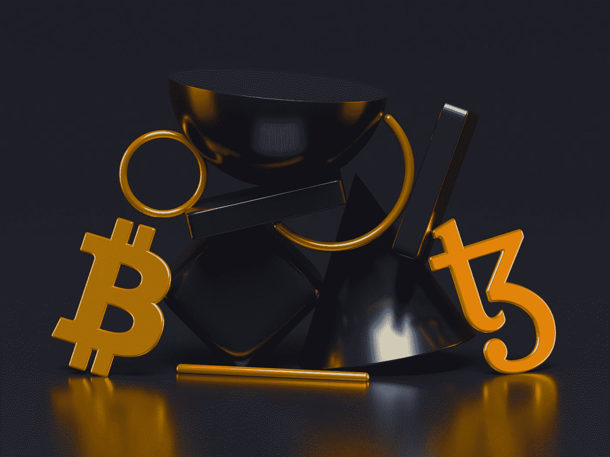
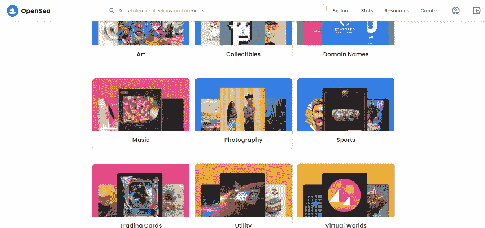
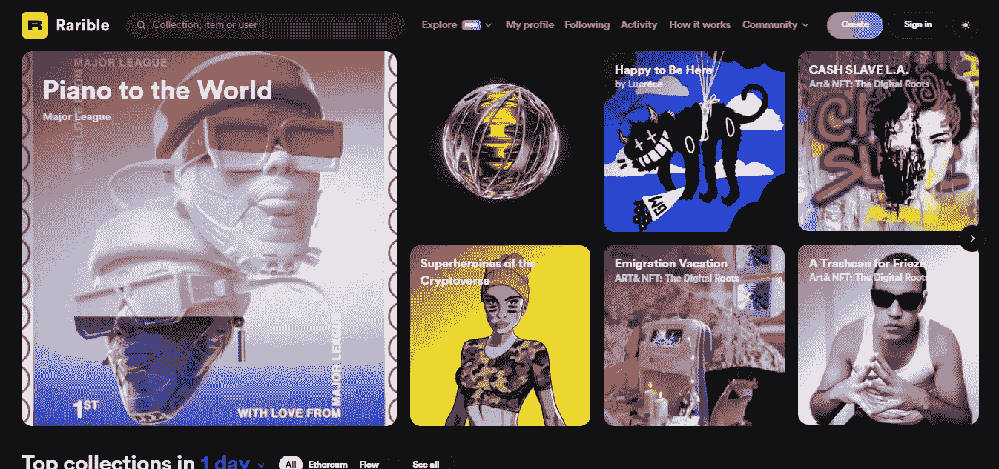

# 什么是 NFT，它们是如何工作的？关于不可替换令牌你需要知道的一切。

> 原文：<https://medium.com/coinmonks/what-are-nfts-and-how-do-they-work-everything-you-need-to-know-about-non-fungible-tokens-c1f82be839e9?source=collection_archive---------21----------------------->

Explaining (non-fungible tokens) and the Blockchain graphics by [mugabiimran](http://mugabiimran.com)

如果你还在疑惑 NFT 是什么，你可能还没看过 Beeple 的著名项目“Everydays”，Everydays:前 5000 天。迈克·温克尔曼。他以 NFTs(2022 年最昂贵的 NFT)的名义以 6900 万美元的价格出售了自己的作品。NFT 畅销书的其他例子包括《神秘朋克》、《T2 无聊猿游艇俱乐部》和《T4 狗窝》。

***真实故事:*** *Beeple 其实就是我从 WordPress 回到 2019 年转投* [*Wix 作为我的网站建设者*](https://bit.ly/FreeWIXSignUp) *和托管平台的原因。*

礼品:[免费渣打银行借记卡](https://bit.ly/FreeDebitcardSC)用于您的网上支付。

提示:你也可以使用 MTN 移动货币购买加密货币(比特币)。

顺便说一下，你可以使用 [Wix](https://www.mugabiimran.com/post/ascend-by-wix-business-tools) 来创建 NFT 收藏网站。当然，拥有一个[加密钱包地址](https://youtu.be/d3hXqZ4mEoU)是推出你的 NFT 系列的第一步，但是如果你想让你的 NFT 项目更大，你需要使用 [Discord](https://discord.com/) 服务器或者 [Twitter 个人资料](https://twitter.com/mugabiimran)来发展一个社区，除了你的网站展示你的 NFT 系列。

[https://youtu.be/d3hXqZ4mEoU](https://youtu.be/d3hXqZ4mEoU)

但是我们先不要高兴得太早。NFT 从哪里开始？

## 什么是 NFT？NFT 代表什么？

首先，NFT 代表不可替代的代币。在这种情况下，不可替代意味着不可交换。例如，如果你想兑换 100 美元的大钞，你可能会得到两张 50 美元或五张 20 美元的钞票。有了 NFTs，你就不能把一个换成另一个。

使 NFTs 不可交换和不可替代的是 NFT 的代币部分。令牌部分代表存储在区块链上的唯一标识号或不可互换的数据单元(稍后将详细介绍)。这个唯一的 ID 证明了特定令牌或 NFT 的所有权。

这看起来像是一大堆专业术语吗？

好吧。让我解释一下。

## 解释了不可替换的令牌。NFT 是如何工作的？

基本上，NFT 提供了一种验证物理或数字资产所有权的方法。NFTs 不仅仅是 Beeple 的数字艺术品、礼品卡和收藏品。需要注意的是，它们是用与加密货币相同的技术构建的。这意味着他们在区块链上在线运营。这也意味着他们有无限的可能性。

## 有哪些 NFT 的例子？

NFT 可以是像 [GaryVee](https://veefriends.com/) (VeeFriends)在他变得富有之前出售的运动卡，像 [NBA 顶级照片](https://nbatopshot.com/)这样突出篮球联赛精彩瞬间的视频剪辑，像[钟表](https://nft.time.com/) NFT 收藏这样的相框，像 [Snoop Dogg's Death Row](https://www.bbc.com/news/entertainment-arts-60330421) 这样记录所有数字 NFT 专辑 B.O.D.R .的歌曲/音频剪辑，甚至是像 Twitter C.E.O .杰克·多西这样的简单推文它以价值 290 万美元的 ETH 售出。

***提示:ETH 是以太坊加密货币的简称，用于购买 NFTs。以太坊也是创造、出售和交易这些非功能性金融工具的区块链。***

2022 年 2 月，超级碗中场表演后，**史努比·道格**宣布他将把他的唱片公司“死囚唱片”转变为第一个 NFT 唱片公司。

在元宇宙，NFT 甚至可以是虚拟的实物资产。元宇宙是一个想象或虚拟的世界。最近，沙盒，最受欢迎的区块链元宇宙游戏体验之一，[推出了 10，000 个 Snoop Dogg avatar NFT](https://news.bitcoin.com/snoop-dogg-drops-10000-playable-sandbox-avatar-nfts-mint-a-unique-doggie-and-explore-the-metaverse-in-style/)。现在都卖完了。这意味着你可以在游戏，虚拟世界/元宇宙中使用 NFTs。

## 我如何购买 NFT？

所以，就像你从亚马逊或易贝购买运动鞋一样，你可以在网上市场或交易所买卖非功能性纺织品。其中一个是公海，另一个是稀有的 T21。

***边注:*** *如果你有兴趣了解更多关于 crypto，* [*查看我的网站*](http://mugabiimran.com) *或者* [*我的 YouTube 频道*](http://bit.ly/MugabiImranYouTube) *。也可以通过*[*Twitter*](http://twitter.com/mugabiimran)*或*[*LinkedIn*](http://linkedIn.com/in/mugabiimran)*联系我。*

好吧。NFT 是用来做什么的？

# NFT 是用来做什么的？

区块链技术和 NFTs 为艺术家和内容创作者提供了一个独特的机会来货币化他们的努力。例如，艺术家不再需要依赖画廊或拍卖行来出售他们的艺术作品。相反，艺术家可以直接将作品作为 NFT 卖给消费者，这也让他们获得更多的利润。此外，艺术家可以编程或设置版税，这样每当他们的(NFT)艺术品被卖给新主人时，他们就会收到一定比例的销售额。

如果你同意我的观点，这是一个非常有吸引力和慷慨的特点，因为艺术家通常在他们的作品首次售出后无法获得未来的收益。

艺术并不是用非艺术电影赚钱的唯一途径。Charmin 和 Taco Bell 等品牌已经拍卖了以 NFT 为主题的艺术品，为慈善事业筹集资金。Charmin 将其产品称为“NFTP”(不可替代的卫生纸)，Taco Bell 的 NFT 艺术在几分钟内就销售一空，最高出价为 1.5 包乙醚(WETH)——在撰写本文时相当于€3290.05。

2021 年 2 月，一只 2011 年的 GIF 猫 Nyan Cat 以近 [€530107.20 的价格售出。NBA Top Shot 在 2021 年 3 月下旬创造了超过](https://www.nytimes.com/2021/02/22/business/nft-nba-top-shot-crypto.html)[€4.4176 亿的销售额](https://www.usatoday.com/story/sports/nba/2021/03/30/nba-top-shot-dapper-labs-valuation-funding-round/7058307002/)。一个勒布朗詹姆斯突出 NFT 卖得比€176702.40。

像 Snoop Dogg 和他的 NFT 收藏(小狗——10K 独特的元宇宙头像)和 Lindsay Lohan 这样的名人使得 NFTs 更加出名，比任何人想象的都更有价值。

Photo by [Tezos](https://unsplash.com/@tezos?utm_source=medium&utm_medium=referral) on [Unsplash](https://unsplash.com?utm_source=medium&utm_medium=referral)

## 什么是区块链技术，它是如何工作的？

区块链就像一个数据库或电子公共账本，上面记录着加密交易。例如，每当我们在[银行](https://bit.ly/FreeDebitcardSC)进行交易时，金融机构都有办法将所有这些交易记录保存在一种叫做分类账的东西中。区块链是加密货币世界的账本。它将每个交易一个接一个地保存在一个块中，创建了一个块链，因此称为“块链”。

与区块链的不同之处在于，一旦进入区块，这些数据就无法更改，并且(它是开源的)每个拥有加密钱包地址的人都可以自由参与区块链，他们可以在发生这些记录/交易时看到它们。

## 区块链解释

2009 年，随着比特币的诞生，第一个区块链诞生了。Etherium 使用相同的技术来运行智能合同、去中心化应用程序(DApps)、去中心化金融(Defi)和非可替代令牌(NFTs)。

区块链是分散的，这意味着它不是由政府或任何银行经营。它由世界各地的人们通过互联网运行，拥有处理全球所有日常交易所需的计算能力。

区块链是一种保护交易的方式，因为你不能操纵或入侵它。这项技术也可以用来验证土地所有权，因为它已经在非洲的[用于同样的目的。](https://www.weforum.org/agenda/2021/09/what-are-the-implications-of-widespread-cryptocurrency-adoption-in-africa/)

***边注:*** *看看区块链和比特币走了多远，通过* [*大会*](https://africaeurope-innovationpartnership.net/blockchain-africa-conference-2022) *，像* [*非洲区块链周*](https://www.africablockchainweek.com/) *，还有* [*区块链非洲大会*](https://blockchainafrica.co/) *。*

## 如何投资区块链技术？

投资区块链技术的一个简单方法是使用(智能合约) [JavaScript](https://bit.ly/UdacityAccount) 和 [Solidity](https://soliditylang.org/) 在区块链上构建/开发自己的应用，或者从已经使用[区块链技术](https://africa.businessinsider.com/markets/how-to-invest-in-blockchain-the-high-risk-but-high-potential-technology-behind/pw9wd8c)的上市公司购买一些股票，例如 IBM、Nvidia、亚马逊、英特尔、万事达卡、摩根大通、迦南、Silvergate、GaryVee、Tai Lopez 等。

另一种方式是买卖非功能性交易。我们今天就来看看。

# 以太坊是什么？

以太坊是支持 NFTs 的加密货币和区块链技术。在以太坊世界或系统中，代币代表一种数字资产。以太坊于 2015 年推出，一直是各种功能和用例中智能合约的驱动力。以太坊是一种加密货币(ETH)也是一种区块链系统。

除了以太坊(ETH)，还有其他使用智能合约的加密货币，如 Solana (SOL)、Polkadot (DOT)，不胜枚举。

## 什么是铸币？铸造与加密挖掘和智能合约有何不同？

智能合约只是在以太坊区块链上构建和运行的程序。智能合约通常是使用 Solidity 平台使用 JavaScript 编程语言构建的。这些你可以从 Udacity 或 LinkedIn 了解。

铸造是在以太坊区块链、Flow 或 Tezos 上创建或注册您的 NFT 系列的过程。一旦你的 NFT 被铸造出来，你就获得了它的数字所有权，你可以把它收藏起来，卖掉或者交易。

然而，加密货币采矿是制造或创造比特币或 Dogecoin 等数字货币的过程，作为对网络(区块链)贡献的奖励，以帮助交易。

对我来说，加密采矿只是印刷钞票的非官方许可证。

当你有足够强大的电脑或显卡参与加密货币开采时，你会收到一部分交易费，作为工作证明(PoW)的电费。工作证明验证您的计算机是解决了允许在区块链上成功交易的方程的计算机。这就是像 NiceHash、HashShiny.io 和 Genesis mining 这样的加密采矿公司如何赚取巨额加密货币资金的。

好吧。现在，从我在本文开始时与您分享的 NFT 例子中，您应该知道什么是 NFT 以及它们是如何工作的。

还记得皮普尔和斯努普多格的《小狗》吗？

此外，你应该有一个非常清楚的想法，如何购买，出售或交易 NFT。如果没有，接下来，让我给你看一些 NFT 房屋(市场)的例子。

# 什么是 NFT 市场？

嗯，如前所述，就像你从亚马逊购买书籍或游戏一样，NFT 市场是你购买或出售 NFT 的地方。现在，亚马逊使用互联网和一些编程语言如 Php、Python 和 Javascript 来完成交易。NFT 依赖于互联网和使用以太坊区块链或 Flow 部署和开发的智能合约。

以太坊、Flow 和 Tezos 是开源平台，除了帮助开发和部署智能合约，它们还解决了区块链采用面临的障碍。说到 NFTs，以太坊是最常见的。

## 最佳 NFT 市场

让我们深入研究 NFT 市场的例子，你可以用它来出售你的加密艺术和有趣的 gif。

# OpenSea

OpenSea 是世界上第一个也是最大的不可替换令牌(NFT)、加密收藏品、体育、音乐、摄影、域名甚至虚拟世界的数字市场。你可以使用像 OpenSea 这样的 NFT 市场来购买、销售和发现独一无二的非凡数码产品。如果你想得到最新的 NFT 消息，你需要订阅他们的时事通讯。

# 稀有的

Rarible 是一个多连锁的 NFT 市场，整合了以太坊、Flow 和 Tezos。这是一个交易数字艺术、音乐和视频、域名、元宇宙(虚拟世界)土地、收藏品以及其他数字资产的地方。在这个平台上，你会发现各种各样的创作者和品牌**、**，包括 Twitter、Lindsay Lohan、Floyd Mayweather Jr、LIRONA、Pak、The Watcher、Aavegotchi 等等。Rarible 还允许你创建定时拍卖，版税，以及其他功能。

# NiftyGateway

Nifty Gateway 是一个购买、出售和存储你的数字艺术的主要市场。它由 [Gemini](https://www.gemini.com/) 所有。他们的目标之一是看到至少 10 亿人收集 NFT。他们与顶级艺术家和品牌合作，在 NiftyGateway 平台上创建非常独特的限量版系列。

NiftyGateway 的独特之处之一是没有汽油费，并且能够从他们的安全钱包中检索您的 NFT 帐户，这是由 Gemini 最先进的托管技术驱动的。

您还可以使用 NiftyGateway 的策划和验证的 drops 来避免诈骗。

# 超级罕见

超稀有是以太坊上的数字艺术市场。每件艺术品都是由网络中的艺术家真实创作的，并被标记为可收藏的数字资产。SuperRare 是一个收集和交易独一无二的单一版本数字艺术品的市场。

# 基础

基金会是一个平台，旨在建立一个新的创意经济——在这个世界里，创作者可以使用以太坊区块链以全新的方式评估他们的作品，并与他们的支持者建立更强的联系。

基金会结合了稀有，开放和超级稀有。这是一个策展平台，在创作者和收藏者之间培育一个相互支持的网络。你所需要做的就是连接你的钱包开始收集 NFT。

## 如何用 4 个简单的步骤购买 NFTs？

**第一步:**首先激活一个加密钱包地址。您可以使用比特币基地或元掩码。

**第二步:**存入你的账户。购买一些加密货币，你将需要一些 ETH 来购买你的 NFT。有一种叫做汽油费的东西，它只是在以太坊区块链上部署你的 NFT 在市场上销售的每笔交易所收取的费用。

如果你还记得，早些时候，我们谈到了区块链是如何被通过互联网从世界各地连接起来的大功率机器管理的。嗯，这也需要大量的电力，这就是汽油费的来源。需要注意的是，一些 NFT 市场不收取汽油费。

*小贴士:总是在汽油费低的时候尝试造币。*

第三步:去你最喜欢的 NFT 市场，开始浏览你的 NFT。

**第 4 步:**创建您的钱包地址并将其连接到 NFT 市场，然后购买您喜欢的 NFT 系列。

一旦您购买了 NFT，它将被添加到您的收藏中，您的所有权证明现在可以在区块链上得到验证。顺便说一下，Twitter 有一种特殊的方式来表示 NFT 的个人资料([六边形个人资料](https://www.theverge.com/2022/1/20/22893502/nft-twitter-profile-picture-crypto-wallet-opensea-coinbase-right-click))。如果你有一个加密钱包和 NFT，所有你需要做的是连接你的比特币基地钱包，分类帐生活，MetaMask，信任钱包，或任何其他你选择的 NFT 支持的钱包得到验证。

## 如何创建 NFT

因此，要创建 NFT，你可以使用你的创造性技能来一个一个地绘制它们，并保存为 JPEG、PNG、GIF、视频，或者使用编程来生成随机的计算机生成的图形。在那之后，简单地跟随剩余的过程。创建钱包地址，将其连接到 NFT 市场，并开始参与 NFT 和元宇宙。

同样，你可以从 Codecademy、LinkedIn Learning 或 PluralSight、Udacity、Udemy 等在线学习平台学习编程。

## 如何在 3 个简单易行的步骤中销售 NFTs？

要出售你的 NFT，你只需要一个经过深思熟虑和精心设计的 NFT 或完整的集合，你的加密钱包地址，和一些以太网。

**第一步:**准备好你的 NFT 收藏、JPEG、PNG、音频、视频剪辑，或者任何你打算作为你的 NFT 出售的东西。你也可以考虑建立一个 [NFT 网站](https://bit.ly/FreeWIXSignUp)，在那里你可以展示你的收藏并提供更多关于你的 NFT 的信息。

**第二步:**访问您首选的 NFT 市场，连接您的加密钱包地址。

第三步:创建或上传你的 NFT 收藏，(JPEG，PNG，音频，视频剪辑，或任何你计划作为你的 NFT 出售的东西。每个平台在整个应用程序中可能有不同的页面，但它们非常相似。

## 如何使用移动货币在乌干达获得加密货币？

如果你刚刚在乌干达或尼日利亚、坦桑尼亚、加纳、肯尼亚、马拉维等其他非洲国家学习加密货币，或者你可能在的任何地方，你可能会想，有没有可能用你的移动货币购买比特币或密码。

是的，它是。根据你所在的国家，你甚至可以通过 PlayStore 访问一些公司和/或应用程序，帮助你使用移动货币购买比特币和其他加密货币，甚至进行交易。

例如，Paxful、币安、比特币基地、Yellowcard 等应用程序允许你在乌干达和非洲各地用移动货币买卖比特币、以太坊和系绳。在乌干达，你可以用同样的应用程序将比特币兑换成移动货币。

## 结论

如果你曾经想进入加密世界，但认为它很复杂，我认为 NFT 使它变得非常简单，容易理解和参与区块链技术，同时在网上用加密货币赚钱。

像 Jay-Z、Eminem 和 Grimes 这样的艺术家/音乐家通过购买一些加密朋克，甚至将他们自己的音乐作为 NFT 出售，使得 NFT 非常受欢迎。史努比·道格把死囚区的唱片变成了 NFT 唱片公司。

NFTs 为世界各地的当地艺术家提供了一个非常巨大的机会，他们可以出售自己的作品，同时帮助世界其他地方使用以太坊区块链上的代币跟踪和验证财产/资产所有权。即使你的作品被复制，世界仍然可以知道你的杰作的原主人。

同样，正如我们在本文开头所讨论的，非功能性测试并不都是关于艺术的，但事实证明它们在这个方向上表现得最好。

我希望这有助于你了解加密货币世界，特别是以太坊智能合约和 NFT(加密艺术、元宇宙、收藏品等等)。

如果你有兴趣了解更多信息，请查看我的网站或我的 YouTube 频道。你也可以通过[推特](http://twitter.com/mugabiimran)或 [LinkedIn](http://linkedIn.com/in/mugabiimran) 联系我。

放下你的 NFT 收藏。让我们互相支持。此外，请在评论中留下您的问题，并分享文章，以帮助更多人了解加密货币和区块链的底层技术。