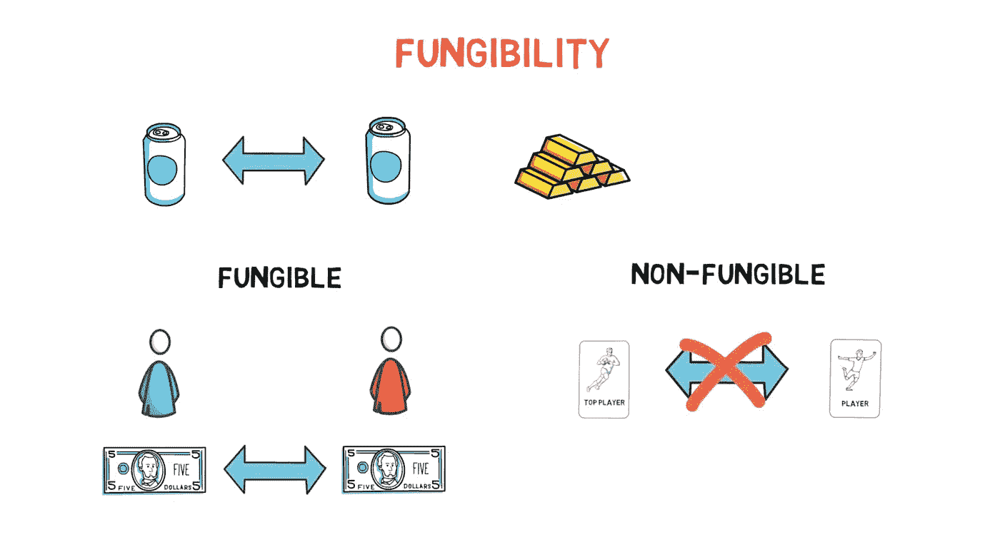
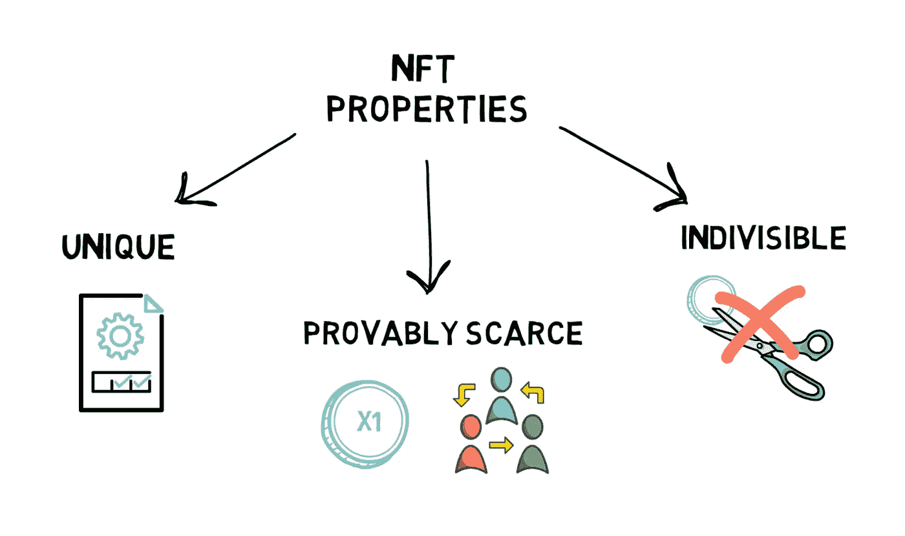
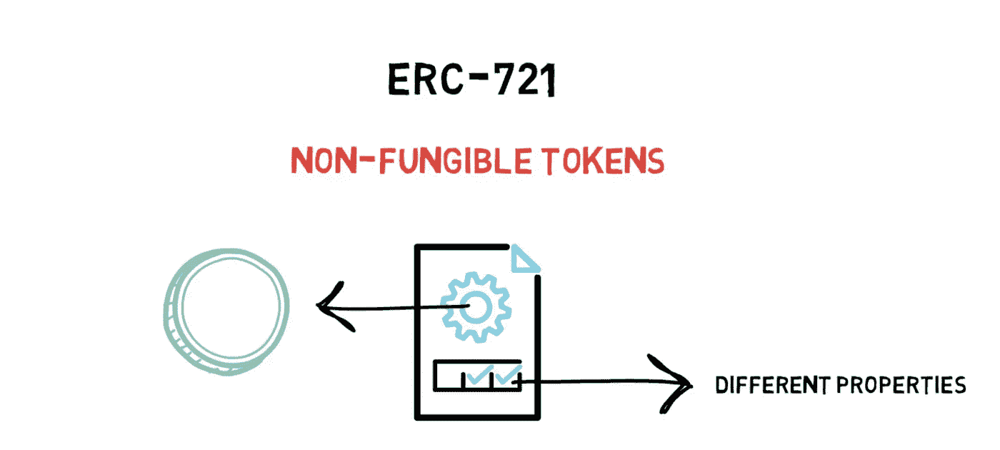
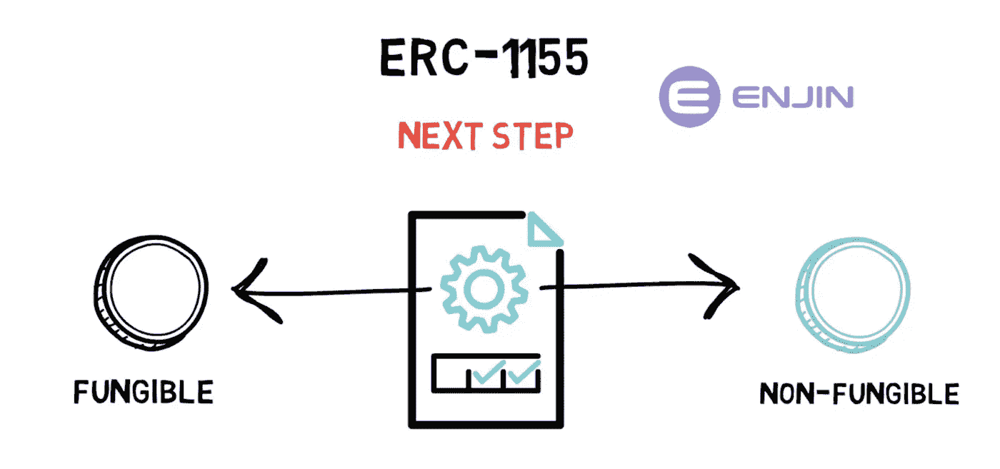
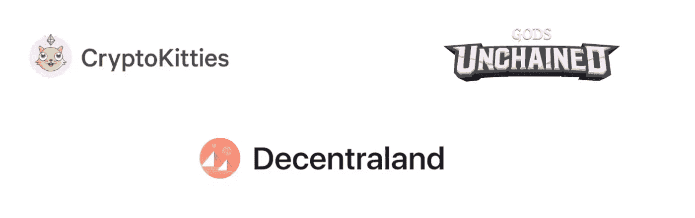
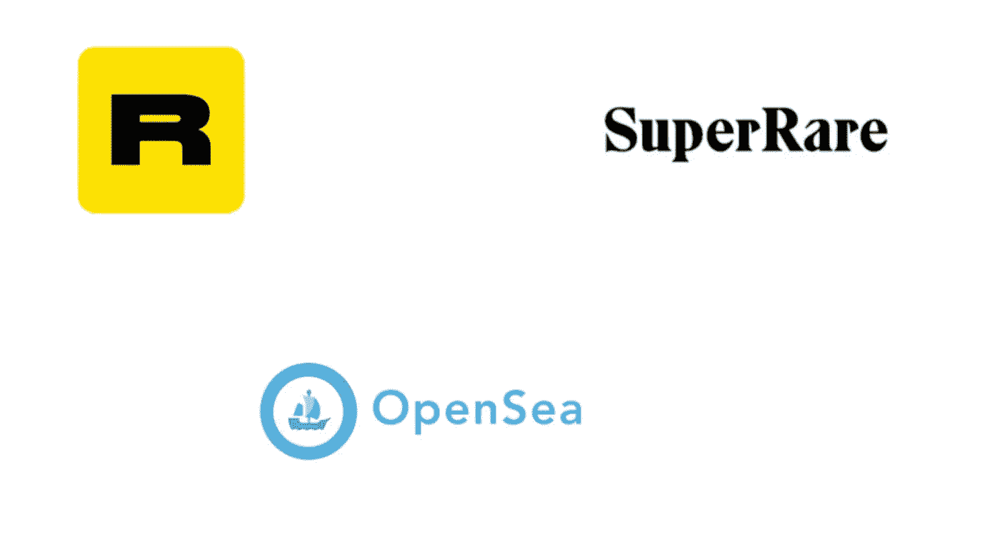
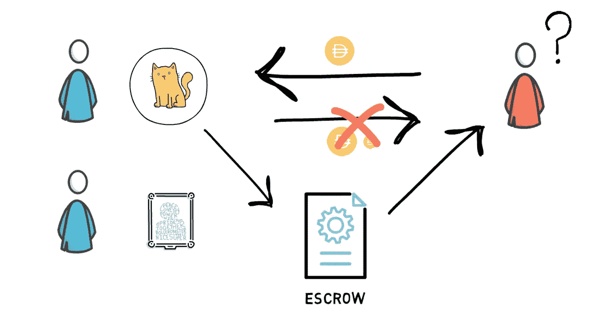
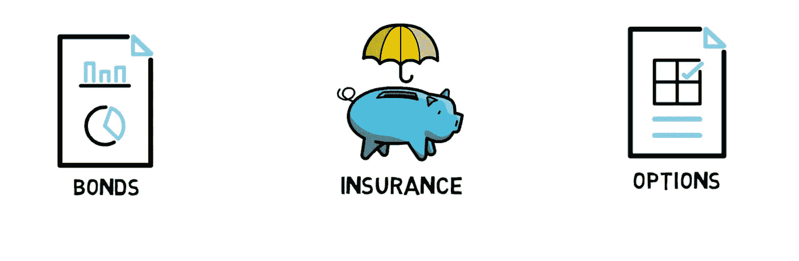

# 什么是 NFT？

> 原文：<https://medium.com/coinmonks/what-are-nfts-cda51b53994f?source=collection_archive---------40----------------------->

在我们的 YouTube 上观看视频的同时，享受这个流的资源！

YouTube:[https://youtu.be/VQddyfau-3s](https://youtu.be/VQddyfau-3s)

不和:【https://discord.gg/J73qhkj7kr】T2

推特:【https://twitter.com/CryptoverseDAO】

linktree:[https://linktr.ee/cryptoversedao](https://linktr.ee/cryptoversedao)

-

什么是 NFT？

NFT 代表不可替换的令牌，是一种加密令牌，可以代表数字稀缺商品(如艺术品或收藏品)的所有权。

“不可替代”不是一个非常流行的词，所以让我们看看它真正的意思。

在经济学中，可替代性是货物或商品的特征，其中每个单独的单元都是可互换的，彼此之间无法区分。

像大多数概念一样，可替换性最好用一个例子来解释。

美元等法定货币是可替代物的一个很好的例子。如果爱丽丝有一张 5 美元的钞票，她可以用鲍勃的 5 美元钞票替换她的钞票，而不会影响爱丽丝或鲍勃。

另一方面，爱丽丝最喜欢的限量版篮球卡就是一个不可替代的好例子。每张卡都被视为收藏品，并有各自的属性。有一个玩家的牌通常与有另一个玩家的牌价值不同。最重要的是，即使在考虑两张相同的卡片时，其他因素如生产年份或卡片的保存方式也会有所不同。

不可替代的一个极端例子是一件艺术品。例如，一幅画通常只有一个原件。

现在，我们知道了不可替代性的含义，让我们看看 NFT 最常见的属性是什么。

唯一-每个 NFT 都有不同的属性，这些属性通常存储在令牌的元数据中。

可证明的稀少-通常有有限数量的 NFT，极端的例子是只有一个副本，令牌的数量可以在区块链上验证，因此它是可证明的。

不可分割——大部分非货币基金不能被分割成更小的面额，所以你不能购买或转让一小部分 NFT。

与标准代币类似，NFT 也保证资产的所有权，易于转让，并且防欺诈。

以太坊上的 NFTs(ERC-721 和 ERC-1155)

尽管 NFTs 可以在任何支持智能合约编程的区块链上实现，但最引人注目的例子是以太坊上的 ERC-721 和 ERC-1155 标准。

在我们进入 NFT 标准之前，让我们快速回顾一下什么是 ERC-20，因为这将有助于比较。

ERC-20 是在以太坊区块链上创建代币的著名标准。一些例子是稳定的硬币，如或戴，和 Defi 令牌，如贷款，，，和大学。ERC-20 允许创建可替换的令牌。因此，刚才提到的所有代币都是完全无法区分的，不管我们是从朋友那里还是从某个交易所收到 USDT，每个代币的价值都是一样的(为了简化解释，我们跳过了接收受污染代币的可能性，这些受污染代币会使代币之间产生差异，使它们“更不可替代”)。

ERC-721 是创建不可替换令牌的通用标准。ERC-721 允许创建可用于创建具有不同属性的可区分令牌的契约。一个常见的例子是著名的 crypto kitties——一种允许收集和繁殖虚拟小猫的游戏。

ERC-1155 是创造不可替代令牌的下一步。该标准允许创建支持可替换和不可替换令牌的合同，它是由金恩创建的，该项目专注于区块链的游戏。在许多游戏中，比如《魔兽世界》,玩家可以持有不可替换的物品——剑、盾牌、盔甲和可替换的物品，比如黄金或箭。该标准允许开发人员定义可替换和不可替换的令牌，并决定应该存在多少这样的令牌。

NFT 空间

除了已经提到的 CryptoKitties，还有一些其他相当受欢迎的游戏利用了 NFT 的力量，如《解放的上帝》和《分散的土地》。

分散土地是一个有趣的例子，因为玩家可以购买数字土地，这些土地以后可以转售或用作游戏中的广告空间。

其他例子包括数字艺术市场，如 Rarible、SuperRare，甚至是市场的聚合者——open sea。

另一个可以用 NFT 表示的稀缺资源的例子是域名，例如以太坊命名服务。以太网扩展，不可阻挡的领域。加密扩展。

有些非功能性食物疗法非常昂贵。最昂贵的加密猫“龙”在 2017 年底以 600 ETH 的价格售出，价值约 17 万美元。像 exchange.eth 这样的稀缺域名价值高达 50 万美元。

NFTs 和 Defi

在 Defi 方面，NFT 可以释放更多分散融资的潜力。目前，在 Defi 中，绝大多数 Defi 贷款协议都是有抵押的。最有趣的想法之一是使用 NFTs 作为抵押品。这意味着，现在你可以提供一个代表一件艺术品、数字土地，甚至是一个象征性的房地产的 NFT 作为抵押品，并以此借钱。

这听起来很酷，但问题就在这里。在我们的标准借贷 Defi 平台中，如 Compound 或 Aave，所提供的抵押品的价值可以很容易地通过整合价格预测来衡量。这些汇总价格来自多个流动性来源，如集中和分散的交易所。当谈到非金融交易时，特定代币的市场往往缺乏流动性，这使得价格发现过程变得棘手。

为了更好地理解这个问题，想象一下有人花 10 ETH 买了一只稀有的 CryptoKitty。这个 NFT 后来被用作抵押品，借款人提取 1，750 DAI，假设 10 ETH 值 3，500 美元，这个特定的 NFT 有 50%的 LTV(贷款价值比)。在此之后，如果没有其他人愿意购买这种特殊的 CryptoKitty，我们可以说这种 NFT 的市场缺乏流动性，甚至不存在。我们唯一可以假设的是，NFT 的价值仍然和上次卖出时一样。这当然不是一个安全的假设，因为 NFTs 的值可能会发生相当大的变化。

这也是为什么一些提供 NFT 抵押贷款的项目使用略有不同的 P2P 贷款模式。在这种市场模式中，借款人可以提供非功能性金融工具作为抵押品，贷款人可以在启动贷款前选择他们愿意接受的 NFT。用作抵押品的 NFT 保存在托管合同中，如果借款人因未按时偿还借款金额+利息而拖欠贷款，NFT 将转移给贷款人。这个领域是新的，但是使用这种模式的公司之一是 NFTfi。

除了用作抵押品，NFT 还可以代表更复杂的金融产品，如保险、债券或期权。来自 Yearn Finance 的 Yinsure 是 NFT 在保险领域应用的一个很好的例子。在银保，每份保险合同都代表一份 NFT，也可以在 Rarible 等二级市场交易。

说到 Rarible，我们最近也开始看到一些定义性的概念，比如流动性开采，被 NFT 的项目所使用。例如，Rarible 开始向在其平台上创建、购买和销售 NFT 的用户奖励 RARI 治理令牌。

摘要

NFT 的交易额超过 1 亿美元，NFT 空间是加密领域增长最快的领域之一，从数字小猫到复杂的金融产品，潜力巨大。

> 加入 Coinmonks [电报频道](https://t.me/coincodecap)和 [Youtube 频道](https://www.youtube.com/c/coinmonks/videos)来了解加密交易和投资

# 另外，阅读

*   [3 贸易评论](/coinmonks/3commas-review-an-excellent-crypto-trading-bot-2020-1313a58bec92) | [皮奥耐视评论](https://coincodecap.com/pionex-review-exchange-with-crypto-trading-bot) | [共同规则评论](/coinmonks/coinrule-review-2021-a-beginner-friendly-crypto-trading-bot-daf0504848ba)
*   [总账 vs Ngrave](/coinmonks/ledger-vs-ngrave-zero-7e40f0c1d694) | [总账 nano s vs x](/coinmonks/ledger-nano-s-vs-x-battery-hardware-price-storage-59a6663fe3b0) | [币安回顾](/coinmonks/binance-review-ee10d3bf3b6e)
*   [Bybit Exchange Review](/coinmonks/bybit-exchange-review-dbd570019b71)|[bit 亚德 Review](https://coincodecap.com/bityard-reivew)|[Jet-Bot Review](https://coincodecap.com/jet-bot-review)
*   [3 commas vs Cryptohopper](/coinmonks/3commas-vs-pionex-vs-cryptohopper-best-crypto-bot-6a98d2baa203)|[赚取密码利息](/coinmonks/earn-crypto-interest-b10b810fdda3)
*   最佳比特币[硬件钱包](/coinmonks/hardware-wallets-dfa1211730c6) | [比特币 02 点评](/coinmonks/bitbox02-review-your-swiss-bitcoin-hardware-wallet-c36c88fff29)
*   [BlockFi 对比摄氏度](/coinmonks/blockfi-vs-celsius-vs-hodlnaut-8a1cc8c26630)|[hod lnaut Review](/coinmonks/hodlnaut-review-best-way-to-hodl-is-to-earn-interest-on-your-bitcoin-6658a8c19edf)|[ku coin Review](https://coincodecap.com/kucoin-review)