# 什么是 NFT？描述了不可替换的令牌

> 原文：<https://medium.com/coinmonks/what-are-nfts-non-fungible-tokens-explained-f3a3d8d18ed7?source=collection_archive---------11----------------------->

## 关于不可替换令牌(NFT ),您只需要知道

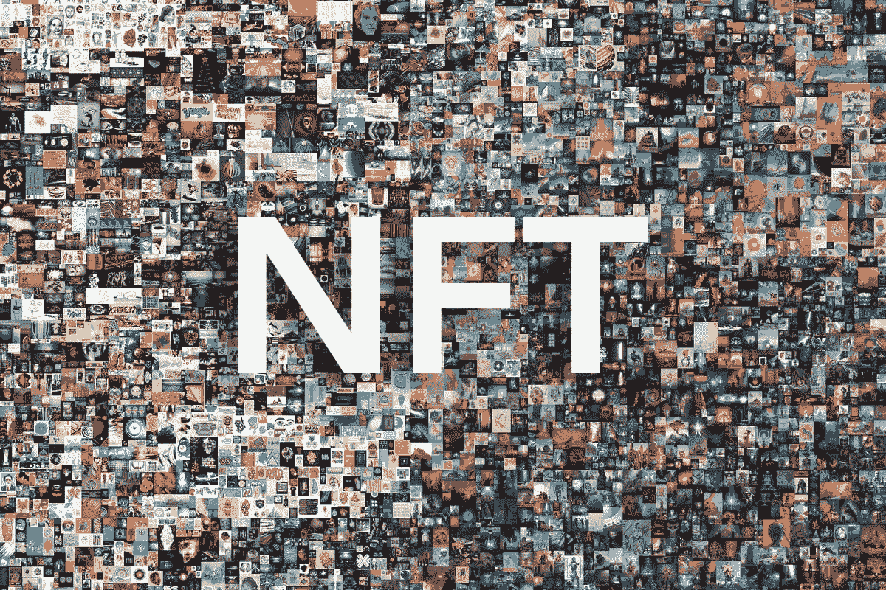

Non-Fungible Tokens (NFTs)

近年来，加密货币一直在飙升，但这些数字资产不仅仅是猖獗的投机。区块链——支持加密的数字账本技术——具有实际的、真实的用途。**不可替换令牌(NFT)**就是一个例子。**NFT**是基于代表数字资产所有权的区块链的令牌。最近在 **NFTs** 的热潮涉及数字艺术和创作(例如，Twitter 首席执行官杰克·多西通过 **NFT** 以 290 万美元的价格出售了第一条发布的推文)。

无论你认为它们是一种投机时尚，还是艺术家的一种伟大的新可能性，不可否认的是，**NFT**正在成为头条新闻，一些创意者至少已经将它们变成了一项业务。那么**什么是 NFT**？请继续阅读，了解关于不可替换令牌的所有信息。

# 什么是不可替换令牌(NFT)？

**不可替代的代币**不是比特币意义上的真正的加密货币。加密货币利用区块链来跟踪各方之间的金融交易，是一种用于互联网和数字优先世界的数字货币。

**NFT**也建立在区块链的基础上，但用于担保资产的所有权。可以把它想象成一种证书，比如汽车或房地产的所有权证书，说明汽车或房屋的合法所有者，只不过 NFT 是数字形式的所有权证明。大多数 NFT 都是基于以太坊区块链网络。

一项 **NFT** 是一项独特的数字资产，不能直接用另一项数字资产替代(因此得名“**不可替代**”)。许多实物资产也是不可替代的。例如，房地产是不可替代的，因为每一部分都是独一无二的。

相比之下,“可替换的”令牌是可以用另一个相同的令牌替换的令牌。以太是以太网上交易的可替换令牌，这意味着一个以太与另一个以太是相同的。比特币也是如此。一个比特币可以换成另一个比特币，因为它们价值相同。实物货币也是如此。一张一美元的纸币和另一张一美元的纸币是一样的，因此它们都是“可互换的”但是每一个 NFT 都是独一无二的；没有另一个完全一样的，所以它们是不可替代的——或者说不能完全取代另一个。

代码被写入这个数字令牌，并使用它所基于的区块链网络(同样，通常在以太坊上)进行记录，以证明一个独特数字资产的历史所有权和当前所有者的列表。一个 **NFT** 可以代表任何数字创作——艺术、音乐、视频、写作等等。

# 是什么让 NFTs 如此特别？

**不可替代的代币**具有独特的属性；它们通常与特定资产相关联。它们可用于证明游戏皮肤等数字物品的所有权，直至实物资产的所有权。

其他代币是可替换的，就像硬币或纸币一样。可替换令牌是相同的，它们在交换时具有相同的属性和值。

# 有多少 NFT？

2021 年 10 月底，全球有近 7000 种不同类型的加密货币。大多数 NFT 都是建立在以太坊上的，但是许多这些代币使用不同的区块链或者建立在专有的 NFT 平台上。因此，有数不清的代表艺术作品、视频、视频游戏内容、音乐等的单独的 NFT。随着越来越多的艺术家和创作者利用 NFTs 来保护和货币化他们的作品，这个数字只会随着时间的推移而增加。

# NFTs 是如何工作的？

NFT 到底是怎么用的？数字艺术收藏就是其中之一。2021 年 3 月，佳士得以 6900 万美元的价格拍卖了艺术家毕普的一幅 NFT 作品《每一天:前 5000 天》。NFT 的购买者现在拥有附属于它的数字艺术的所有权。数字创作者幼虫实验室在 2017 年拍卖了个人密码朋克角色；一些国家森林公园现在价值数百万美元。

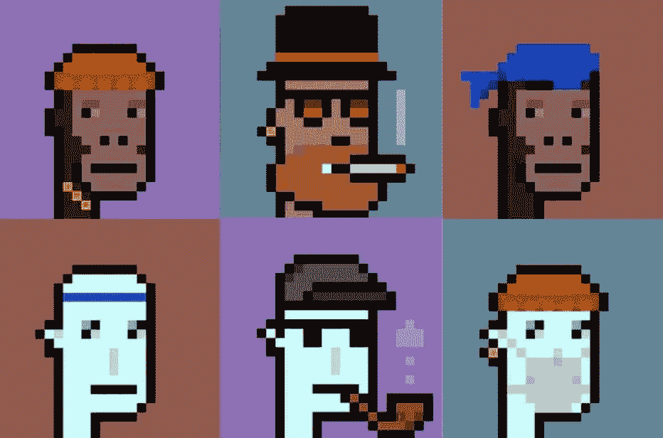

CryptoPunks Characters

这些是 NFT 价值膨胀的一些极端例子。不过，对于常见的功能，艺术家可以使用 NFTs 向收藏家和其他数字创作者出售他们的作品。NFT 的所有者或创造者也可以为艺术品的复制或在线使用收取版税。NFTs 有望成为执行数字版权和商标法的一种方式。

真实世界的用例也比比皆是。耐克在 NFTs 上拥有一项专利，可以将运动鞋认证为独一无二的物品。但是在收藏家物品领域之外(现代艺术投机的一种形式)，NFTs 可能有一些实用的日常价值。还记得前面提到的汽车或房地产等实物资产的所有权吗？基于区块链的令牌可以用来保证物理财产的所有权，并省去传统上处理所有权服务和相关法律文件的昂贵中介。然而，对于 NFTs 来说，现在还为时尚早，所以未来几年可能会有更多的想法出现。

# 为什么不可替换的令牌很重要？

除了代表数字艺术家和其他创作者将他们的作品货币化的一种方式外，**NFT**还被视为艺术投资和收藏的发展，以及一种新的加密货币投资资产类别的一部分。因为 NFT 是独一无二的，所以 NFT 的收藏升值的可能性很小(就像毕普的数码艺术品一样)。如果你是一个艺术收藏家，在网上市场，如 **OpenSea** ，NFT 很容易买卖。加密货币交易应用**币安**正在推出 NFT 市场，**比特币基地环球**可能也会这么做(它已经投资了几个 NFT 市场，包括 Rarible)。

但是，对于普通投资者来说，非金融资产代表了一种高度投机的投资类别，应该尽量避免。非功能性传播并不是因为它们的实用性而增值，而是基于它们所代表的媒体(数字艺术、视频、音乐等)的价值。).给像艺术品这样的东西贴上一个价值标签是非常困难和主观的，而且不像给股票估值，股票代表着企业的所有权股份和对企业未来利润的要求权。

无论如何，希望间接接触非金融交易的投资者可能会考虑在他们的投资组合中增加一点以太，因为大多数非金融交易都利用以太坊网络的区块链。以太也是一种高度投机的投资，尽管随着时间的推移，如果以太坊网络的使用增加，它的价值可能会增加。(重要的是要注意，以太令牌的数量没有上限，但最近交易验证方式从工作证明到利益证明的变化应该会随着时间的推移减少以太坊的供应。)

即便如此，**不可替代代币**可能是一项重要的技术发展。在一个模糊现实世界和虚拟世界界限的新数字时代，一种在线跟踪数字资产所有权和分配的新方法将变得越来越重要。这些位于区块链的代币还可能扰乱金融中介，降低汽车和房地产等大宗商品的买卖成本。这并不一定意味着你应该投资于高度投机性的非金融资产，但至少，它们的发展值得关注。

# NFT 是用来做什么的？

理论上，非专利技术可以与几乎所有的知识产权相联系，但是到目前为止，这种活动只集中在少数几个领域。

**艺术和音乐:**最广为人知的非艺术类作品的例子是视觉艺术，尤其是售价高达数百万美元的视频和静止图像。例如，一些所有者将他们的 NFT 用作社交媒体个人资料图片，将它们放在在线画廊中，甚至将其用作视频会议背景。

收藏品:事实证明，NFT 科技也适合其他收藏品的数字版本，比如交易卡。包括 NFL、MLB 和 NBA 在内的体育联盟都创建了数字收藏，以纪念诸如显著的统计数据和杰出的比赛之类的事情。

**游戏和虚拟现实:**NFT 可以附着在一些独特的视频游戏物品上，如武器、装备或特殊角色——其中许多物品长期以来一直在游戏内市场上出售和交易。NFTs 可能会使此类产品的销售更容易执行，并减少对中央政府(如游戏制造商)的依赖。

从长远来看，NFTs 可以在创建一个俗称元宇宙的虚拟空间领域中发挥作用。一些预测者预测，未来几年，人们将花更多的时间沉浸在他们创造的虚拟现实空间中。在这些领域，专属的非专利技术可以获得新的地位。

# 谁使用 NFTs？

**NFTs** 正在各行各业的艺术家、游戏玩家和品牌之间上演。事实上，似乎每天都有新的玩家进入 NFT 市场。对于艺术家来说，走进 NFT 空间增加了另一种出售艺术品的可能性，并为粉丝提供了一种支持方式。NFT 艺术的范围从小型、快速制作的 gif(上图中的彩虹猫由 [NyanCat](http://www.nyan.cat/) 以 69 万美元售出)到更宏大的作品。名人也参与其中，或者作为收藏家投资，或者创建他们自己的 NFT(或者让艺术家为他们创建)。

众所周知，知名艺术家的作品会以非转售形式卖出高价，这是一群匿名的“艺术爱好者”为了提高 NFT 的价值而焚烧一幅班克斯原作时所依赖的。然而，一些销售仍然令人瞠目结舌。去年 12 月，帕克的 NFT 作品《合并》(The Merge)以 9，180 万美元的价格售出(他实际上出售了该作品的股份)，这是在世艺术家作品的第三高价格。

与此同时，NFT 正在动摇视频游戏中游戏内购买的概念。到目前为止，在游戏中购买的任何数字资产仍然属于游戏公司——游戏玩家购买它们是为了在玩游戏时暂时使用。但非金融资产意味着资产的所有权已经转移到了实际买家手中。这意味着它们可以在整个游戏平台上买卖，并根据谁拥有它们而产生额外的价值。整个游戏现在完全基于 NFTs 制作。

# 顶级 NFT 范例

## **毕普的《每一天:前 5000 天》**

皮普尔的纯 NFT 数字艺术品是第一个在主要拍卖行出售的 NFT。佳士得以令人瞠目结舌的 6900 万美元拍卖了这笔资产。

Beeple’s purely NFT digital artwork

## **威廉·夏特纳大事记**

演员威廉·夏特纳发布了他 60 年演艺生涯中的个人大事记集锦。他在 9 分钟内卖出了 12.5 万张，其中包括他早期的一些头像，一张沙特纳拥抱《星际迷航》联合主演伦纳德·尼莫伊的照片，以及一张沙特纳的牙齿 x 光片。

Actor William Shatner’s collection of NFTs

## Grimes WarNymph

创作型歌手格莱姆斯卖出了 10 张 NFT 专辑，赚了 580 万美元。销售额最高的资产是一部名为《老人之死》的独一无二的录像，售价为 389，000 美元。

Grimes WarNymph video “Death of the Old”

## **年年猫**

一个受人喜爱的 GIF Nyan Cat meme 的加密艺术再现在网上拍卖中卖到了 59 万美元，这是创作者 Chris Torres 首次涉足 NFTs。

“我对成功感到非常惊讶，但我想我最高兴的是知道我基本上打开了密码世界中一个全新的迷因经济的大门，”托雷斯说。

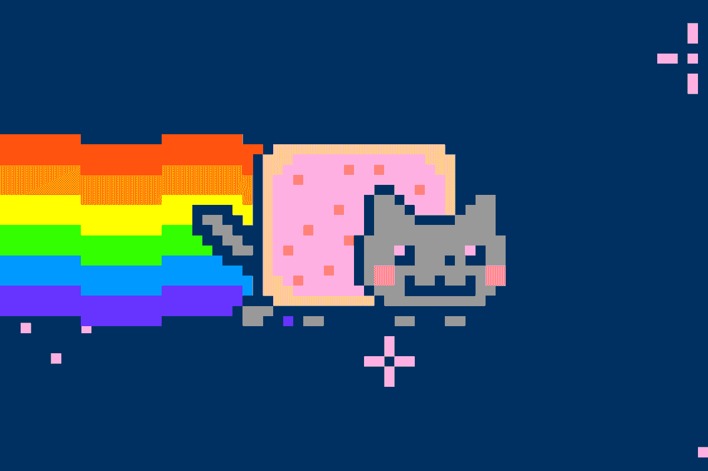

GIF Nyan Cat meme

## **格兰菲迪威士忌**

酿酒商 William Grant and Son 最近以每瓶 1.8 万美元的价格出售了 15 瓶 46 年陈酿的格兰菲迪威士忌，每瓶都附有自己的 NFT 艺术印象。NFT 允许所有者炫耀他们的购买，并作为所有权的防伪证书。

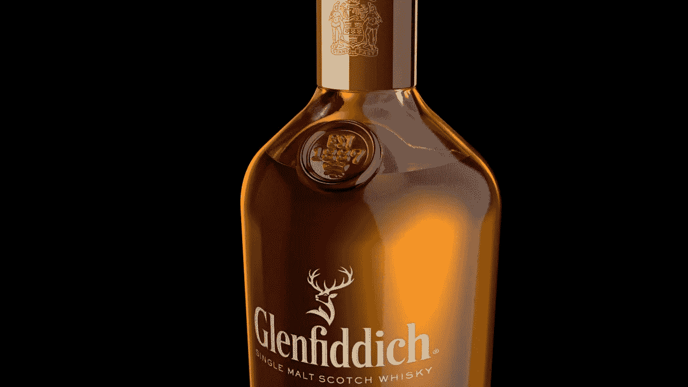

Glenfiddich whisky 15 bottles of 46-year-old

## **杰克·多西的第一条推特**

Twitter 首席执行官杰克·多西卖出了他的第一条推文，那是在 2006 年 3 月 Twitter 发布的那天。这条推文的 NFT 卖了近 300 万美元。多尔西表示，这些钱将被转换成比特币，然后捐赠给一个名为 GiveDirectly 的慈善组织。

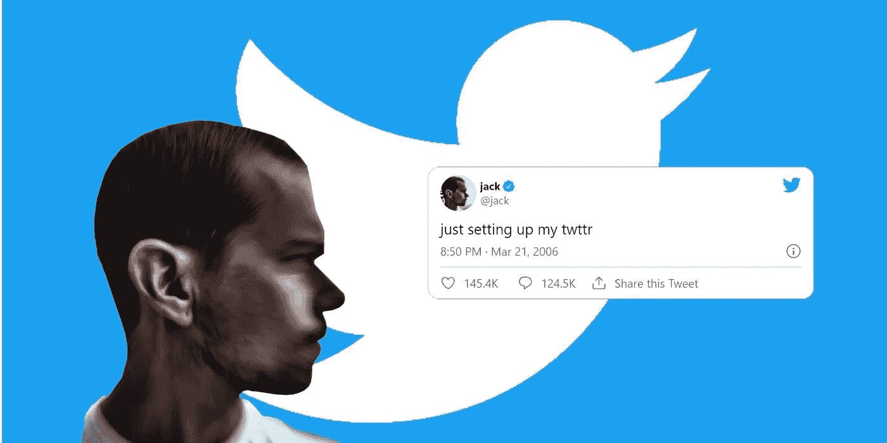

Jack Dorsey’s first Tweet

## **家具 NFTs**

阿根廷设计师安德烈斯·雷辛格出售人们可以在分散的土地或《我的世界》这样的开放世界中使用的家具。雷辛格最贵的作品售价略低于 7 万美元。

Argentinian designer Andrés Reisinger furniture NFTs

## **塔可钟 gif**

快餐巨头塔可钟委托制作了一系列基于他们菜单上的菜肴的 gif，然后作为 NFT 在网上出售。这些代币在推出后几分钟内就销售一空，塔可钟将所有销售收入捐给了该公司的慈善组织塔可钟基金会。

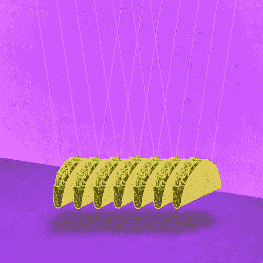

Taco Bell GIFs

## 无限轴

Axie Infinity 是一款从创立之初就绝对炸了的游戏。它引入了加密货币和 NFT 的一些方面，是这种技术更独特的例子之一。

在游戏中，你可以购买“斧头”，这是一种你用来战斗、建造和狩猎的小生物。每个 Axie 都是一个 NFT，这些已经卖到 80 万美元。玩家可以通过玩游戏赚钱，有些人甚至可以以此为职业。

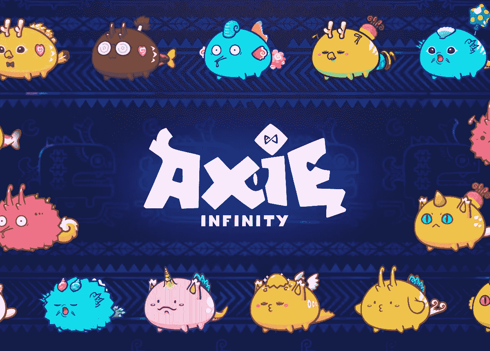

Axie Infinity

# 如何购买 NFT？

用于支持 NFTs 的技术类似于加密货币中使用的技术。所以如果你已经明白了这一点，你就领先了一步。否则，你可能需要掌握一些基本知识。

一般来说，如果你想买一辆 NFT，你必须决定四件事:

# 1.在哪里购买 NFT

下面列出的网站只是出售 NFTs 的一些网站:

*   [OpenSea](https://opensea.io/)
*   [超级罕见](https://superrare.co/)
*   [俏皮网关](https://niftygateway.com/)
*   [基础](https://foundation.app/)
*   [VIV3](https://viv3.com/)
*   [贝克斯沃普](https://www.bakeryswap.org/#/exchange/new-artworks)
*   [阿谢商场](https://marketplace.axieinfinity.com/)
*   [稀有](https://rarible.com/)
*   [NFT 展厅](https://nftshowroom.com/)

随着视频游戏中的游戏内购买，NFT 也在掀起波澜(我们确信，这让各地的父母都很高兴)。这些资产可以被玩家买卖，包括独特的剑、皮肤或头像等可玩资产。

# 2.如何选择 NFT

网上商店允许用户根据艺术品的种类、创作者、价格和其他过滤条件来搜索 NFT。如果你有兴趣购买一个有一定程度的缓存，你可以看看著名的收藏，如 CryptoPunks 和 Bored Ape Yacht Club。

但是要注意，在一个快速发展和监管宽松的空间，模仿者和骗子可能会很快出现。平台往往有知名创作者的验证账号，可以帮你选择。

对于不太出名的创造者(他们的非功能性食物可能更实惠)，德沃尔建议看看他们以前卖过什么，以及他们打算生产多少种特定类型的 NFT 等信息。例如，如果他们没有建立一个外部网站来提供关于他们艺术的信息，这可能是一个危险信号。

# 3.如何支付 NFTs

一些市场接受美元等法定货币的支付，但在其他情况下，你不能使用现金或信用卡直接支付 NFT。NFT 注册的网络所使用的加密货币的价格通常是固定的。例如，如果一个创造者在以太坊区块链铸造了你的 NFT，你会用以太坊来支付。如果区块链是索拉纳，你会用索尔

# 4.如何存储 NFT

在你购买之前，你可能必须建立一个数字钱包，它可以存储加密资产，并在其中放置足够的加密货币来支付全额费用。MetaMask 是一种通常用于购买和存储 NFT 的钱包。

不过，在你买东西之前，要确保你有一个钱包(或多个钱包)能够存放你正在使用的货币和你想要持有的 NFT。

如果你还没有加密货币，你必须选择一个交易所并购买一些。比特币基地，一个主要的加密交易所，也有一个钱包服务，可用于 NFTs。

一些服务，如 Nifty Gateway，将为您保留您的 NFT，如果您愿意将您的购买委托给第三方，这可以简化过程。

# 教程:如何在网上购买 NFT 代币

不可替代的代币可以在大量的 NFT 市场上购买，包括 OpenSea、Rarible 和 SuperRare。

以下是如何使用 Rarible 获得一些数字产品的方法:

**第一步:**转到 [Rarible](https://rarible.com/) 网站，点击右上角的“连接”按钮。从这里，选择要连接到平台的钱包并登录。

*你需要接受服务条款才能登录。*

在这个例子中，我们将使用 Metamask 连接，这是一个流行的网络和移动钱包。

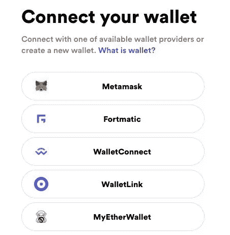

Connect wallet using Metamask

**第二步:**登录后，在平台上搜索你想要购买的 NFT。

在这个例子中，我们将展示如何购买赞高的《命运之手》。无论您想购买哪一款 NFT，流程都是相似的(假设您可以直接购买)。

一旦您选择了想要购买的 NFT，请点击“立即购买”按钮。

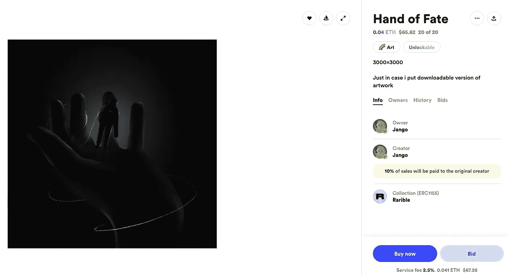

NFT you wish to purchase

**第三步:**会弹出一个确认窗口，要求您仔细检查订单的详细信息。

如果您愿意继续，请点击“继续付款”按钮进入最后一步。

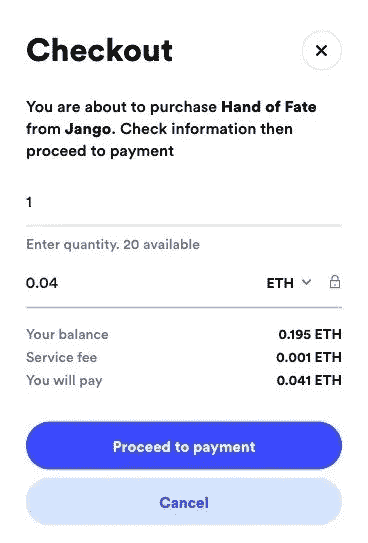

‘Proceed to payment’

**第四步:**然后会弹出你的钱包点击，要求你确认交易。同样，如果您愿意继续，只需确认交易，交易就会得到处理。

一旦确认，你的 NFT 将直接存入你的以太坊地址，并由你保管。

**注意:**您可能希望避免在高峰时段购买您的 NFT，否则您可能会面临过高的汽油费(如下例所示)。

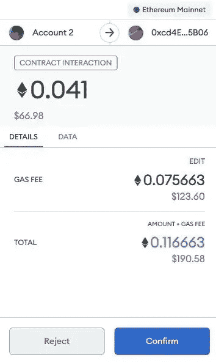

Ethereum address

# NFTs & DeFi

**不可替代的代币**也在加密货币最有趣和最具创新性的领域之一——分散金融(DeFi)领域掀起波澜。

DeFi 中如何使用 NFT 的一个例子是 Aavegotchi，这是一个由 DeFi 货币市场 Aave 资助的实验性创业公司。Aavegotchis 是在游戏世界中使用的 NFT 加密收藏品；每个 Aavegotchi 都有 Aave 的 aTokens 作为抵押品，这意味着每个 Aave 都会产生收益。如果所有者清算他们的股份，Aavegotchi 就消失了。

另一个旨在弥合 DeFi 和 NFT 社群的服务是 [Rarible](https://rarible.com/) ，这是一个分散的应用程序(或 d app)，使用户能够在 Rarible 市场上销售数字艺术品。

2020 年 7 月，Rarible 推出了 RARI，这是一种用于奖励创作者和收藏者的治理令牌；它只能通过积极参与平台来获得，这个过程被称为“市场流动性挖掘”

# NFTs 的未来

目前，围绕**不可替代代币**的大部分注意力集中在艺术品、游戏和加密收藏品上。越来越多的知名品牌开始许可他们的内容进行非功能性传播；梦幻足球游戏 Sorare 已经在其平台上注册了 100 多家足球俱乐部，而蓝精灵、《我的世界》和 BBC 的医生等都被渲染为 NFT。Twitter 在 2021 年 6 月推出了自己的 NFT 集合；几个月后，它宣布计划验证用户的 NFT 头像。

对于游戏来说，**不可替代的代币**可以用来代表游戏中的物品，比如皮肤，潜在地允许它们被移植到新游戏中或者与其他玩家进行交易。

然而，它们的潜力要大得多；可能的应用包括版权和知识产权、票务、视频游戏、音乐和电影的销售和交易。2021 年 9 月，惊悚片《零距离接触》成为第一部以 NFT 身份上映的长篇电影；几周后，疫情主题惊悚片《禁闭》紧随其后。10 月，汤姆·布拉迪的 NFT 平台亲笔签名推出了一个音乐垂直，威肯是其第一个签约。

视频游戏公司抓住了 NFTs 的可能性，刺客信条发行商育碧成为第一家在 2021 年末推出游戏内 NFTs 的主要游戏公司。包括 Konami 在内的其他游戏公司已经试验了 NFTs，但许多游戏玩家仍然对这项技术持怀疑态度；2021 年 12 月，开发商 GSC Game World 放弃了将游戏内 NFTs 纳入其游戏 S.T.A.L.K.E.R. 2:切尔诺贝利之心的计划，此前粉丝们对此普遍反弹。

NFT 也有望成为元宇宙的关键组成部分，这是一个持久的共享虚拟世界，用户可以作为 3D 化身进行互动。像 Meta(前脸书)、阿迪达斯、耐克和三星这样的公司都已经进入了元宇宙，预计会有更多的品牌跟进。

分散土地和沙盒等元宇宙平台已经利用 NFT 来表示虚拟土地的地块和游戏中的物品，如化身的衣服。迈向单一持久元宇宙的下一步可能会利用 NFTs 的互操作性，使用户能够在不同的元宇宙平台之间移动虚拟物品。

**不可替代的令牌**为安全令牌的创建以及数字和现实世界资产的令牌化增加了潜力。财产等实物资产可以被标记为部分或共享所有权。如果这些安全令牌是不可替换的，那么资产的所有权是完全可追踪和清晰的，即使只有代表部分所有权的令牌被出售。

**不可替代令牌**的进一步应用可能包括资格认证、软件许可、担保，甚至出生和死亡证明。不可替代令牌的智能合约不可改变地证明了接收者或所有者的身份，并且可以存储在数字钱包中，以便于访问和表示。有一天，我们的数字钱包可以包含我们拥有的每一个证书、许可证和资产的证明。

# **总结**

希望你已经完全理解了**不可替代令牌(NFT)的所有内容。**如果你有任何关于 NFTs 的问题，欢迎在评论区提问。在 Linkedin 上关注我，保持联系

[https://www.linkedin.com/in/ishanshahzad/](https://www.linkedin.com/in/ishanshahzad/)