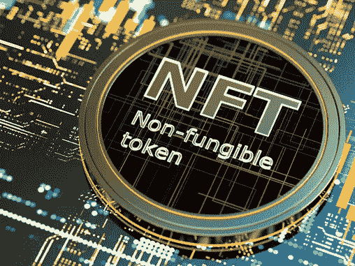
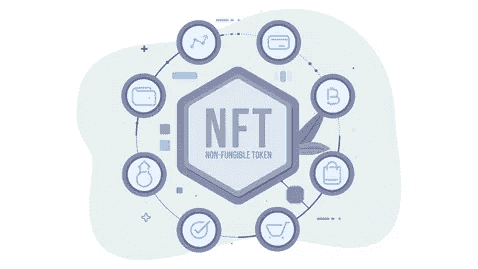

# 什么是不可替换的令牌？

> 原文：<https://medium.com/coinmonks/what-are-non-fungible-tokens-1be3d197a0fb?source=collection_archive---------38----------------------->

## 你是众多艺术家中的一员吗？他们在把作品放到网上之前会三思而后行。或者担心你的作品在网上不安全，因为任何人都可以轻易伪造或复制它们？

## 好吧，如果你对这些问题的回答是肯定的，那么你的搜索到此为止。所有的事情都可以通过 NFTs 来解决。

在这篇博客中，我们将简化:

NFTs 的历史

什么是 NFTS？

NFT 的示例

NFTs 是如何工作的？

NFT 与其他加密货币有何不同？

NFTs 的未来

让我们从一切开始的地方重新开始。

**历史 if NFTs:**

在当今的创意世界中，NFT 是不可思议的创新，它是艺术家在全球范围内创造惊人作品并将其货币化的福音。当正常生活是分布式的，创新往往会引发意想不到的想法，这些想法后来成为革命性的，一个这样的创新是互联网，另一个是区块链。在 2008 年美国分裂之后，区块链进入了这个领域，区块链是一个加密货币和 NFT 建立在其上的系统。NFTs 的想法是在 2012 年推出“彩色硬币”之后出现的。彩色硬币是代表区块链真实世界资产的独特硬币。2018 年晚些时候，NFTs 开始进入普通人的视野，然后在 2021 年初完全爆发。与其他公司相比，非正规金融公司更具市场效率和灵活性，能够促进资产转移。

**什么是 NFTS？**

NFT 是一种数字资产，它通过创建一个独特的数字签名来定义资产的所有权，可以用于真实货币加密货币或任何其他投资，如不可替代的代币，俗称 NFT。不可替换的代币意味着这些代币不可互换，并且它们中的每一个都代表特定人所拥有的独特资产，另一方面，可替换的代币是可互换的，并且可以被分成各种更小的单元来构建相同的价值。

例如，理解 200 卢比钞票是可替换的，可以换成 10 张 20 卢比钞票或两张 100 卢比钞票。然而，艺术家的艺术是不可替代的，这意味着它不能被分成不同的单元或批量生成，即使它被其他来源复制，它也不会是真实的。每个 NFTs 包含可区分的信息，如谁是数字资产的所有者，谁出售了它，使它们不同并易于验证，几乎不可能伪造任何这样的证书。它将确保每个艺术家作品的原创性。

【NFTs 是如何工作的？

NFT 基本上为数字收藏品创建了基于区块链的数字证书。这些可以是游戏、音乐、艺术等等。这个证书给你的作品一个独一无二的身份，并使它完全属于你，因此没有对象方可以伪造或复制原始作品。NFTs 使用的下划线技术和编程语言与其他加密货币如区块链和编程语言 Eth 或 script 完全相似。据专家介绍，NFT 的概念主要存在于以太坊区块链，是记录每一笔交易的分布式公共账本。一个常见的误解是 NFTs 是一种加密货币，或者说 NFTs 和加密货币没有区别。虽然它们看起来是一样的，但 NFT 不同于其他加密货币。

**NFTs vs 其他加密货币**

比特币和以太坊是常见的加密货币类型，是可互换的代币，这意味着如果你将比特币或以太坊互换，你将获得相同价值的物品作为回报。另一方面，NFT 是一种独特的不可替代的代币，这意味着如果你试图交易它，你可能会得到完全不同的金额，甚至在最糟糕的情况下你可能会失去它。NFT 最流行的一个例子是“密码朋克”。

CryptoPunks 使您能够利用以太坊区块链上持有的所有权证明来购买、出售和存储 10，000 件收藏品。到目前为止，你必须被说服以艺术家的身份购买 NFTs，以保护一幅画或其他艺术品的所有权。通过这样做，你可以保护你的作品免受任何形式的伪造。购买 NFTs 也是很特别的，它赋予你的努力以特殊的价值，这种价值后来在销售时有所贡献。总之，这对你来说是一个双赢的局面。

现在，你脑海中一定会有一个问题:**NFT 是如何变得如此受欢迎的？**

多年来，事实证明，非功能性饮食对许多人的生活是有益的。举几个例子，杰克·多西首席执行官和 Twitter 的联合创始人 Vignesh Sundaresan 以医疗车闻名，他在 Beeple 上带来了价值近 7000 万美元的 NFT。看着它越来越受欢迎，人们不相信这项技术，并愿意投资数百和数千美元的非功能性测试。

NFTs 在几个社交媒体平台上增加了新兴艺术家的媒体曝光率和特殊津贴。NFT 的流行为新兴艺术家和新的艺术平台带来了前所未有的机遇。此外，它还激励人们投资互联网平台上的各种艺术品，并促进 Instagram 等数字资产的版权。

**NFTs 的未来范围**

NFTs 是一个相当新的概念。然而，根据专家的说法，相信在未来几年，目前依赖各种加密货币的加密用户中有 40%以上将转向 NFTs 作为他们的切入点。由于其日益受欢迎的结果，NFT 有一个公平的机会来代表未来数字经济的最重要的部分。随着 NFTs 的轰炸市场，人们相信 NFT 持有者将有一个更光明的未来，并可以从 NFTS 获得巨额收益。

今天，世界正在见证数字音乐、艺术、绘画等符号化的快速发展，这使得艺术家能够从联合国授权的活动中保护他们的艺术作品，以防止任何此类活动。NFT 应用程序非常有吸引力。NFT 的现状和对非母语英语教师的积极描述。然而，有各种各样的因素对非专利技术的发展起着重要的作用。一些因素可能是 NFT 有能力存储文档并确保所有权。NFT 是数字市场未来的另一个原因是“保护资产”。除此之外，NFTs 迅速发展的一个主要原因是“促进无纸化交易”。

通过这次讨论，我们了解了 NFT 的未来范围，也有可能改变非功能性服务业增长或扩张的挑战。

第一个可以是卖家标签，因为它仍然是 NFT 面临的突出挑战。除了卖家标签，NFT 的另一个警钟是所有权，因为它已经成为音乐行业中一个颇具争议的话题。越来越多的艺术家采取法律行动反对出售他们的 NFT 音乐，这极大地影响了 NFTs 在市场上的声誉。

至此，我们结束了“什么是不可替换的令牌？”博客。希望这对你有帮助。

> 加入 Coinmonks [电报频道](https://t.me/coincodecap)和 [Youtube 频道](https://www.youtube.com/c/coinmonks/videos)了解加密交易和投资

# 另外，阅读

*   [折叠 App 审核](https://coincodecap.com/fold-app-review) | [Kucoin 交易机器人](/coinmonks/kucoin-trading-bot-automate-your-trades-8cf0ca2138e0) | [Probit 审核](https://coincodecap.com/probit-review)
*   [如何匿名购买比特币](https://coincodecap.com/buy-bitcoin-anonymously) | [比特币现金钱包](https://coincodecap.com/bitcoin-cash-wallets)
*   [币安 vs FTX](https://coincodecap.com/binance-vs-ftx) | [最佳(SOL)索拉纳钱包](https://coincodecap.com/solana-wallets)
*   [比诺莫评论](https://coincodecap.com/binomo-review) | [斯多葛派 vs 3Commas vs TradeSanta](https://coincodecap.com/stoic-vs-3commas-vs-tradesanta)
*   [Capital.com 评论](https://coincodecap.com/capital-com-review) | [香港的加密借贷平台](https://coincodecap.com/crypto-lending-hong-kong)
*   [如何在 Uniswap 上交换加密？](https://coincodecap.com/swap-crypto-on-uniswap) | [A-Ads 审查](https://coincodecap.com/a-ads-review)