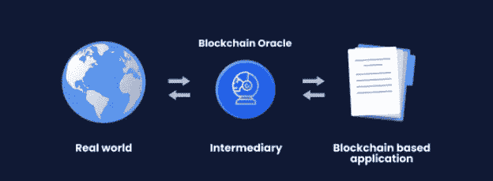
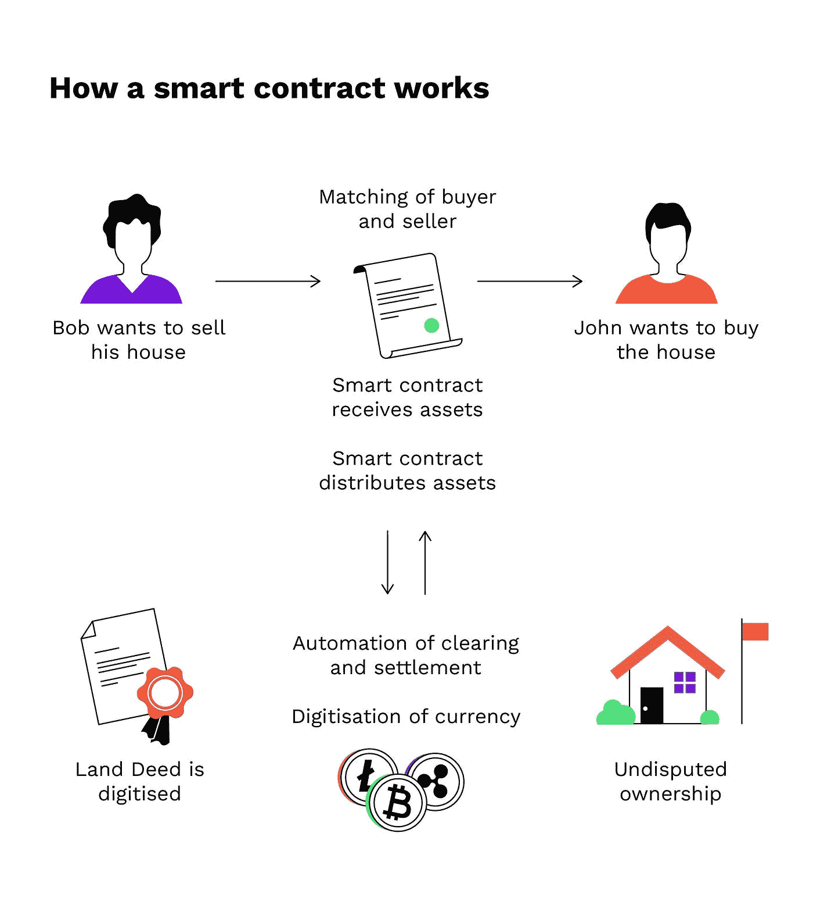
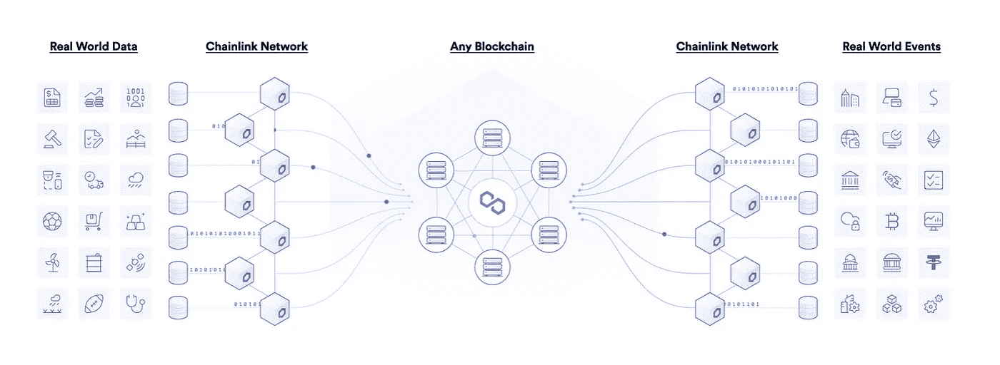

# 神谕是什么，它们重要吗？

> 原文：<https://medium.com/coinmonks/what-are-oracles-and-are-they-important-6e1a89a3312b?source=collection_archive---------72----------------------->

虽然它们可能不像另一个 P2E 游戏或 NFT 项目那样“性感”，但 Oracles 是 Blockhain 技术中少数几个已经证明了其广泛用例的东西之一，所以今天我将解释它们是如何工作的。

为了解释什么是 Orcacle，我首先要解释什么是智能合约。

智能合同是一种替代常规合同的程序。这些合同可以由任何人创建，并将规定一些要求，如果这些要求得到满足，然后支付某种形式的发生。

我举个例子解释一下。假设迈克有一辆车想卖掉。

他找到了对这辆车感兴趣的人，他叫乔希，他们已经商定了价格。现在车必须过户到乔希名下，车必须放在他名下作为他的财产。反过来，乔希必须付给迈克约定的钱。

这一过程可能包括也可能不包括公证(取决于你居住的地方的法规),将会花费相当多的时间，而且很遗憾还会有一些额外的费用。

这就是智能合同的用武之地，有了智能合同(Mike 可以很容易地自己创建)，所有这些麻烦几乎都可以自动完成。

一旦完成任务，例如交付汽车和钥匙，Mike 将命令智能合同从 Josh 的钱包中取走资金。

一个额外的好处是，智能合约减少了欺诈的可能性，因为它是建立在区块链上的。正如您可能知道的，在 Blockhain 中，每个数据点(或者称为块)都链接到它的前一个和后一个。由于这一点和散列的存在，试图改变特定块的人将不得不重新计算整个块链。

正因为如此，不可能有人篡改文件，不付钱就想拿到车。

现在，我们终于可以正确地解释神谕是什么了。您可能已经注意到，为了让智能契约工作，它必须检查指定的需求是否得到满足。当这些要求得到满足时，交易才能进行。因此，Oracle 只是现实世界和智能合约之间的一个连接，它检查需求是否得到满足。

这些预言的用例非常广泛，它们可以从检查股票/密码价格到体育游戏、在线交易、保险等等

正如你所看到的，用例的数量确实是巨大的，没有它们，这些智能契约永远无法运行，所以它们是绝对必要的。

说某样东西有广泛的用例是一回事，但我实际上也会证明给你看。让我们以 Chainlink 为例，目前它是迄今为止最大和最常用的 Oracle。

它有助于定义协议和指数，如 Aave，Celsius，Compound，DyDx，Paxos 和 Pancake swaps，以不断检查资产价格。

或 Band 协议，与 Binane 和 CoinGecko 一起可靠地提供数据。它们还有助于镜像协议，我已经讨论过了:

 [## 镜像协议，是什么？

### 简而言之，Mirror 是 Terra 链上的一个协议，它允许你在…

medium.com](/@BitcoinShrimps/mirror-protocol-what-is-it-f3d838daa643) 

最重要的是，它们还可以用于体育比分、天气、电子竞技数据和可验证的随机数生成。

# 结论

甲骨文被用作智能合约和现实世界之间的纽带。它们是绝对必要的，因为没有它们智能合约就无法工作。最重要的是，正如我向您展示的那样，他们的用例已经得到了验证。

因此，我认为在您的加密产品组合中加入甲骨文是绝对必要的，即使它们可能不是最令人兴奋的事情。

在接下来的几天里，我将写一篇关于我最喜欢的先知的评论，请继续关注。