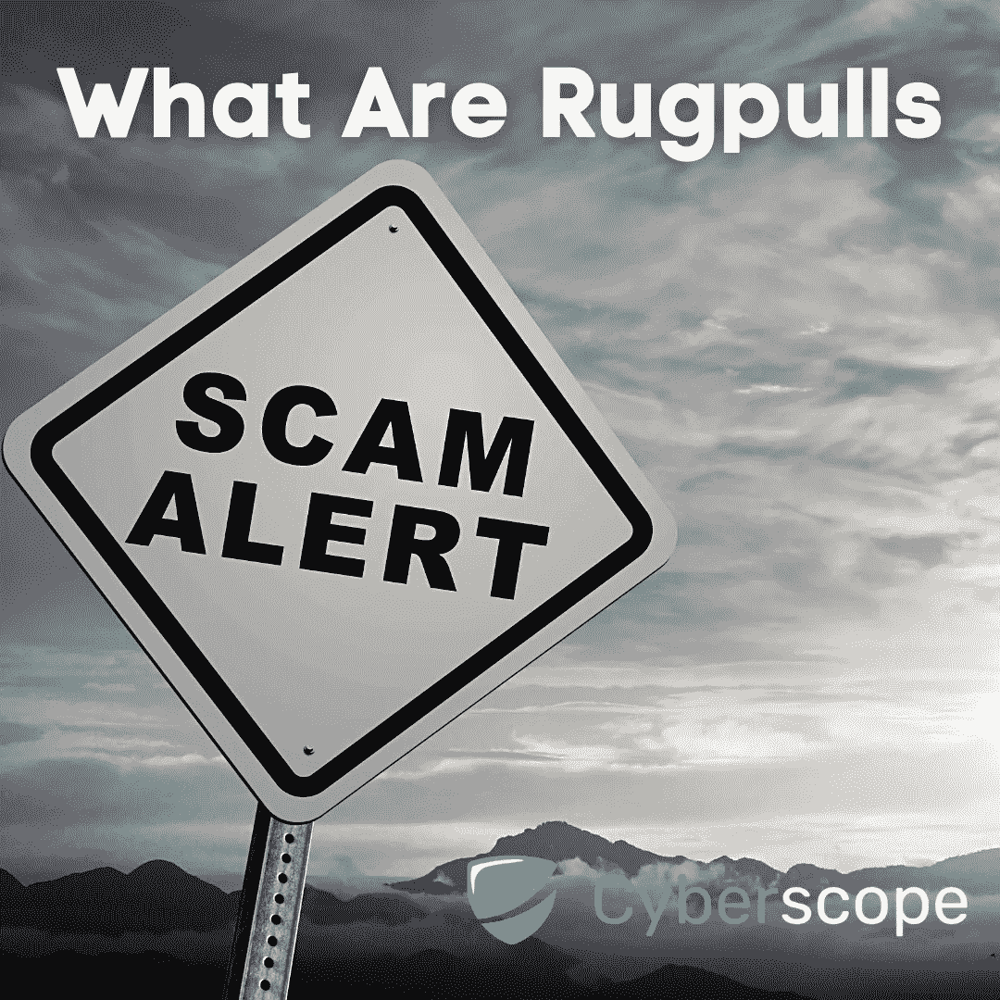
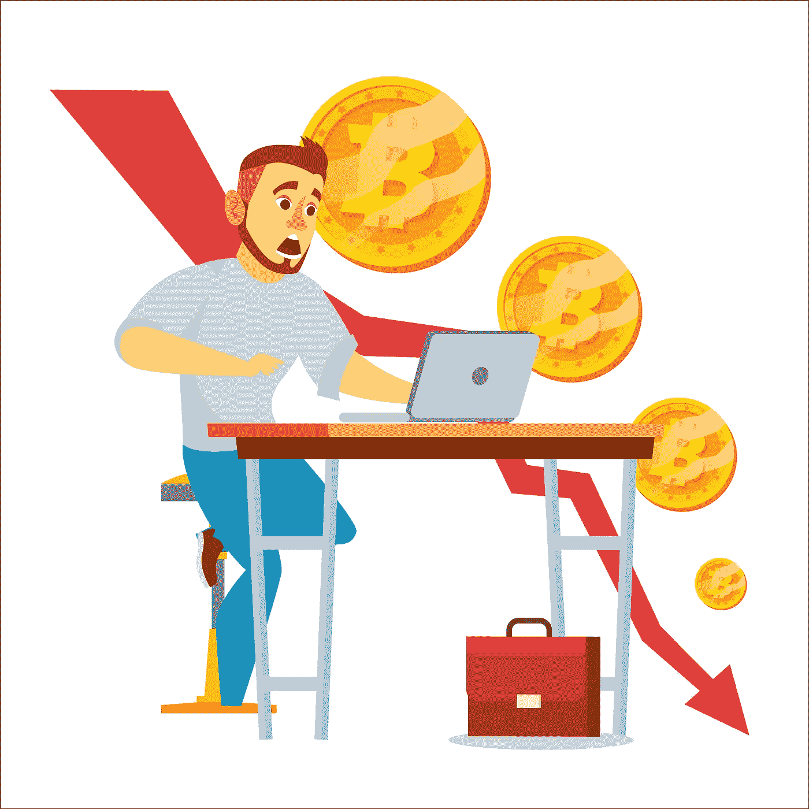
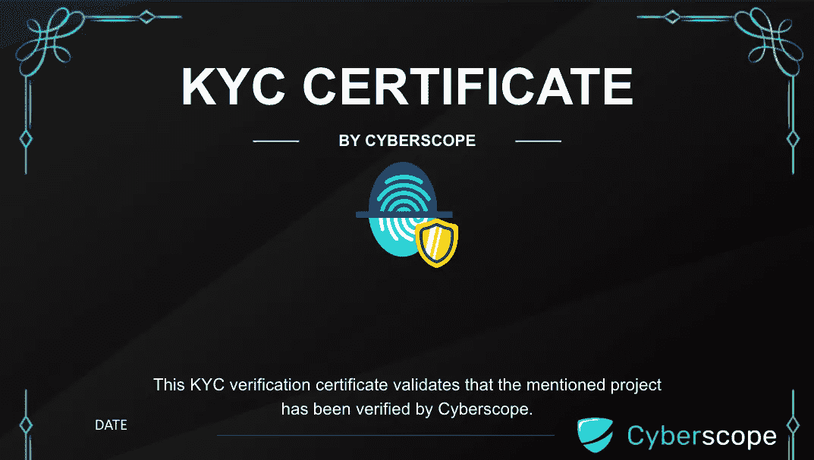

# 什么是地毯拉手，如何避免被骗

> 原文：<https://medium.com/coinmonks/what-are-rug-pulls-and-how-you-can-avoid-getting-scammed-299439934a46?source=collection_archive---------46----------------------->

正如我们大多数人所知，在投资方面，加密货币的世界充满了地雷。一份新的美国联邦贸易委员会报告称，自 2021 年初以来，加密货币骗子已经从超过 46，000 人那里窃取了超过 10 亿美元。

自 2018 年以来，加密诈骗出现了前所未有的增长，高达 60 倍。在这个行业中，人们会遇到的最常见的骗局之一就是拉地毯。在本指南中，我们将探讨什么是拉地毯，如果你想避免成为拉地毯的受害者，需要寻找哪些迹象。

# 什么是地毯拉手？

当一个欺诈性的项目团队创建一个新的加密令牌，然后在放弃它们之前尽可能多地从中获取价值，直到它们的价格降到零时，就发生了一场骗局。项目所有者(或团队)有时有权取消其代币的流动性，使公共投资者购买的代币变得一文不值。

拉地毯是一种退出骗局，也是最常见的分散融资(DeFi)利用方式之一。

# 硬地毯拉手与软地毯拉手

地毯拉手通常有两种不同的形式，硬的和软的。当代币背后的开发团队将从项目中移除所有流动性，出售他们的代币，并且通常会消失时，这是一个硬地毯拉。通常，当这种情况发生时，很难收回你的资金，但不是不可能。

软地毯拉(或慢地毯拉)是指项目背后的开发团队放弃了他们的令牌，但继续向投资者保证他们仍在为项目工作。柔软的地毯通常给骗子带来较少的利润，但很难对他们提起诉讼。这是因为要证明团队是否真的放弃了项目并不容易。

# 如何避免拉地毯

虽然你不可能 100%安全地避免地毯拉扯(尤其是柔软/缓慢的地毯拉扯)，但在投资新项目之前，需要注意以下几点:

## 锁定流动性

当投资者购买流动性池未被锁定的代币时，他们最常成为拉地毯的受害者。如果代币供应没有流动性锁定，没有什么能阻止项目所有者带着全部流动性逃跑。确保你投资的代币的流动性至少有 90%被锁定，以确保你的投资没有被硬拉的风险。

## 锁定的团队令牌

在你的投资中要考虑的另一个重要的事情是项目的象征经济学。代币的队伍自己持有多少代币？他们是否锁定了他们的代币，或者他们是否制定了某种可行权计划？锁定团队代币意味着团队在锁定期结束前不能出售代币(或部分代币)。一个好的项目团队不会在他们的加密货币项目启动后至少几个月内出售他们的任何代币。

## KYC 和审计

最后但同样重要的是，始终检查项目团队是否审核了他们的智能合同，以及他们是否通过了像 Cyberscope 这样的受欢迎的网络安全公司的 KYC 验证。[智能合同审计](https://www.coinscope.co/blog/crypto-audit-firms)将发现任何潜在的漏洞，但不会保护您免受软硬手段的攻击。另一方面，KYC 将保持项目业主的责任，以防他们执行软或硬地毯拉。在这种情况下，KYC 提供商可以使用项目团队的证书，并对他们采取法律行动，并有可能收回您的资金。

# 结论

投资加密项目伴随着许多潜在的风险(也有收益！).确保你总是 DYOR(做你自己的研究)并关注我们在 [Cyberscope](/@cyberscope) 的指南，在这里我们的日常任务是保护散户投资者和交易者免受骗子和欺诈者的伤害。

[*Cyberscope*](https://www.cyberscope.io/) *是密码行业领先的智能合同审计& KYC 公司之一，已经审计了 500 多个区块链项目和 NFT。所有主要发射台的官方合作伙伴。*

…

*最初发布于*[*https://www . cyber scope . io*](https://www.cyberscope.io/)*。*

> 加入 Coinmonks [电报频道](https://t.me/coincodecap)和 [Youtube 频道](https://www.youtube.com/c/coinmonks/videos)了解加密交易和投资

# 另外，阅读

*   [3 商业评论](/coinmonks/3commas-review-an-excellent-crypto-trading-bot-2020-1313a58bec92) | [Pionex 评论](https://coincodecap.com/pionex-review-exchange-with-crypto-trading-bot) | [Coinrule 评论](/coinmonks/coinrule-review-2021-a-beginner-friendly-crypto-trading-bot-daf0504848ba)
*   [莱杰 vs Ngrave](/coinmonks/ledger-vs-ngrave-zero-7e40f0c1d694) | [莱杰 nano s vs x](/coinmonks/ledger-nano-s-vs-x-battery-hardware-price-storage-59a6663fe3b0) | [币安评论](/coinmonks/binance-review-ee10d3bf3b6e)
*   [加密交易机器人](/coinmonks/crypto-trading-bot-c2ffce8acb2a) | [Bingbon 评论](https://coincodecap.com/bingbon-review)
*   [Bybit Exchange 审查](/coinmonks/bybit-exchange-review-dbd570019b71) | [Bityard 审查](https://coincodecap.com/bityard-reivew) | [Jet-Bot 审查](https://coincodecap.com/jet-bot-review)
*   [3 commas vs crypto hopper](/coinmonks/3commas-vs-pionex-vs-cryptohopper-best-crypto-bot-6a98d2baa203)|[赚取加密利息](/coinmonks/earn-crypto-interest-b10b810fdda3)
*   最好的比特币[硬件钱包](/coinmonks/hardware-wallets-dfa1211730c6) | [BitBox02 回顾](/coinmonks/bitbox02-review-your-swiss-bitcoin-hardware-wallet-c36c88fff29)