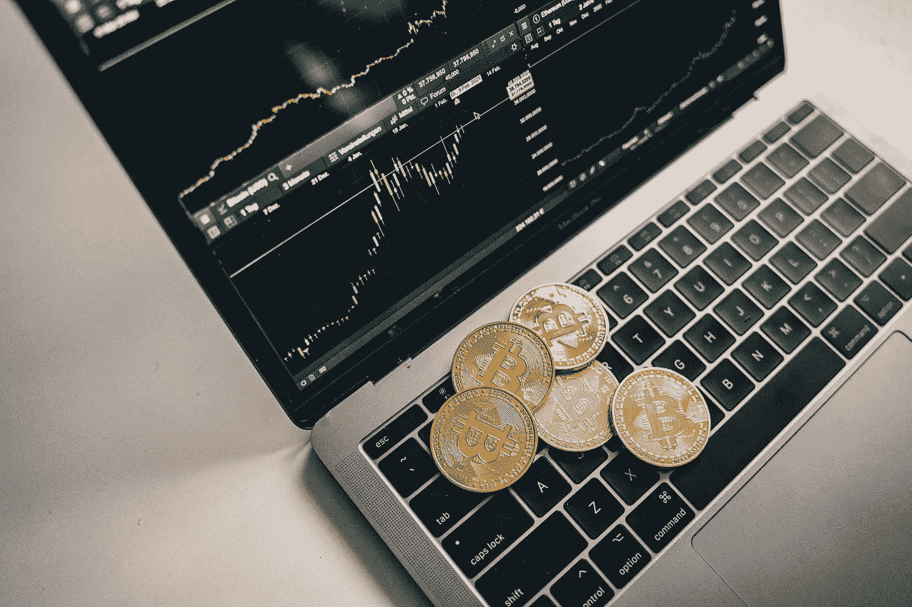

# 分散融资中的障碍是什么，如何避免？

> 原文：<https://medium.com/coinmonks/what-are-rug-pulls-in-decentralized-finance-and-how-to-avoid-them-ba71f0108bd9?source=collection_archive---------32----------------------->

Photo by [Alesia Kozik](https://www.pexels.com/photo/coins-on-top-of-a-laptop-6770774/)

我们称之为地毯拉，是加密货币世界中的一种操纵技术，其中 Defi 项目所有者放弃项目，并通过谎报应该需要修复的软件问题来卷走投资者的钱。

它们是 Defi 生态系统和分散交易所中最常见的。

这使得他们最容易受到这种恶意的伤害，因为他们大多不受监管。

保持安全的一个方法是检查给定池的流动性与给定项目有什么关联。

流动性越高，Defi 项目越强。但这并不能解决所有问题。检查这类项目的结算和谁是幕后黑手同样重要。

## 研究创始人的历史也很重要。

不要盲目地跟随任何新闻和投资计划，被虚假的高回报广告所迷惑，去收集或下注你的硬币。创始人的支持者是谁？过去有没有针对他们的报道？

## 真正的硬币项目更有可能在社交媒体上获得成功，显示出足够的存在、社区参与和积极的反馈。

研究它是非常有用的，因为如果有的话，你很可能会遇到警告信号。

依靠用户在社交媒体评论上的评论，而不是那些可能因出售特定代币或为特定硬币做广告而获得报酬的影响者。

任何 Defi 项目背后的基础都是流动性池，因此没有足够的流动性，他们就不能提供交易功能，如代币交换、加密借贷、自动做市商(AMMs)等。为了推动 Defi 引擎，这些服务组合在一起，因为它们需要相关流动性池中有足够的流动性才能平稳运行。

重要的是，要始终注意了解该平台对集合代币最可信和最值得信赖的项目实施的锁定期，将集合流动性锁定一段时间，以保护投资者的利益。

这两种骗局和欺诈并不罕见，即使是在监管有序、历史悠久的股票市场。

因此，由于加密货币领域高度不受监管，加上 DeFi 领域的资本洪流，增加了退出骗局和拉地毯的风险。

数十亿美元危在旦夕，需要一种结构性的有效调查解决方案来应对日益增长的加密欺诈风险。

> 加入 Coinmonks [电报频道](https://t.me/coincodecap)和 [Youtube 频道](https://www.youtube.com/c/coinmonks/videos)了解加密交易和投资

# 另外，阅读

*   [OKEx vs KuCoin](https://coincodecap.com/okex-kucoin) | [摄氏替代度](https://coincodecap.com/celsius-alternatives) | [如何购买 VeChain](https://coincodecap.com/buy-vechain)
*   [币安期货交易](https://coincodecap.com/binance-futures-trading)|[3 commas vs Mudrex vs eToro](https://coincodecap.com/mudrex-3commas-etoro)
*   [如何购买 Monero](https://coincodecap.com/buy-monero) | [IDEX 评论](https://coincodecap.com/idex-review) | [BitKan 交易机器人](https://coincodecap.com/bitkan-trading-bot)
*   [CoinDCX 评论](/coinmonks/coindcx-review-8444db3621a2) | [加密保证金交易交易所](https://coincodecap.com/crypto-margin-trading-exchanges)
*   [红狗赌场评论](https://coincodecap.com/red-dog-casino-review) | [Swyftx 评论](https://coincodecap.com/swyftx-review) | [CoinGate 评论](https://coincodecap.com/coingate-review)
*   [Bookmap 评论](https://coincodecap.com/bookmap-review-2021-best-trading-software) | [美国 5 大最佳加密交易所](https://coincodecap.com/crypto-exchange-usa)