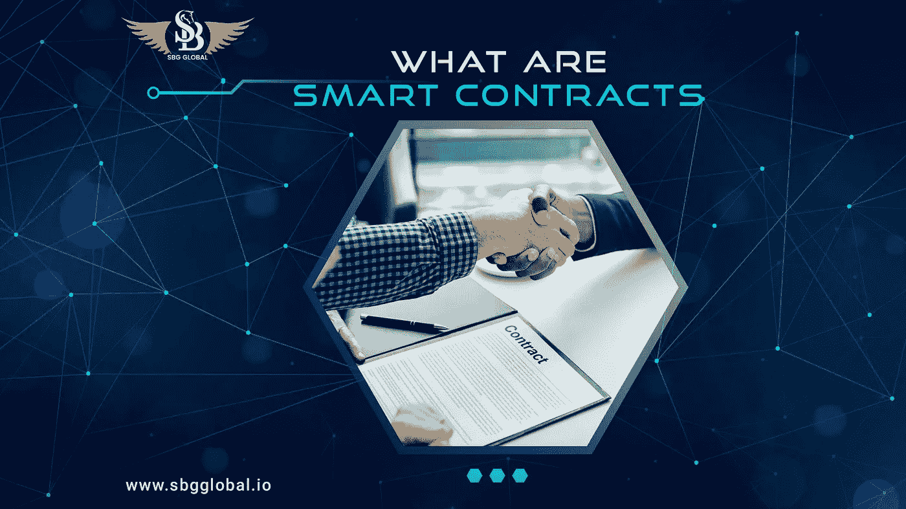

# 什么是智能合约？

> 原文：<https://medium.com/coinmonks/what-are-smart-contracts-184d92f8954e?source=collection_archive---------67----------------------->

**智能合约解释**

智能合约只是放在区块链上的项目，当预先设定的条件得到满足时就会运行。他们经常被用于机械化安排的执行，因此所有成员可以迅速确定结果，几乎没有调解人的参与或时间的不幸。他们同样可以将工作过程计算机化，当条件满足时，引发下列活动。

**智能合同如何工作**

智能合约的工作原理是遵循基本的“万一/何时……”声明，这些声明被写入区块链的代码中。当预先规定的条件得到满足和检查时，PCs 组织执行活动。这些活动可以包括将资产交付给合适的聚会、登记车辆、发送通知或者给一张票。交换完成后，区块链将被刷新。这意味着交换是不可改变的，只有获得同意的集会才能看到结果。

然而，在智能合约中，可能会有许多限制，这取决于满足成员愉快地完成任务的情况。为了制定条款，会员应决定如何在区块链上处理交易所及其信息，确定“如果/当…然后…”的决定，监督这些交易所，调查每一个可以想到的豁免，并描述解决问题的系统。

[然后，在这一点上，精明的协议可以由设计师定制——尽管是渐进的，利用区块链开展业务的协会会提供布局、网络界面和其他基于互联网的设备，以重新安排组织智能合同。](https://blog.sbgglobal.io/smart-contracts-explained/)

> *加入 Coinmonks* [*电报频道*](https://t.me/coincodecap) *和* [*Youtube 频道*](https://www.youtube.com/c/coinmonks/videos) *了解加密交易和投资*

# 另外，阅读

*   [Bookmap 点评](https://coincodecap.com/bookmap-review-2021-best-trading-software) | [美国 5 大最佳加密交易所](https://coincodecap.com/crypto-exchange-usa)
*   最佳加密[硬件钱包](/coinmonks/hardware-wallets-dfa1211730c6) | [Bitbns 评论](/coinmonks/bitbns-review-38256a07e161)
*   [新加坡十大最佳加密交易所](https://coincodecap.com/crypto-exchange-in-singapore) | [收购 AXS](https://coincodecap.com/buy-axs-token)
*   [红狗赌场评论](https://coincodecap.com/red-dog-casino-review) | [Swyftx 评论](https://coincodecap.com/swyftx-review) | [CoinGate 评论](https://coincodecap.com/coingate-review)
*   [投资印度的最佳加密软件](https://coincodecap.com/best-crypto-to-invest-in-india-in-2021)|[WazirX P2P](https://coincodecap.com/wazirx-p2p)|[Hi Dollar Review](https://coincodecap.com/hi-dollar-review)