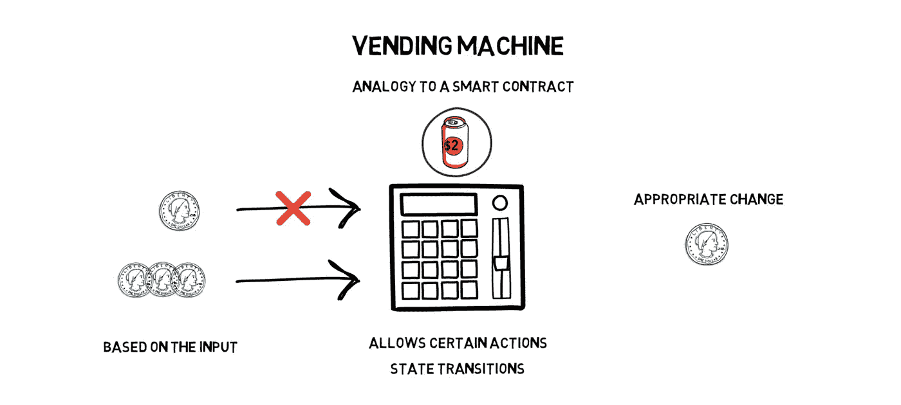
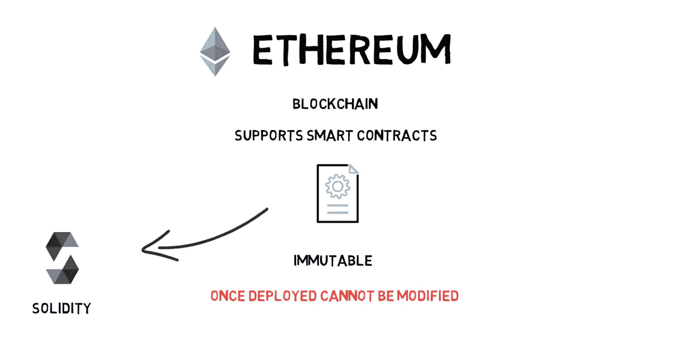
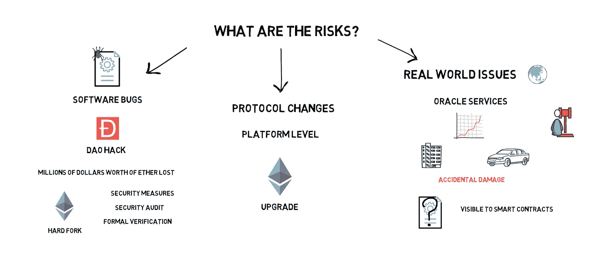

# 什么是智能合约？

> 原文：<https://medium.com/coinmonks/what-are-smart-contracts-1fd39434e794?source=collection_archive---------58----------------------->

在我们的 YouTube 上观看视频的同时，享受这个流的资源！

YouTube:[https://youtu.be/B1egtVJyNHw](https://youtu.be/B1egtVJyNHw)

不和:【https://discord.gg/J73qhkj7kr】T2

推特:【https://twitter.com/CryptoverseDAO】

linktree:[https://linktr.ee/cryptoversedao](https://linktr.ee/cryptoversedao)

-

什么是智能合同:

智能合同这个术语自提出以来已经获得了大量的宣传；就像人工智能、机器学习、区块链等其他热门术语一样，它一直是人们关注的焦点。智能合同，也称为加密合同，是自动计算机程序，支持货币交易、数字资产交易和其他类型的业务。这些交易由一组预定义的规则保护，这些规则被称为智能合约系统。因此，智能合同不仅保证双方遵守智能合同的原则和规定，而且自动履行合同义务。

法典就是法律

你听说过“代码就是法律”这种说法吗？技术是用来执行规则的。这样的话，我们还需要律师吗？或者，也许我们可以生活在一个完全自动化的世界里，代码决定我们能做什么，不能做什么。随着智能合约的发展，这一未来场景可能比我们想象的更近。

什么是智能合同？

智能合约是一段可以以确定的方式自动执行的代码。智能合约代码通常存储在区块链上并在其上执行，以使其不可信且安全。智能合约还具有接收、存储、发送资金，甚至调用其他智能合约的能力。它们遵循 if-then 语义，这使得它们很容易编程。

智能合同旨在消除决策中的人为因素。在标准的传统合同中，人的因素通常被证明是最容易出错和最不可靠的因素。

自动售货机经常被作为智能合同的一个很好的类比，因为它有一些相似之处。典型的自动售货机被编程为允许基于输入的特定动作和状态转换。它也以完全确定的方式工作。例如，如果你想买一罐 2 美元的可乐，但无论你尝试多少次，你都只有 1 美元，你将无法得到饮料。另一方面，如果你插入 3 美元，机器会给你一罐可乐和适当的零钱。甚至给出的零钱也是以预先定义和编程的方式选择的，基于哪些硬币可用以及机器想要首先处理哪些硬币。

智能合约可以完全依赖于区块链上可用的信息，例如，如果你给我 10 个代币 A，我就给你 10 个代币 B(假设这两个代币在同一个区块链上都可用)，或者它可以依赖于外部数据源，例如以太坊或 S&P500 价格。后一个例子增加了智能合约的难度，因为它们必须信任真实世界的数据。使用 oracle 服务可以最大限度地减少所需的信任，但即使是 oracle 服务也必须是可信的。已经有几个项目通过使用某些激励措施使 oracles 更有可能提供正确的数据。Chainlink 是一个在这个类别中脱颖而出的项目。

以太坊是区块链的一个很好的例子，它支持智能合约，并使程序员实现他们的智能合约成为可能。智能合同可以用一种叫做 Solidity 的编程语言来编写，Solidity 就是专门为这个目的而开发的。在以太坊中，所有部署的智能合约都是不可变的。这意味着一旦部署，它们就不能被修改，这就产生了一定的风险，我们将在后面讨论。以太坊上的智能合约也是分散的，这意味着没有一台机器控制合约。以太坊网络的所有节点存储具有相同状态的相同契约。

虽然以太坊是目前最受欢迎的通用智能合约平台，但它不是唯一的平台，它有几个竞争对手。其中一些是卡尔达诺，泰佐斯，EOS 和创，但不是所有的都有相同的特征。

智能合约这个术语是由著名的密码学家 Nick Szabo 在 20 世纪 90 年代早期创造的。这个名字虽然不是最不言自明的，但却很常用，尤其是在区块链行业。

智能合同与传统合同

要了解智能合约的优势，让我们将一个假设的智能合约与传统领域中的对等合约进行比较。

假设我们要写下面的契约。

如果爱丽丝发送 X 个令牌 A，而鲍勃发送相同数量的令牌 B，则令牌将被交换，爱丽丝将收到鲍勃的令牌，鲍勃将收到爱丽丝的令牌。

在一个非智能契约世界中，实现这一点的一种方法是与第三方创建一个托管契约，而不必让 Alice 信任 Bob，也不必让 Bob 信任 Alice。第三方将从 Alice 收集令牌，等待来自 Bob 的相同数量的令牌 B，并向 Alice 和 Bob 发送它们各自交换的令牌。这种方法已经显示了 Alice 和 Bob 可能面临的一些问题。

信任中介。不能保证第三方在收到 Alice 和 Bob 的资金后不会跑掉(或丢失)代币。我们必须依靠中介的声誉和潜在的保险。这种方法是不确定的，如果出现问题，它可能会有不同的输出，这取决于多种因素，包括潜在案件将解决的司法管辖区。另一方面，智能合同将以完全自动化和确定性的方式工作，确保双方在满足存款硬币的初始标准时收到资金。智能合约还可以在自身内部持有资金，这在传统世界中是不可能实现的。

速度。根据中介的不同，Alice 和 Bob 可能需要等待几天或几周才能完成令牌的转换。如果他们想在周日交换代币呢？中介到底有没有在运营？有了智能合同，这类问题就不存在了，合同可以在满足初始条件后几秒钟内完成。

成本。传统合同不仅昂贵，因为中介必须从中获利，而且如果合同有任何问题，仲裁和执行等方面的隐性成本也存在巨大风险。

可重用性。负责交换 Alice 和 Bob 的令牌的同一个智能合约可以被任何想要交换令牌的人使用。在传统世界中，他们都必须签署单独的合同，并向中介支付各自的费用。

欺诈。这是另一项隐性成本，这次是中介本身的成本。在初始化交换之前，中介必须确保 Alice 和 Bob 的令牌都是合法的。欺诈在传统金融领域非常普遍，大多数公司都有庞大的团队专门致力于防范欺诈。通过智能合同，代币可以在区块链上验证，通过数字签名，Alice 和 Bob 是否有资格使用代币就一目了然了。

智能合同有越来越多的用例，从支付和分散融资到供应链和众筹。智能契约也是分散式应用程序或 Dapps 的基本构件。下面讲几个智能合约的例子。

分散金融或 Defi 是严重依赖智能合同的新行业之一。这一领域已经建立的一些东西包括。

分散稳定币

通过巧妙利用智能合约和某些激励措施，我们可以创造一种与美元挂钩的稳定货币，而不必在现实世界中储存美元。MakerDAO 是使之成为可能的公司之一。

自动化流动性供应

一组智能合约可以允许用户以完全无许可和分散的方式提供流动性和交换令牌。Uniswap 或 Kyber 网络就是这种协议的很好的例子。

另一个用例是为供应链提供更多的透明度，像 OrginTrail 这样的协议在其中发挥作用。

谈到众筹，你可以想象一份合同，一旦某些目标得到满足并得到社区的验证，该合同就会释放资金。

这还不止于此。是时候多举一些未来的例子了。

如果智能合同可以促进拼车、公寓出租等事情，会怎么样？

慈善怎么样？你可以想象一个完全自动化的基金，不通过任何中介，直接把钱送到最需要的人手中。例如，该基金可以确定某个地区遭受了飓风袭击，并将资金转移到世界的那个地区。现在，这听起来很不可能，但是当我们说话的时候，所有必要的因素都在建立。

智能合约的用例几乎是无限的，但在我们实现所有这些之前，我们必须解决几个问题。

智能合约的主要风险之一是困扰其他软件的问题——bug。

智能合约中的错误的最好例子是 DAO 黑客攻击，由于攻击者能够从智能合约中提取资金，导致了价值数百万美元的以太网损失。这导致以太坊硬分叉，在以太坊社区制造了很多分歧。

自从 DAO hack 事件后，以太坊社区想出了很多额外的安全措施。如今，几乎所有流行的智能合同都经过了安全审计，通常是由多个团队进行的。除此之外，有一种趋势是使用正式的验证方法来证明某些合同将总是按照预期的方式运行。

协议变更。

即使智能合约没有任何错误并且已经过审计，我们仍然不能保证平台级别的更改不会导致任何问题。我们可以想象一种情况，升级到以太坊本身可能会导致某些智能合约开始表现出与之前预期不同的行为。

> 加入 Coinmonks [电报集团](https://t.me/joinchat/Trz8jaxd6xEsBI4p)，了解加密交易和投资

现实世界中的问题无法通过 oracle 服务轻松传达。

Oracle 服务确实可以提供一种可靠的方式将真实世界的信息传递到区块链。例如，正如我们前面提到的，他们可以提供以太坊或 S&P500 价格。现在想象一下，你租了一套公寓或一辆汽车，并造成了一些意外损坏。没有任何人工干预的智能契约怎么可能知道它呢？有很多这样的例子，很难想象现实世界中发生的意想不到的事情是如何被智能合约发现的。

除此之外，还有其他风险，如监管或税收，但我相信这些最终都可以解决。

智能合约可能无法做到理论上承诺的所有事情，至少目前是这样。以下是主要原因:

智能合约并不‘智能’。
智能编码合约并非天生智能或聪明。它们之所以被称为“智能”,是因为它们内置了自动化和条件执行功能，并且不需要第三方干预。但在现实中，他们不能判断情况，并按照“准则即法律”的原则行事。虽然这是有用的，但也是有害的。例如，合同中的条件不能更改或篡改，即使双方都同意协议之外的条件。智能合约只是执行双方同意的条件，并在任何状态下遵循代码。

创建智能合同是非常复杂和乏味的。智能合约缺乏实际应用的另一个原因是编写智能合约的复杂工程。智能契约应该是图灵完全的，即智能契约可以模拟任何图灵机。为此，它必须非常复杂，这反过来又使它们难以分析。问题在于安全性。如果智能合约有漏洞，它就可能被违反，使用它就没有意义。分析一个图灵完全智能契约成为一项艰巨的任务。即使是普通的合同也需要多年的专业知识和一致的构建和修复来满足用户需求。

智能合约摘要:
优点
全自动
确定性结果
不可信
快速
精确
安全
经济高效
透明

缺点
软件漏洞
协议变更
法规不明确
税收不明确

