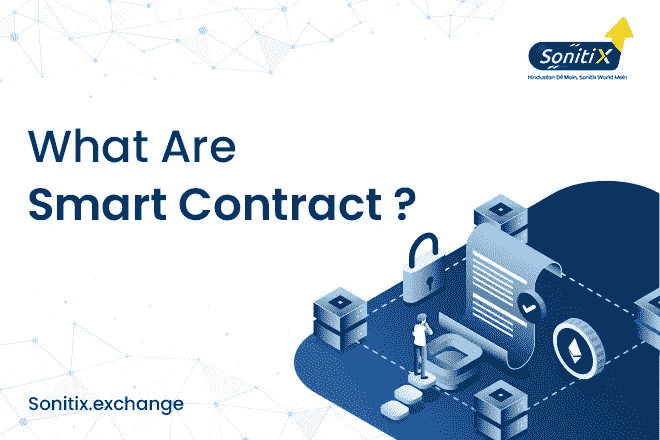

# 什么是智能合约？

> 原文：<https://medium.com/coinmonks/what-are-smart-contracts-a4781b6204c6?source=collection_archive---------68----------------------->

What Are Smart Contracts

智能合约是一项新技术，在处理趋势时，你应该了解什么是智能合约以及它们是如何工作的？有什么好处，用在哪些部门？

让我们先了解一下到底什么是智能合约？用简单的术语来定义智能合约就是存储在区块链上的程序，当条件满足时运行。这些合同

处理写在区块链代码上的条件语句，如果满足任何提供的条件，一个叫做节点(计算机网络)的系统就执行程序。这些合同是自治的、分散的和透明的，它们通常是不可逆的和不可修改的。

智能合同的想法最初是由计算机科学家尼克·萨伯在 1994 年提出的。这些区块链在每次交易后被更新，即没有机会改变已经授予查看结果的许可的交易方。智能合约中发生的这些交易都是通过区块链进行的。不涉及第三方。智能合同用于金融贸易和服务、保险、信用授权、法律程序和众筹协议。智能合约在多个区块链网络上创建。它们大部分是使用以太坊的原始编码语言 solidity 创建的。简单地说，智能合同是存在于分布式区块链网络中的数字合同，它在给定的条件下执行任务。

**重要的是要注意智能合约的应用:-**

*   智能合约可用于投票系统。智能合同可以使投票系统不那么容易受到欺诈和操纵的影响。智能合约将增加投票时的参与者数量。
*   智能合同将有助于保持患者记录的私密性。只有特定的人才有权访问记录。患者的收据可以存储在区块链上，该收据可以由医院自动提供给保险公司作为工作证明。
*   它改变了传统的基于纸张的方法，如索赔保险、提供适当的文档等。智能合约的其他好处是什么
*   没有第三方风险。详细来说，智能合约不需要任何中间环节，这就减少了经纪费用。因此，这使得整个系统免受欺诈，并且可以负担得起，因为这样可以节省大量资金。
*   每次交易后，区块链都会更新。因此，这种升级会导致原始数据的恢复，这有助于数据备份。也就是说，即使由于任何原因导致数据丢失，备份也始终可用，并且不会因为任何原因导致任何丢失。
*   在任何值得尊敬的领域的任何方面，安全是每个候选人主要关心的问题。智能合同中的数据是加密的，这提供了高安全性。
*   在所提供的条件下完成任何所提供的任务都是由节点(计算机网络)来执行的，这使得它很快。因此，该系统工作速度很快。
*   智能合约非常准确，因为它消除了人工填写表格或任何文档时发生的错误。
*   透明度是任何智能合同的另一个主要因素。但是每种好处都有局限性，每种技术都有一定的局限性。智能合约也有一定的局限性，它们是:
*   这些合同是不可撤销和不可修改的。编码时发生的任何错误或任何特定错误都是不可逆转的。当涉及到小错误时，会有一个大的过程。
*   在某个地方使用智能合约，很难确保根据达成的协议来满足条款。
*   没有完全消除第三方。由于某种原因，编码提供的需求需要第三方，所以这些团体永远不可能被完全消除。

**结论:**

智能合同有助于我们消除第三方，从而提高成本效益。是新技术为我们提供了更好更简单的理解合同条款的方法，而不是传统的方法。加密代码使其高度安全，计算机响应技术的参与使其快速。简而言之，智能合约是好技术的完整组合。

如果你想跟上加密货币行业的趋势，请加入我们在 [Discord](https://discord.gg/FStQ26T89J) 、 [Reddit](https://www.reddit.com/user/Sonitixexchange) 和 [Telegram](https://t.me/+JgmgBJTzvaA0NDBl) 上的社区

> 加入 Coinmonks [电报频道](https://t.me/coincodecap)和 [Youtube 频道](https://www.youtube.com/c/coinmonks/videos)了解加密交易和投资

# 另外，阅读

*   [BigONE 交易所评论](/coinmonks/bigone-exchange-review-64705d85a1d4) | [电网交易机器人](https://coincodecap.com/grid-trading)
*   [氹欞侊贸易评论](https://coincodecap.com/anny-trade-review) | [CoinSpot 评论](https://coincodecap.com/coinspot-review)
*   [新加坡十大最佳加密交易所](https://coincodecap.com/crypto-exchange-in-singapore) | [收购 AXS](https://coincodecap.com/buy-axs-token)
*   [投资印度的最佳加密软件](https://coincodecap.com/best-crypto-to-invest-in-india-in-2021) | [WazirX P2P](https://coincodecap.com/wazirx-p2p)
*   [西班牙 5 大最佳文案交易平台](https://coincodecap.com/copy-trading-spain)
*   [Pionex 双重投资](https://coincodecap.com/pionex-dual-investment) | [AdvCash 审查](https://coincodecap.com/advcash-review) | [支持审查](https://coincodecap.com/uphold-review)