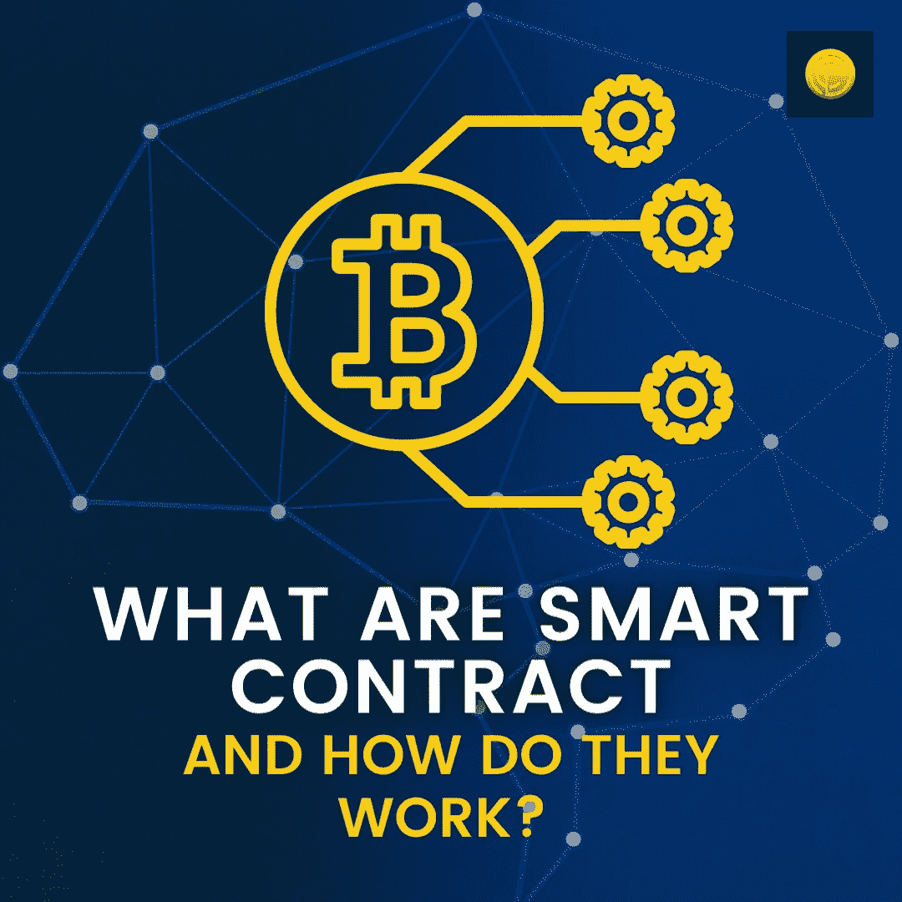

# 什么是智能合约，它们是如何工作的？

> 原文：<https://medium.com/coinmonks/what-are-smart-contracts-and-how-do-they-work-3011a808e32?source=collection_archive---------62----------------------->

[区块链](https://www.coindhan.com/)和加密货币已经证明了自己的革命性！然而，需要注意的是为什么？基本上是因为他们已经消除了对第三方的依赖，并恢复了社区的权力。但是这是如何实现的呢？也许，通过代码，这就是为什么著名的口头禅，“在代码中，我们信任”每天都充斥着密码诗。但是，是什么定义了代码和去中心化生态系统的运作——智能联系人

# 什么是智能合约？

智能合约是一种自动执行的可编程代码，它基于“假设”模型工作。通过智能合同，双方可以在不依赖任何第三方执行合同的情况下开展业务。智能合约中编写的每一行代码都可以在链上验证，并且它们是不可变的。，这意味着它们一经验证，就不能在任何时间点进行更改。

[区块链](https://blog.coindhan.com/2022/02/16/top-cold-wallets-to-pick-in-2022/)和加密货币已经证明了自己的革命性！然而，需要注意的是为什么？基本上是因为他们已经消除了对第三方的依赖，并恢复了社区的权力。但是这是如何实现的呢？也许，通过代码，这就是为什么著名的口头禅，“在代码中，我们信任”每天都充斥着密码诗。但是，是什么定义了代码和去中心化生态系统的运作——智能联系人

# 它们是如何工作的？

智能合同基于共识和“假设”情景。例如，如果 Alice 和 Bob 是从事涉及撰写研究材料的业务的两方。因此，Alice 作为客户所做的是将 ETH 锁入智能合同托管库，并与 Bob 达成交易。鲍勃已经向爱丽丝保证他会在规定的时间内完成这项工作。如果鲍勃不能按时完成工作；但是，如果延迟提交，Alice 没有义务付款。因此，Bob 会做的是按时完成提交。爱丽丝给了鲍勃另一个优势，如果他在截止日期前提交，他将有权在 [ETH](https://www.coindhan.com/trading/ethinr) 获得额外的 100 美元。

智能合约将考虑所有这些“假设”场景，块验证器将批准这些条款，并开通由智能合约支持的业务线。因此，Alice 将把 1ETh + 100$的 ETh 存入智能合约库，Bob 必须按时完成工作。如果 Bob 按时完成工作并提交，Alice 会给予批准。一旦批准完成，1 ETH 将被释放到 Bob 的钱包中。以防万一，如果 Bob 在截止日期前提交，1 ETH+100 $ ETH 作为奖金将被存入他的钱包。但是，如果 Bob 未能在截止日期前按时提交，存放在智能合同托管保险库中的钱将被存回 Alice 的个人钱包。在所有这些情况下，将不会有任何第三方干预来评估任务，一切都将由使用区块链技术的智能合同来管理。这就是智能合约如何建立一个真正分散的点对点经济，这几乎是一种新的金融和运营形式。

> 加入 Coinmonks [电报频道](https://t.me/coincodecap)和 [Youtube 频道](https://www.youtube.com/c/coinmonks/videos)了解加密交易和投资

# 另外，阅读

*   [加拿大最佳加密交易机器人](https://coincodecap.com/5-best-crypto-trading-bots-in-canada) | [Bybit vs 币安](https://coincodecap.com/bybit-binance-moonxbt)
*   [阿联酋 5 大最佳加密交易所](https://coincodecap.com/best-crypto-exchanges-in-uae) | [SimpleSwap 评论](https://coincodecap.com/simpleswap-review)
*   [购买 Dogecoin 的 7 种最佳方式](https://coincodecap.com/ways-to-buy-dogecoin) | [ZebPay 评论](https://coincodecap.com/zebpay-review)
*   [最佳期货交易信号](https://coincodecap.com/futures-trading-signals) | [流动性交易所评论](https://coincodecap.com/liquid-exchange-review)
*   [火币的加密交易信号](https://coincodecap.com/huobi-crypto-trading-signals) | [Swapzone 审查](/coinmonks/swapzone-review-crypto-exchange-data-aggregator-e0ad78e55ed7)