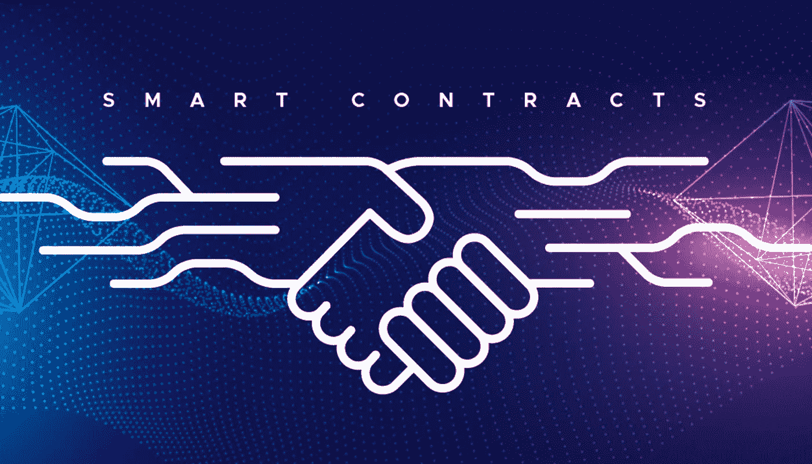

# 什么是智能合约，它们是如何工作的

> 原文：<https://medium.com/coinmonks/what-are-smart-contracts-and-how-do-they-work-f557f0ca40b1?source=collection_archive---------42----------------------->

## 智能合同解释

假设你要租一辆车。为了完成交易，你需要通过区块链支付加密货币。之后，你会收到一张虚拟合同的收据。然后你会在指定的日期拿到一把数字车钥匙。

如果钥匙没有准时到达，你将通过区块链得到退款。然而，如果…