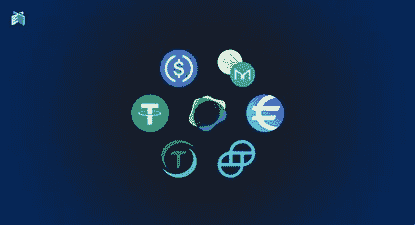

# 什么是 Stablecoins？

> 原文：<https://medium.com/coinmonks/what-are-stablecoin-9a2bb4b0bb71?source=collection_archive---------9----------------------->

如果你曾经购买加密货币，你可以清楚地看到它们今天上涨 10%，第二天下跌 5%。这使得很难使用它们作为交换媒介。举例来说，想象一下今天得到 1000 美元的比特币，第二天你决定用它买一部好手机。你去商店查看你的余额，发现它下降了 15%。没人想这样，对吗？