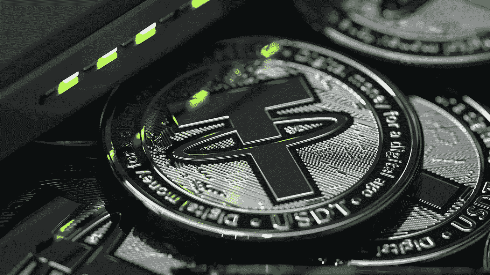

# 什么是稳定的收入，什么是风险

> 原文：<https://medium.com/coinmonks/what-are-stablecoins-and-what-are-the-risks-6684beb404e5?source=collection_archive---------52----------------------->

Source photo Unsplash.com

# 什么是 Stablecoins？

换句话说，稳定币是一种加密货币，其价值与另一种资产相关联。法定货币(如美元或欧元)通常被用作次级资产。它的价值，至少相对于相关货币来说，保持不变。如前所述，这是由于基础资产的不变价值，例如，美元…