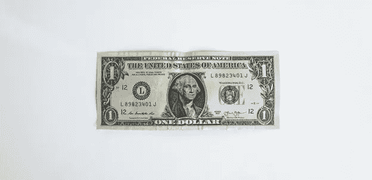

# 什么是 Stablecoins，它们为什么存在？

> 原文：<https://medium.com/coinmonks/what-are-stablecoins-and-why-do-they-exist-1b8440998359?source=collection_archive---------6----------------------->

顾名思义，stablecoins 旨在保持稳定。本质上，稳定的硬币是数字形式的美元。但这不一定总是正确的，因为稳定的硬币可以通过算法与任何法定货币挂钩，包括欧元、英镑和其他货币，以及其他形式的资产，如黄金。

在动荡的加密货币市场中，稳定的硬币成为了稳定的避风港，在投资者中获得了很高的人气。由于是非盈利性的，它们是可预测的，因此 stablecoins 在所有加密货币中名列前十。

现在让我们来看看 stablecoins 是如何工作的…

## 稳定硬币的机制是什么？

稳定货币通常以相同的方式工作:它们是区块链的加密货币，交易者可以像其他加密货币一样在交易所购买、出售和交易。Stablecoins 可以存储在钱包或冷库中，就像它们可以存储在比特币或任何其他加密货币中一样。

严格来说，稳定币是一种与美元或其他法定货币、贵金属或其他有价值资产的价格挂钩的加密货币。稳定硬币的价格反映了它所要挂钩的资产的价格；例如，从理论上讲，一个美元稳定的硬币将总是以 1 美元交易。

为了获得信誉，大多数稳定的货币由某种类型的外部资产储备支持，无论是法定货币、商业票据、黄金等商品还是债务工具，以保持其完整性。一般来说，稳定币背后的公司或协议将拥有相当于或多于流通中稳定币数量的储备。这意味着在任何给定的时间，每个稳定币持有者可以选择用一美元或相关的固定资产向发行者兑换稳定币。

## **有四种稳定的变化:**

这四种不同的硬币有它们自己的固定稳定硬币的方法来保持一个稳定的数字:

1.  菲亚特支持的
2.  加密货币支持
3.  商品支持的
4.  算法的

## **菲亚特支持的 stablecoins:**

到目前为止最受欢迎的稳定硬币；它由存放在代币发行者金库中的实物法定货币以 1:1 的比例提供支持。中央权力机构监督稳定的货币，确保储备足够的现金或现金等价物。

菲亚特支持的 stablecoins 的好处是，随着时间的推移，它们已被证明是值得信赖的。法定抵押加密货币的概念很容易理解，消费者也知道它们是如何保值的。然而，并非所有菲亚特支持的稳定硬币发行者都足够透明。一些发行人经常因审计不够频繁而受到批评。尽管相反的情况也是如此，一些发行者被社区誉为极其透明。

另一方面，菲亚特支持的 stablecoins 本质上并不是分散的，而且经常受到公众的监督和监管。诸如 Tether (USDT)和 USD Coin (USDC)等法定支持的 stablecoins 是世界上最受欢迎的加密货币，按市值排名第三和第五。

## **加密货币支持的 stablecoins:**

这类稳定货币由其他加密货币支持，或者更具体地说，由过度抵押的加密货币债务头寸支持。它们完全在区块链上发挥作用，它们的抵押方法对所有人开放；因此，它们是最透明的稳定货币，因为储备记录在公共账上，任何人都可以查看。

例如，MakerDAO 是最广泛采用的加密货币支持的 stablecoins 之一。用户可以通过智能合约与 MakerDAO 进行交互，将 Ether)存入协议，以铸造(或发行)DAI 稳定币。这实质上是 MakerDAO 向用户提供的贷款，其中存放的 ETH 用作抵押品。如果贷款价值相对于抵押品达到某个阈值(即当 ETH 失去价值时)，智能合同将自动执行并出售 ETH 以覆盖其自身的本金，从而保持其稳定货币的完整性。

## **商品支持稳定债券:**

虽然不是很受欢迎，但商品支持的稳定债券确实存在。它们的价值与贵金属、工业金属或石油等商品的价值挂钩。这种稳定货币的显著特点是，它们的价格不像其他类别那样与法定货币单位挂钩。

这种稳定币的目标是允许零售商以一种无许可的方式容易地获得交易商品。系绳黄金(XUAT)是商品支持的稳定货币的一个例子。这种货币由瑞士金库里的黄金储备支持。一个 XAUT 表示并跟踪一盎司黄金的价格。

**算法稳定积分:**

与其他类别不同，算法稳定币没有任何现实世界资产、法定货币或加密货币的支持。事实上，它们根本没有任何资产支持。他们完全依靠供求力量。

它是这样运作的:假设稳定币的交易价格高于 1 美元，这意味着对这种代币的需求很高。为了让价格回到 1 美元，该算法会铸造额外的供应，从而降低价值，直到代币达到 1 美元。另一方面，当稳定币的交易价格低于 1 美元时，该算法会切断供应，从而增加价值，直到代币达到 1 美元。这就是 TerraUSD (UST)对付月神令牌的基本方式。

## **关闭思路**

在剧烈波动的加密货币世界中，稳定的加密货币为投资者提供了一种实现投资组合稳定的方式。Stablecoins 充当各种加密货币的中立场地或流动性交易对。它们之所以受欢迎，是因为它们提供了可预测的、持续的价值形式。市场上有很多稳定的硬币选择，它们的价值保持方式不同。没有单一的最佳稳定币，而是应该根据用户的个人资料和目的来选择。不同的选项提供不同的安全级别、透明度级别和稳定性级别。最终选择哪个选项是最好的将取决于最终用户的概况。

在我们的下一篇文章中，我们将深入探讨不同类型的稳定硬币的利弊。本文将分析不同类型的投资者/用户在决定将资金存放在哪里之前应该考虑的各种因素。

*Compound Capital Partners 是一只开放式基金，通过其稳定货币和 delta 中性收益农业的双重方法提供对数字资产类别的投资。*

*碎碎念:*[https://twitter.com/investcompound](https://twitter.com/investcompound)

*网址:*[*https://www.compound.capital/*](https://www.compound.capital/)

> 加入 Coinmonks [电报频道](https://t.me/coincodecap)和 [Youtube 频道](https://www.youtube.com/c/coinmonks/videos)了解加密交易和投资

## 另外，阅读

*   [NFT 十大市场造币集锦](https://coincodecap.com/nft-marketplaces)
*   [AscendEx Staking](https://coincodecap.com/ascendex-staking)|[Bot Ocean Review](https://coincodecap.com/bot-ocean-review)|[最佳比特币钱包](https://coincodecap.com/bitcoin-wallets-india)
*   [Bitget 回顾](https://coincodecap.com/bitget-review)|[Gemini vs BlockFi](https://coincodecap.com/gemini-vs-blockfi)|[OKEx 期货交易](https://coincodecap.com/okex-futures-trading)
*   [美国最佳加密交易机器人](https://coincodecap.com/crypto-trading-bots-in-the-us) | [经常性回顾](https://coincodecap.com/changelly-review)
*   [在印度利用加密套利赚取被动收入](https://coincodecap.com/crypto-arbitrage-in-india)
*   [霍比审核](https://coincodecap.com/huobi-review) | [OKEx 保证金交易](https://coincodecap.com/okex-margin-trading) | [期货交易](https://coincodecap.com/futures-trading)
*   [麻雀交换评论](https://coincodecap.com/sparrow-exchange-review) | [纳什交换评论](https://coincodecap.com/nash-exchange-review)
*   最好的[加密税务软件](/coinmonks/best-crypto-tax-tool-for-my-money-72d4b430816b) | [CoinTracking 评论](/coinmonks/cointracking-review-a-reliable-cryptocurrency-tax-software-5114e3eb5737)
*   [Stackedinvest 评论](https://coincodecap.com/stackedinvest-review) | [北海巨妖评论](/coinmonks/kraken-review-6165fc1056ac) | [bitFlyer 评论](https://coincodecap.com/bitflyer-review)
*   最佳[加密借贷平台](/coinmonks/top-5-crypto-lending-platforms-in-2020-that-you-need-to-know-a1b675cec3fa) | [杠杆代币](/coinmonks/leveraged-token-3f5257808b22)