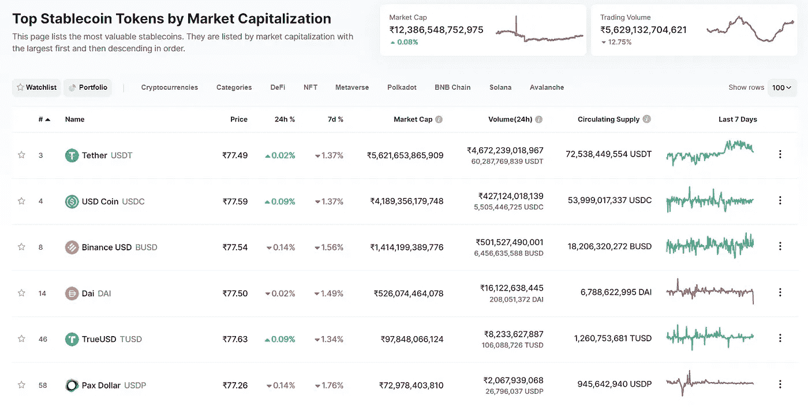
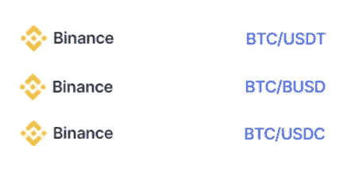
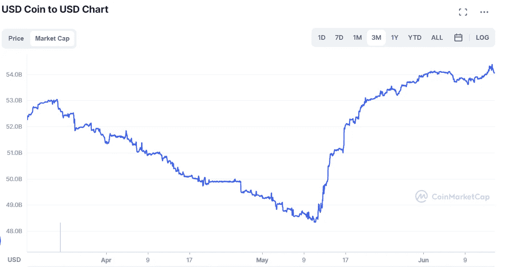
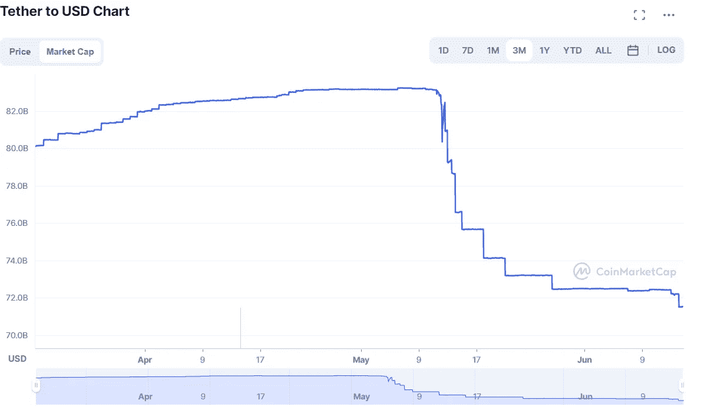
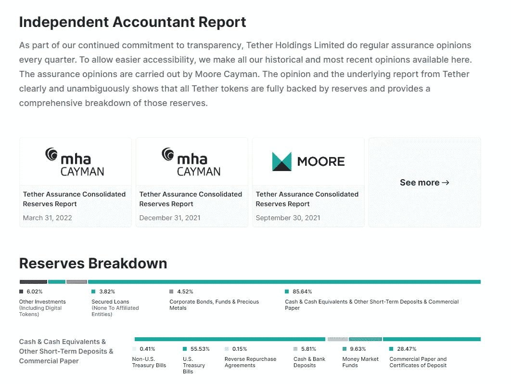

# 什么是 Stablecoins？我们为什么需要它们？他们安全吗？

> 原文：<https://medium.com/coinmonks/what-are-stablecoins-why-do-we-need-them-are-they-safe-1f97b50ce695?source=collection_archive---------38----------------------->

以详细和简单的方式解释所有的稳定币概念。

source: coinmarketcap

我们都知道密码市场非常不稳定。一枚硬币的价格可以在一天内上涨 20%或 30%，也可以暴跌 50%。！！但是有一些硬币的价格值是稳定的。这些被称为稳定的硬币。

为了理解稳定币的价格稳定性，我们需要了解一些基本概念。

**在这篇文章中，我将解释，**

*   金本位和法定货币
*   什么是稳定币
*   为什么我们需要稳定的硬币
*   稳定的可卡因安全吗

最后，我给了**、**和**戴**一些见解。所以一定要坚持这篇文章直到最后🙌****

# ****金本位和法定货币****

****你需要钱来买卖物品，获得服务等等。对吗？但是你有没有想过这些钱的价值是从哪里来的？在 19 世纪，英国引入了金本位制的概念。这仅仅意味着货币是由黄金支持的。例如，如果英国政府向其人民流通 1 亿英镑，那么这一数额由价值 1 亿英镑的黄金支持。在这种情况下，1 英镑= 1/(1 亿)黄金。但是你可能会问为什么是金子？因为它稀有珍贵。****

****金本位有优点也有缺点。但是全世界的政府都跟随它，直到 1970 年代初。1971 年，美国停止用黄金支持其货币美元，从而放弃了金本位制。现在，你可能会问，美国用什么来支撑它的美元？答案是**信任。现在，法定货币的定义出现了。******

****法定货币是政府发行的货币，没有任何实物商品如黄金、白银等支持。相反，它是由对发行它的政府的信任来支持的。这里的信任是指对经济的信任。我不打算深入研究这一宏观经济学部分，因为它对本文来说是不必要的。[点击此处](https://coinmarketcap.com/fiat-currencies/)查看法定货币列表。****

****从技术上讲，所有的政府货币都是法定货币，但仍有一些政府用黄金、外汇资产、债券等来支持他们的货币。****

****全世界的政府都信任美元。那是因为美国是世界上最大的经济体。所有的全球贸易都以美元进行。因此，美元被冠以“世界储备货币”的称号。如前所述，一些国家用外币资产支持本国货币。所以这些国家选择美元来支持他们自己的货币，因为这是最好的选择。****

****从所有的阅读中，你可能会得出这样的结论:为了获得任何东西的价值，它应该有所支持。****

# ****什么是稳定币？****

****在加密市场中，稳定币是一种价值保持固定的加密货币。在密码市场上有许多稳定的竞争者，但最受欢迎的是、、、戴等。[点击此处](https://coinmarketcap.com/view/stablecoin/)查看可用的稳定歌曲列表。****

****现在，要保持一种稳定货币的固定价值，它应该有一种资产作为支持。让我们以 USDC 为例。这种稳定的货币由美元支持。具体来说，USDC 是与美元挂钩的 T2。这意味着在加密市场上每出现一个 USDC 代币，储备中就会出现一个美元。1 USDC = 1 美元。这里储备的意义上来说，是一个**专用的银行账户**。USDC 由以下公司创建:Circle 和比特币基地。这些公司组成了一个名为中心的小组来维护和审计银行账户(储备)。****

****像 USDC 一样，还有其他稳定的硬币，如 USDT、BUSD 等。它们也是由美元支持的。BUSD 由最大的加密货币交易所币安维护。****

****正如你所看到的，正如我在前面解释美元的重要性一样，大多数稳定的货币是由美元支持的。但也很少有其他资产支持的稳定债券。例如，**停滞欧元**是由欧元支持的稳定货币。XSGD 是另一种由新加坡元支持的稳定货币。还有一些稳定的货币是由其他加密货币支持的，如 BTC、ETH 等。****

****所以基本上稳定的货币可以由任何资产支持。它们分为四种类型:法定支持(美元，欧元)，加密货币支持(BTC，瑞士法郎)，商品支持(黄金，白银)，最后一种是算法稳定的货币。****

# ****为什么我们需要稳定币？****

****现在，让我们来回答为什么我们需要稳定的硬币。****

****让我们假设没有稳定点。现在，你已经在一天开始时给你的朋友布拉德送去了价值 100 美元的 BTC。现在布拉德有价值 100 美元的 BTC。他可以使用中央交易所(中央交易所(CEX)是一个购买或出售加密货币的平台)兑现他的 BTC。在这里，布莱德可以卖掉他价值 100 美元的整个 BTC，然后把钱存入他的银行账户。但是这个过程通常需要 1 到 4 个工作日。同样在 CEX，存款和取款也要收费。****

****但相反，布拉德希望最终投资其他加密货币，如 ETH，所以他选择持有他的 BTC，直到那时。现在，当他一天结束时，BTC 下跌了 5%。意思是，他损失了 5 美元，现在只有 95 美元可以投资。****

****这个问题可以通过 stablecoin 解决。布拉德在这里可以做的是，在收到 BTC 的时候，他可以把它换成一个稳定的硬币，也许是 USDC。或者简单地说，你可以直接寄 100 USDC 给布莱德。所以现在布拉德持有 100 USDC，它将永远价值 100 美元，他可以在一天结束时或明天或任何他想要的时间投资任何加密货币。****

****简单地说，Stablecoin 提供了一种抵御极端加密波动的方法。****

****稳定的硬币还有许多其他的优点。如你所知，你可以向世界上任何地方的任何人发送加密货币。你可以简单地发送 100 USDC 到对方的钱包地址。但是如果做银行转账，就有很多障碍。国际银行转账费用高而且非常慢。****

****另一个优势是加密货币在交易中与稳定货币配对。这个过程是，在 CEX，你把钱存起来，然后买稳定的硬币。然后你用这些稳定的货币投资加密货币。****

********

****source: coinmarketcap****

****从上图中，你可以看到在币安我们可以用 USDT、USDC 或 BUSD 买到 BTC。像 BTC 一样，所有其他加密货币也与稳定硬币配对。这里的好处是可以无缝互换加密货币。您的 BTC 可以很容易地与 BTC/USDT -ETH/USDT 配对的 ETH 交换。当你想卖的时候，你会得到稳定的收入，这些收入可以转换成现金，存入你的银行账户。****

# ****Stablecoins 安全吗？****

****首先，稳定的货币不受政府管制。这些都是大型风投创立和维护的。其次，你需要知道一个叫做去挂钩的概念。****

****大多数稳定货币与法定货币以 1:1 的比例挂钩。脱钩意味着偏离预期比率。例如，1 USDT = 1 美元。与 USDT 脱钩意味着 USDT 与美元脱钩。在德佩格事件后的几天内，整个特拉生态系统被摧毁了。UST 和卢娜的值达到了地面。投资者在短短几天内总共损失了 450 亿美元。这也导致了密码市场的崩溃。在 Terra 生态系统衰落的背后发生了如此多的事情，并且有许多关于它的文章，所以请检查一下。****

****继 UST·德佩格之后，许多其他稳定的同事也遭到了解雇。所以在使用 stablecoins 之前一定要做好调查。****

****如何确定一枚稳定币是否安全？如前所述，应该有足够的储备来支持稳定的货币，以维持联系汇率。现在，让我们以 USDC 为例。USDC 是一个开源项目，也是由美国会计公司审计。USDC 还提供储备月报。[点击此处](https://www.centre.io/usdc-transparency)查看网站和月度报告。****

****、戴****

****USDC 是市值 54B 的第二大稳定国。目前最稳定的货币是 USDT，市值 710 亿英镑。但是在系绳后面发生了一些事情。请参见下面的两张图表****

## ****正如你所看到的，在过去的两个月里，USDC 市值稳步上升，但 USDT 市值急剧下降。巅峰时期， **USDT** 有 **84B** 但是现在，在 **71B** 左右。这背后的原因是因为人们和投资者正在对 USDT 失去信心。USDT 稳定币是由泰斯公司创建和维护的。现在在 Tether 的官网，宣称 100%透明。据说每个季度都要接受审计。你可以在他们的官方网站上找到这些报告。****

****看到这里，你可能会问为什么投资者会害怕？嗯，这里棘手的部分是，审计是由一家名为**“MHA 开曼”的公司进行的。在该公司的 LinkedIn 页面中，它说它只有 3 名员工。此外，在 1 月份，其母公司正在接受英国政府的调查(来源:coindesk)。看到这一切，人们开始担心了。人们质疑这些报道是否合法，他们不确定泰瑟(USDT)是否得到了全力支持。******

********

****USDC Market Cap, source: coinmarketcap****

********

****USDT Market Cap, source: coinmarketcap****

****所以，在使用稳定币时，一定要做大量的研究。每个人给加密持有者的一个建议是**DYOR——自己做研究。**也检查其他稳定的内容。戴也是另一位知名的稳定人士。1 戴= 1 美元。它由**智能合约**驱动。但这里的独特之处在于，戴被过度抵押了。也就是说，对于每一个 Dai 代币，它将被归类为超过 1 美元的资产。这样可以保证安全。****

********

****source: [https://tether.to/en/transparency/#reports](https://tether.to/en/transparency/#reports)****

****所以，我希望你对 stablecoins 有更好的理解。如果你喜欢我的文章，你可以在这里和推特上关注我****

****也检查我以前的文章以及…****

****深入探究以太坊的区块链****

****在这里，我们讨论的结构以太坊区块链，EVM，结构的一个单独的块，ommer 块，Merkle…****

**** [## medium.com

### 加密货币到底是什么，比普通货币好吗？

定义加密货币，它的用途，各种加密货币，最后与法定货币进行比较。](/@infomalhaut/deep-dive-into-the-blockchain-of-ethereum-5bf131cd6a57)  [## medium.com

### 深入探讨:IPFS、FILECOIN、Filecoin Solana 用例

深入探讨 IPFS、Filecoin 以及如何在索拉纳生态系统中利用其力量](/coinmonks/what-exactly-is-cryptocurrency-and-is-it-better-than-regular-currency-9876103b695e)  [## medium.com](/@infomalhaut/deep-dive-ipfs-filecoin-filecoin-solana-use-cases-476f21945777) 

### [加入 Coinmonks](/@infomalhaut/deep-dive-ipfs-filecoin-filecoin-solana-use-cases-476f21945777) [电报频道](https://t.me/coincodecap)和 [Youtube 频道](https://www.youtube.com/c/coinmonks/videos)了解加密交易和投资

另外，阅读

> [交易信号是什么？](https://coincodecap.com/trading-signal) | [Bitstamp vs 比特币基地](https://coincodecap.com/bitstamp-coinbase) | [买索拉纳](https://coincodecap.com/buy-solana)

# [如何给 MetaMask 钱包添加 Arbitrum？](https://coincodecap.com/how-to-add-arbitrum-to-metamask-wallet)

*   [KuCoin vs 北海巨妖 vs BitYard](https://coincodecap.com/kucoin-vs-kraken-vs-bityard)
*   [加密交易的最佳 VPN](https://coincodecap.com/best-vpns-for-crypto-trading)
*   [ProfitFarmers 点评](https://coincodecap.com/profitfarmers-review) | [如何使用 Cornix Trading Bot](https://coincodecap.com/cornix-trading-bot)
*   [西班牙 5 大最佳文案交易平台](https://coincodecap.com/copy-trading-spain)
*   [ProfitFarmers Review](https://coincodecap.com/profitfarmers-review) | [How to use Cornix Trading Bot](https://coincodecap.com/cornix-trading-bot)
*   [5 Best Copy Trading Platforms in Spain](https://coincodecap.com/copy-trading-spain)****