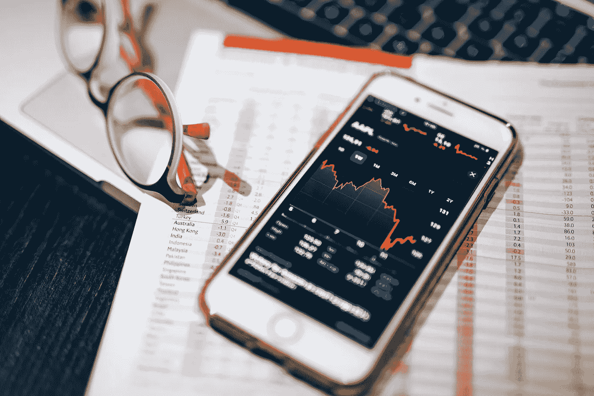

# 什么是股票和股份

> 原文：<https://medium.com/coinmonks/what-are-stocks-and-shares-c5e21c657d5e?source=collection_archive---------27----------------------->

对于股票和股份是什么，它们从哪里来，以及它们在金融世界中的目的的最基本的理解。

*本帖原文出自*[*【www.portfolio-hub.co.uk】*](http://www.portfolio-hub.co.uk)

什么是股票和股份？它们之间有什么不同？

为了这篇博文，我决定写一些股票市场最基本的知识。对我来说…