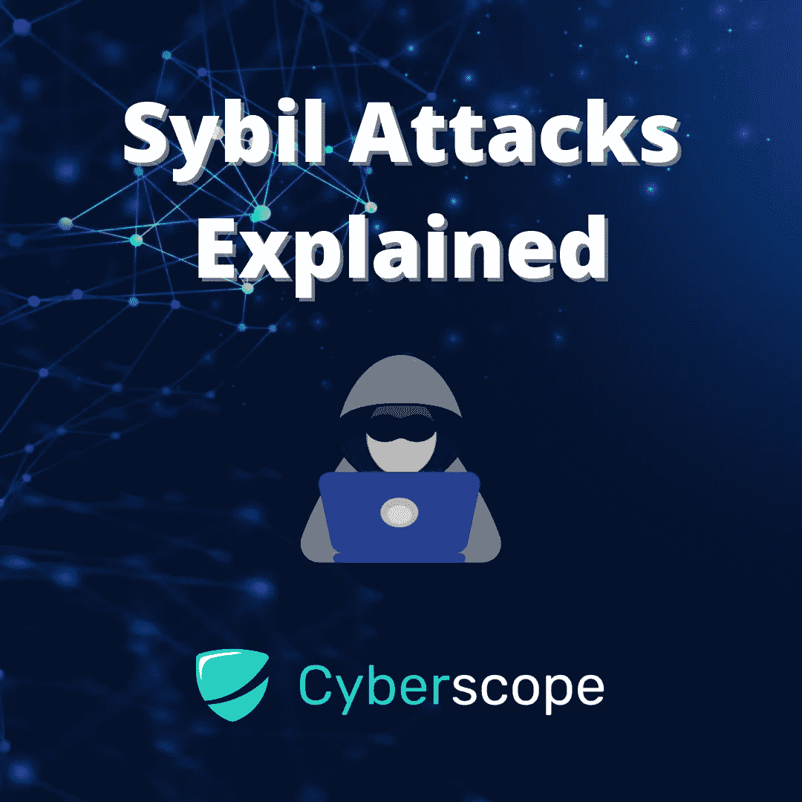

# Sybil 对区块链的攻击有哪些

> 原文：<https://medium.com/coinmonks/what-are-sybil-attacks-on-the-blockchain-27a5e0c93710?source=collection_archive---------14----------------------->

区块链是一项强大而高效的技术，但这并不意味着它是完美的。安全漏洞仍然存在，区块链安全的最大问题之一就是 Sybil 攻击。在本指南中，我们将涵盖您需要了解的关于 Sybil 攻击的一切，包括它们是什么、它们如何工作、它们的例子以及如何防止它们发生。所以，事不宜迟，让我们直接进入并了解有关 Sybil 攻击的更多信息吧！

# 什么是女巫攻击？

[Sybil 攻击](https://en.wikipedia.org/wiki/Sybil_attack)是一种攻击类型，其中对手创建多个身份来获得对网络的控制。该术语由心理学家 Flora Rheta Schreiber 于 1973 年首次提出，她用它来描述一名患有分离性身份障碍(DID)的女性(被称为 Sybil Dorsett)。

在区块链的语境中，该术语指的是某人使用多个身份或账户(也称为 sockpuppets)来迷惑和操纵他人。拥有足够资源的个人或组织有可能创建大量虚假账户，让人们觉得参与支持某项特定事业的人比实际存在的人多。这可以用来左右公众舆论，使欺诈交易看起来合法。

# **西比尔攻击是如何工作的**

为了进行 Sybil 攻击，攻击者必须首先创建多个身份。这些新的身份彼此独立行动，并在区块链网络上有自己的交易。这样，看起来好像有很多人在使用你的服务，而实际上只有一个人负责他们所有的活动。

可以想象，这种攻击有许多潜在的用途:

*   利用机器人在选举中为他人投票。随着分散自治组织(Dao)的兴起，这已成为一个普遍问题。
*   如果攻击者创建足够多的假身份(或 Sybil 身份)，他们还可以在投票中击败网络上的诚实节点。然后，他们可以拒绝接收或发送数据块，从而有效地阻止网络中的其他用户。
*   在大规模 Sybil 攻击中，攻击者甚至可能设法控制网络计算能力或哈希速率，并实施 [51%攻击](https://www.investopedia.com/terms/1/51-attack.asp)。在这种情况下，他们可以更改交易的顺序，并阻止交易被确认。他们甚至可以撤销他们控制下的交易，这可能导致重复支出。

# Sybil 攻击的例子

以下是一些现实生活中 Sybil 攻击的例子:

*   2014 年，针对匿名网络的一次著名的 Sybil 攻击持续了几个月。Tor 匿名的工作原理是通过三个独立的节点路由流量。第一个知道用户的 IP 地址，第三个知道流量的目的地。中间节点是一种可信的中介，因此节点一和节点三彼此互不了解。运行大量的服务器有可能打破这些匿名保证。
*   另一个值得注意的例子是发生在比特币黄金上的 51%，2018 年 5 月价值 1800 万美元的比特币黄金被盗。这是该网络第二次遭受此类攻击，第一次发生在 2017 年底，导致价值超过 72，000 美元的比特币黄金令牌被重复花费。

# **如何预防茜玻发作**

防止 Sybil 攻击的一种方法是更多地依赖于利害关系一致性算法的证明，而不是工作证明。利益一致机制的证明要求主节点或服务节点运营商持有(锁定一段时间)大量的加密货币。这种木桩是对西比尔攻击的一种威慑。被网络检测到正在进行欺诈或恶意活动的节点将会失去一部分股份，以及将来参与的权利。由于赌注高于潜在回报，再次攻击的成本超过了回报。

此外，为了控制整个网络，攻击者需要获得加密货币流通供应量的 51%。这样做的成本非常高，任何攻击者都不可能负担得起。

像比特币这样的大型工作证明网络也不可能成为 51%攻击的受害者。控制 51%的网络哈希能力(支持 Sybil 攻击)所需的挖掘硬件数量将会非常昂贵，以至于不值得攻击者花费时间。简而言之，攻击的成本将超过潜在的回报。

# 结论

我们已经介绍了 Sybil 攻击的基础知识以及它们是如何工作的。这些攻击是恶意用户如何操纵区块链为己所用的一个例子。如果你有兴趣了解更多关于这些类型的攻击或加密货币的其他安全漏洞，你可以注册我们的[每周简讯](https://twitter.com/cyberscope_io)或关注我们的[媒体](/@cyberscope)。

[*cyber scope*](https://www.cyberscope.io/)*是密码行业领先的智能合同审计& KYC 公司之一，已经审计了 500 多个区块链项目和 NFT。所有主要发射台的官方合作伙伴。*

…

*原载于*[*https://www . cyber scope . io*](https://www.cyberscope.io/)*。*

> 加入 Coinmonks [电报频道](https://t.me/coincodecap)和 [Youtube 频道](https://www.youtube.com/c/coinmonks/videos)了解加密交易和投资

# 另外，阅读

*   [币安 vs FTX](https://coincodecap.com/binance-vs-ftx) | [最佳(SOL)索拉纳钱包](https://coincodecap.com/solana-wallets)
*   [比诺莫评论](https://coincodecap.com/binomo-review) | [斯多葛派 vs 3Commas vs TradeSanta](https://coincodecap.com/stoic-vs-3commas-vs-tradesanta)
*   [Capital.com 评论](https://coincodecap.com/capital-com-review) | [香港的加密借贷平台](https://coincodecap.com/crypto-lending-hong-kong)
*   [如何在 Uniswap 上交换加密？](https://coincodecap.com/swap-crypto-on-uniswap) | [A-Ads 评论](https://coincodecap.com/a-ads-review)
*   [WazirX vs CoinDCX vs bit bns](/coinmonks/wazirx-vs-coindcx-vs-bitbns-149f4f19a2f1)|[block fi vs coin loan vs Nexo](/coinmonks/blockfi-vs-coinloan-vs-nexo-cb624635230d)