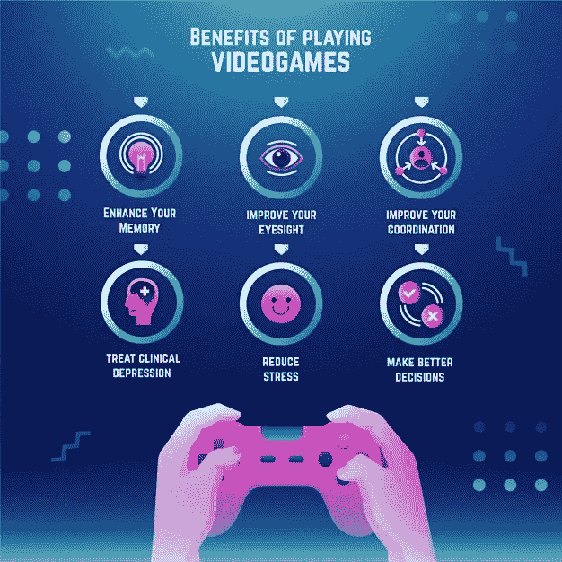
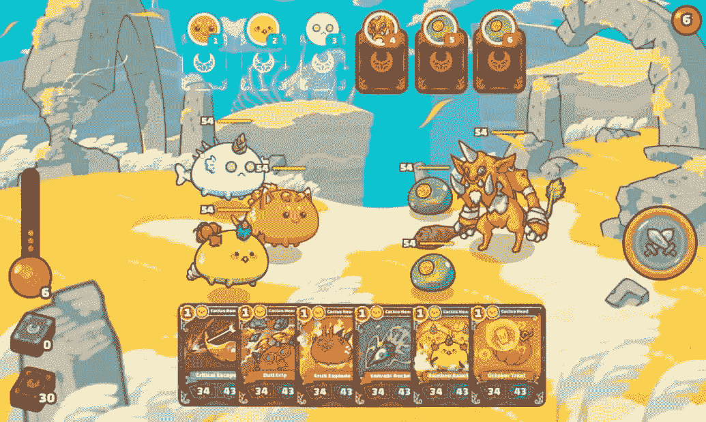
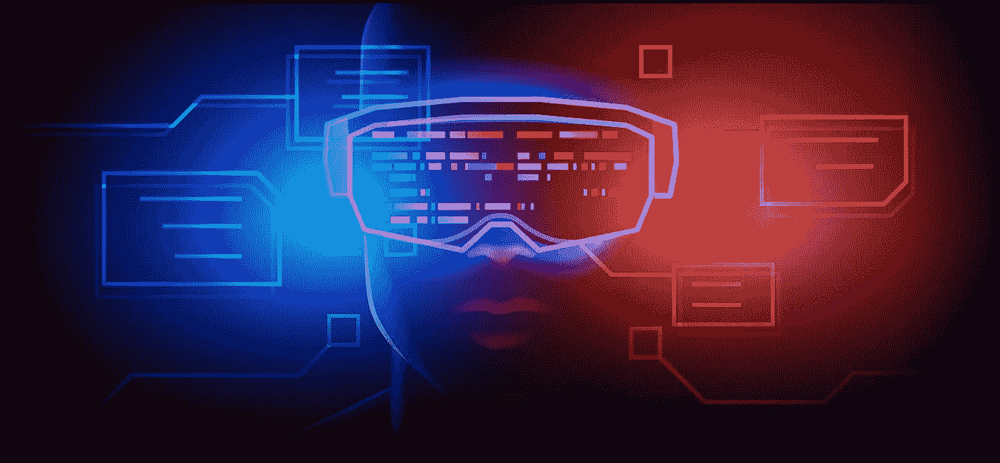
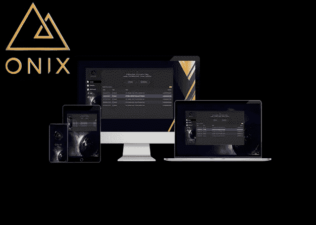
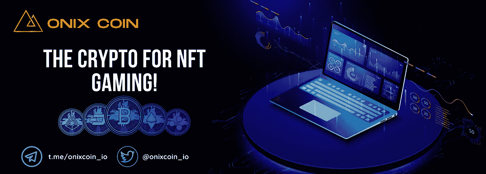
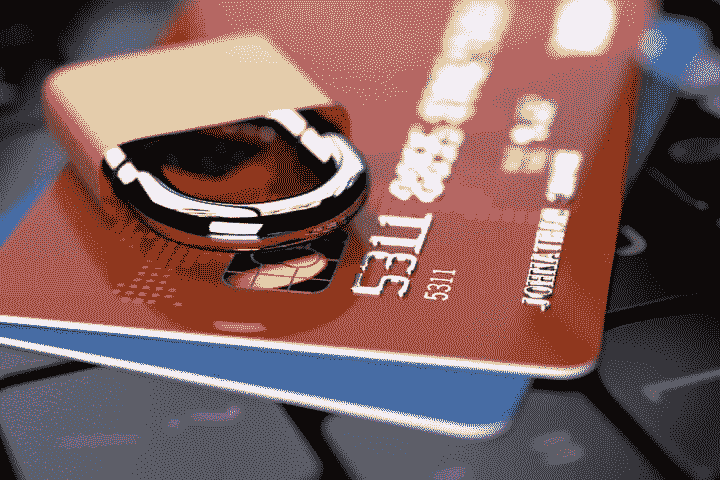
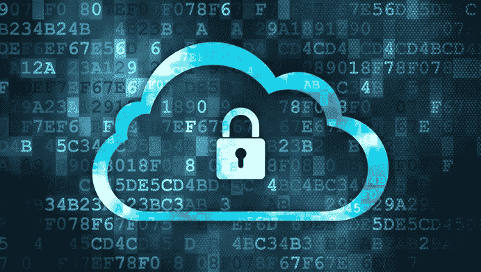
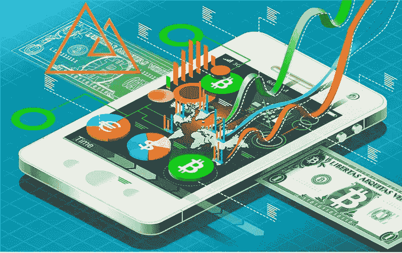
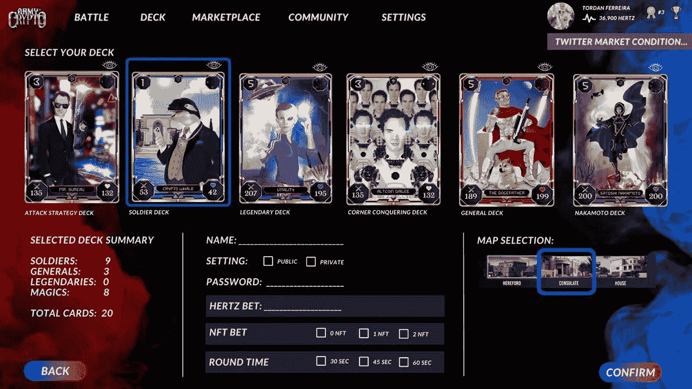
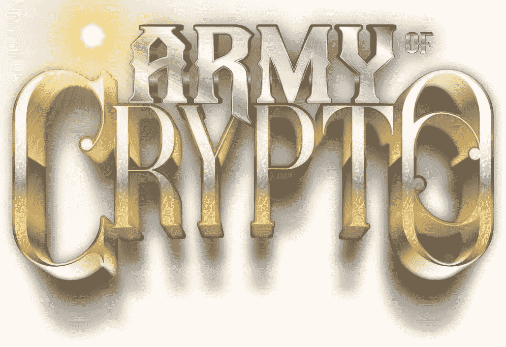

# 区块链博彩有什么好处？

> 原文：<https://medium.com/coinmonks/what-are-the-benefits-of-blockchain-gaming-3f78ef1e9d98?source=collection_archive---------42----------------------->

2022 年 3 月 8 日星期二

Blockchain Technology, The Future of Gaming!

目录

**博彩业的特点**

**区块链游戏的好处**

1.  *提高支付处理的成本效益*
2.  *最大限度减少欺诈活动*
3.  *储存安全和安保*
4.  *更好地控制游戏经济*
5.  *降低游戏项目价格*
6.  *区块链/NFT 游戏为开发者打开新领域*

**常见问题解答**

*什么是区块链？*

什么是 NFT？

区块链博彩业有多大？

加密是合法的投资吗？

非技术人员可以学习区块链吗？

# 博彩业的特点:

博彩业有特定的特点和动态，此外，利益相关者也有特定的任务。这些使得它成为全球技术领域中快速增长的一部分。它们也使它成为了破坏的主要候选对象！这些是:

1.  你需要钱来玩最流行的游戏。虽然它们中的一些允许玩家积累游戏中的货币，但这对大多数玩家来说太不方便了，因为这需要很长时间。大多数玩家花他们的法定货币购买游戏中的资产。
2.  游戏企业家和开发者需要一个安全可靠的环境来开发和发布游戏，并随后从中获利。
3.  玩家需要安全地买卖游戏内资产；因此他们需要安全的平台。
4.  玩家可以玩很多游戏，他们在那里创建个人资料。他们希望这些档案能够跨游戏互操作，这是技术可以帮助的另一个领域。
5.  人们对无形资产进行价值预测的趋势是真实的，因此我们将看到越来越多的真实资金花在虚拟游戏上。当一个行业进入这个阶段，技术颠覆的时机就成熟了。
6.  当他们不玩在线游戏时，玩家需要安全地存储他们的虚拟游戏资产。目前，这些资产存储在游戏公司的中央服务器中，这使它们成为黑客的容易目标。这是技术可以产生重大影响的另一个领域。
7.  你玩网络游戏吗？那你经历过这个。你从未真正拥有任何游戏内资产，而是游戏公司拥有它们。这是另一个破坏的机会。
8.  你曾经因为你最喜欢的网络游戏被关闭而感到沮丧吗？或者说，你有没有感觉到规则被突然武断地改变了？能够给予玩家更大控制权的技术将会扰乱当前的游戏市场。
9.  你有没有过这样的感觉:你有能力让一个游戏变得更加有趣，但是你却因为游戏公司不雇佣你而做不到？一项为有才华的开发人员打开领域的技术将会改变游戏规则。
10.  作为一名玩家，你有没有觉得如果你能和开发者合作，你可以让游戏变得更加令人兴奋？如果技术能够催生一种商业模式，让玩家和开发者之间进行更紧密的合作，它将永远改变这个行业。
11.  你有没有觉得如果游戏公司允许创造更稀有的游戏资产，那么这个游戏会变得更有趣？这项技术可以在这方面有所帮助。
12.  玩家经常面临虚拟游戏平台中的欺诈交易，这是技术可以发挥作用的另一个方面。

# 区块链游戏的优势

我们将深入探讨区块链技术解决游戏行业问题的可能性。关于 NFTs 和 NFT 游戏以及它们的使用案例的许多问题一直是讨论的焦点。随着关于区块链技术是否给游戏行业带来了前所未有的新东西的激烈辩论，游戏行业也没有什么不同。下面我们来看一些要点，这些要点概括了区块链在游戏行业中的优势:

1.提高支付处理的成本效益

随着人们对加密货币的极大兴趣，安全地买卖加密令牌现在变得很容易。如果你在区块链上开发游戏，并允许玩家使用数字货币买卖游戏中的资产，他们就有足够的安全手段来进行这些交易。

博彩业可以从世界各地进入。尽管玩家有机会利用法定货币，但就成本效益而言，它们并不有效。玩家必须支付昂贵的费用来利用在线游戏。

有了区块链，游戏玩家可以远离他们的借记卡或信用卡。无论支付的金额有多小，这项技术都提供了一种分散的支付方式。骗子没有办法窃取信息或操纵该部门。

例如，Onixcoin 为玩家提供了一个很好的网络钱包。他们还可以在不使用数字货币时保护它们的安全，使用来自[on excoin](https://onixcoin.io/about/token#wallet)的桌面钱包。

Onixcoin

如果玩家保护好他们的私钥，他们的交易就是安全的。然而，他们需要保持一种严格的方法来保护他们的计算机安全，例如，定期备份，避免风险网站，以及避免在网络或移动钱包中保存太多的加密货币。

2.最大限度减少欺诈活动

博彩业遭受网络欺诈的打击最大。因此，该行业一直在寻找可以节省损失收入的技术。

区块链技术可以通过根除每一个欺诈机会来节省数十亿美元。像 B2Expand 这样的公司已经开始使用加密经济来减少欺诈活动。

运行在区块链网络之上的智能合约如果存在漏洞，就很容易受到攻击。黑客有可能利用这些漏洞，2016 年的以太坊 DAO 黑客就是一个例子。

在以太坊 DAO 黑客事件中，恶意代理利用了“去中心化自治组织”(DAO)智能合约中的一个漏洞。他们准备卷走 ETH 3.6 万英镑(当时是 7000 万美元)，然而区块链的透明度阻止了他们。

一个公开的区块链允许每个人阅读所有交易，以太坊社区很快发现了这种黑客行为。他们实施了一个硬分叉，以防止资金外流，并退还资金给道投资者。在[刀、劈、软叉、硬叉](https://www.cryptocompare.com/coins/guides/the-dao-the-hack-the-soft-fork-and-the-hard-fork/)中读到关于刀劈的内容。

如果你正在区块链上开发一个游戏，确保你的智能合约编码良好。然而，完全公开所有交易的分类账有助于防止欺诈，这是区块链为您提供的另一项支持。

游戏和区块链是天然的合作伙伴。如果你计划开发下一款病毒游戏，考虑一下区块链理工大学在游戏发行方面的优势，以及其他优势。

3.储存安全和安保

游戏物品经常面临来自黑客的安全威胁。因此，在线存储数据对游戏公司来说似乎是一种风险。但是区块链加密已经成为一种可持续的解决方案。

用区块链加密法存储的数据使黑客无法破解。这项技术需要在正确的时间使用正确的节点才能突破。这就是为什么游戏物品得到了双重安全保护。

黑客最爱集中式服务器！这只是他们的一个固定目标，如果他们能破解加密，服务器上存储的所有资产都是他们的。

游戏行业的区块链技术可以改变这一点。当玩家在你基于区块链的游戏中购买数字收藏品时，他们可以将它们安全地存储在他们的加密钱包中。

区块链可以用于在没有中央服务器的情况下安全地托管游戏。这也是为什么大多数区块链游戏都是回合制的原因。拥有一种不受用户限制或单位带宽成本限制的安全托管游戏的方法是采用区块链游戏的关键驱动因素。

4.更好地控制游戏经济

政府可以禁止或调节一个行业的经济。严苛的法规催生黑市，这对任何行业都不是好事。游戏公司也受到这个问题的困扰。游戏开发商正在失去对这一行业的控制。这损害了他们获得最大收益的能力。

有了区块链，就不需要制定政策了。开发者可以不断地从每个游戏生态系统中收取版税。此外，区块链允许游戏开发商开始或停止出售资产，没有任何限制。

不像目前的场景，你真的不拥有你在游戏中购买的东西，区块链在游戏中的一个好处是玩家拥有他们的资产。一款基于区块链的游戏将使用智能合约来管理游戏内部的交易，这一点很重要。

智能合约在满足其中编码的条件时自动执行，并且结果是不可逆的。当你启动一个区块链驱动的游戏时，你的玩家使用智能合约购买的所有游戏内资产都被转移到他们的公共地址。智能合约还允许完全透明，每个参与者都可以查看规则。

智能合同执行结果记录在分散的区块链中，并且这些记录是不可变的。没有一个集中的代理可以改变存储资产的公共地址，因此没有人可以改变游戏中资产的所有权。

一个已经可见的游戏行业趋势是，越稀有的数字收藏品将吸引更高的价格，这一趋势在未来将变得更加明显。这提高了该部门的收入。

区块链智能合约可以成为创建“如果-那么-否则”条件的一种很好的方式，这种条件将基于某些类型的交互产生更稀有的游戏内资产。例如，CryptoKitties 智能合约在某些情况下会产生更稀有的小猫品种，它们会吸引更高的价格。

5.降低游戏项目的价格

游戏项目的高价格限制了开发商的客户群。这也是游戏玩家在数字市场寻找被盗游戏物品的一个原因。然而，区块链带来了负担得起的微交易好处。这可以让开发商在不损失利润的情况下以便宜的价格出售他们的电源。此外，用户可以在玩在线游戏时控制自己的支出。

这些指针清楚地表明了为什么区块链是下一个游戏行业的颠覆。可见区块链是一个安全繁荣的游戏产业的未来。

Army of Crypto

密码交易员和投资者拥有公共地址，他们可以使用该地址在不同的区块链网络上进行交易。如果你在区块链上创建你的游戏，你的玩家可以把他们唯一的公共地址从一个游戏带到另一个游戏。

他们可以从同一个公共地址跨不同的游戏使用他们的加密货币进行交易。

6.区块链/NFT 游戏为开发者打开新领域

假设你是一个有才华的开发者，有一个关于杀手级游戏应用的好主意，但是，你没有游戏行业的经验。集中化的游戏公司在高度竞争的环境中运营，经验对他们来说具有额外的价值。你可能要等一段时间才能在游戏公司找到工作，开发你的杀手级游戏。

你可以学习开发一个 DApp 游戏，里面有很棒的资源。例如，织机网络已经建立了一个互动课程，开发自己的 DApp 游戏。看看他们的隐型僵尸编码学校。

我之前提到过 Onixcoin，但他们并不是唯一一家为开发区块链游戏提供 SDK 的区块链初创公司。Loom Network 提供了他们的 Unity SDK，你可以用它来构建你的游戏。查看 Unity SDK 的 GitHub 资料，开始使用。

Army of Crypto Logo

你也可以像下面这样从头开始构建你的区块链游戏:

*   学习以太坊开发，包括智能合约的编码和 DApp 开发。
*   创建你的以太坊账户。
*   安装您需要的工具。
*   编写您的智能合同。
*   测试、部署和运行您编写的智能合约。

区块链游戏是开源的，需要指导可以查看类似游戏的代码。例如，如果你正在构建类似 CryptoKitties 的东西，你可以在他们的 [EthFiddle](https://ethfiddle.com/09YbyJRfiI) 库中查看他们的智能合约。

开源代码还允许您从基础代码开始，因此您可能不必从头开始。

# 常见问题解答

什么是区块链？

区块链是**一种记录信息的系统，这种方式使得改变、入侵或欺骗系统变得困难或不可能**。区块链本质上是交易的数字分类账，它被复制并分布在区块链的整个计算机系统网络中。

什么是 NFT？

我们可以将**不可替换令牌** (NFT)描述为**加密**令牌，它唯一地定义了**资产**。它既可以表示数字资产，如图像，也可以跟踪现实世界的资产，如房子、汽车或歌曲。由于您可以唯一地定义资产，这意味着您也可以证明对该资产的所有权，并且**证明其真实性**。

区块链博彩业有多大？

该报告调查了 56 个国家的 300 家公司，发现该行业在第三季度创造了 23 亿美元的收入，约占 NFT 交易总量的 22%。

加密是合法的投资吗？

投资加密资产有风险，但也有可能极其有利可图。**如果你想直接获得对数字货币的需求，加密货币是一个很好的投资**，而一个更安全但潜在利润较低的替代选择是购买加密货币相关公司的股票。

非技术人员可以学习区块链吗？

尽管区块链已经存在了十多年，但区块链仍处于采用曲线的早期。**即使你是非技术人员，你也可以从今天开始学习**。今天开始学习区块链技术类似于 90 年代末学习 web 开发。

*最初发表于*[T5【https://www.reddit.com】](https://www.reddit.com/user/TreyTrillionaire/comments/t9af1a/what_are_the_benefits_of_blockchain_gaming/?utm_source=share&utm_medium=web2x&context=3)*。*