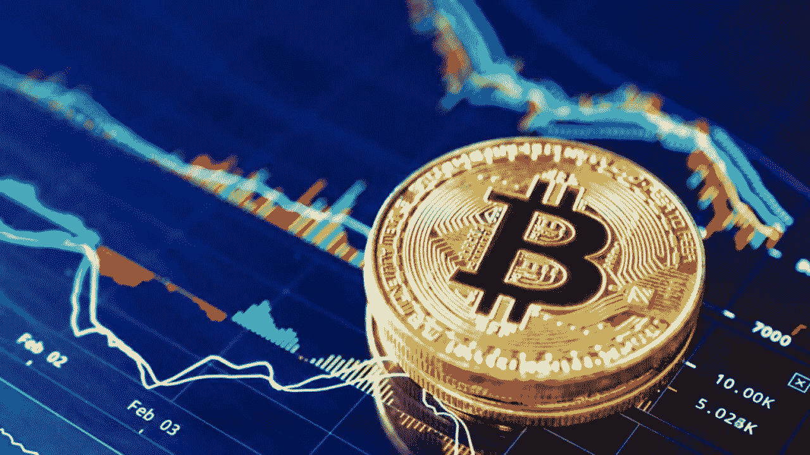
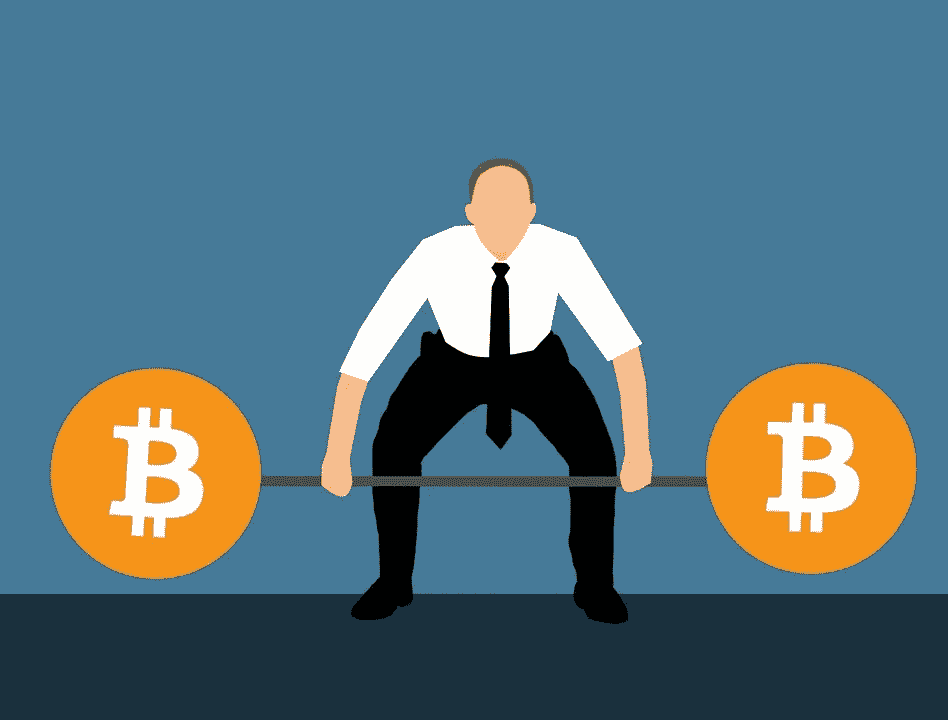
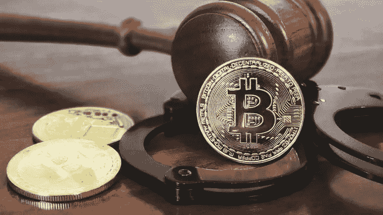

# 在尼日利亚销售比特币有哪些挑战

> 原文：<https://medium.com/coinmonks/what-are-the-challenges-with-selling-bitcoin-in-nigeria-e944844b21c0?source=collection_archive---------64----------------------->

*根据研究，你知道比特币将在 2140 年停止开采吗？*

我们都知道，最新流行的技术是加密货币，数百万人正在利用它发大财。加密货币的扩张速度如此明显，以至于目前的世界首富埃隆·马斯克(Elon Musk)也积极参与了这一领域。更有趣的是，要讨论的话题是作者和什么工程化的加密货币， ***比特币*** 。首先，什么是比特币，它对货币市场产生了怎样的影响？？

## **比特币的历史**

比特币创建于 2008 年，2009 年通过一个名叫中本聪的匿名来源开始运作。发明者是一个人还是一群人还没有被发现。发明比特币是为了去中心化，改善交易手段，保证可扩展性。你可以通过挖掘获得比特币，这涉及到很高的计算能力和可以解决的数学困难。这反过来有助于形成互连的节点和块，并增强所参与的交易的安全性。它在区块链平台上运作，参与交易的任何人都可以看到它的透明度和可信度。它还防止黑客攻击，因为矿工用令牌验证任何交易。每笔交易都需要大量的挖掘者(挖掘者是确认所有交易以检查可信度的验证者，每笔交易需要 51%)。比特币平台上的所有交易都是加密的，只有每个用户唯一的用户私钥才能访问。与传统银行系统相比，比特币的特点和主要功能是提供更好的操作手段。它超越了中央集权(私有化)、交易速度慢以及与政府发行的货币(通常称为现金)相关的高成本。比特币的出现带来了数以吨计的加密货币，俗称 ***Altcoins*** ，也将政府银行系统赶下台，在全球范围内合并。

最近，从国家到组织和企业，不同的实体都采用了比特币。萨尔瓦多就是一个例子，该国将比特币作为合法支付方式。尽管如此，由于加密货币的操作是被允许的并且是开源的，各种政府机构中断加密货币使用的尝试一直处于平静状态。

截至发稿时，比特币目前的市值为 7852.9 亿美元，是加密货币市场中最高的。这是全球交易量最大的硬币，只有 2100 万枚。但由于比特币提供的机会和便利，它在一些国家变成了祸根，因为它削弱了当地货币的使用。一个例子是尼日利亚，非洲人口最多的国家。

## **在尼日利亚销售比特币面临的挑战**

Bitcoin Challenges

尽管比特币有很多好处，但在尼日利亚进行交易也有很多弊端。这篇文章向你展示了这些弊端，以及它们是如何影响国家经济和公民知识的。

● **政府:**尼日利亚政府财政部门于 2021 年 2 月 5 日禁止了与当地货币奈拉直接进行加密货币交易。该指令发布给尼日利亚的银行中心，以避免奈拉兑换任何加密货币。它还禁止任何与加密货币相关的业务，如加密交易、赌博、DeFi 应用等。政府对加密货币如何提振经济视而不见，而是采取了严厉措施来阻止它。

Bitcoin Challenges

● **缓慢的比特币交易:**尽管设置了限额

尼日利亚政府仍然是非洲最高的加密交易商，世界第二。但尽管如此，使用其他手段进行买卖的交易速度相对较慢。例如，购买加密货币是通过 P2P(点对点)，加密交换平台。许多是不受监管和未注册的，会员俱乐部的密码爱好者，许多这些交易需要时间才能到达买家。典型的比特币交易应该在几分钟内发生，因为这是比特币最初的功能之一。

● **费用过高且不稳定:**这是影响比特币交易的一个相当重大的问题。由于禁止银行使用与加密相关的功能，用于交易的其他媒介提供了更高的费用。上面列出的所有交易加密货币的手段，包括比特币，都有较高的利率。然而，这使得投资者和加密爱好者很难更好地参与加密平台。

● **安全性:**每天都有数百个加密交换平台和钱包遭到黑客攻击。尼日利亚的主要交易平台包括币安、Trust wallet、Paxful、比特币基地和 Luno。而且他们中的大多数正在被黑客攻击，由于薄弱的密码使用或恶意软件通过假链接或假令牌(网络钓鱼)的介绍。

还有其他影响比特币的挑战，如糟糕的客户服务关系、网络不稳定、系统崩溃等。你如何克服这些挑战？

许多平台和网站可以尝试修改其中的一些问题，但 Dartafrica.io 已被证明是所有人中最好的。

## 用比特币换现金

Dart Africa 向其客户提供最优惠的价格出售硬币，Dart Africa 因其惊人的交易价格而广受欢迎。承诺客户在与 Dart Africa 交易时，他们的 BTC 将获得最高的回报。您可以随时使用 [Dart Africa 的汇率计算器检查您的硬币将会得到什么。](https://dartafrica.io/coincalculator)

交易也是在几分钟内处理，一旦你将你的比特币发送到网站上提供的地址，在确认比特币交易后，相应的价值将在几分钟内立即发送到你的账户。Dart Africa 快速可靠。

# 如何在 Dart Africa 上销售比特币

*   使用您的凭据登录您的帐户。如果您没有帐户，请创建一个帐户。
*   单击工具栏图标(左上角的三条垂直直线)。您将在您的帐户面板上看到此信息。
*   点击出售硬币。
*   在硬币栏中选择 BTC 作为您的首选硬币选项。
*   输入你要出售的 BTC 的数量，相应的美元和奈拉的数量将显示在列中。注意:你可以出售的 BTC 或任何加密货币的最低美元价格是 20 美元。
*   点击立即出售硬币。
*   将提供一个钱包地址和一个 QR 码。您可以通过手动输入地址或扫描二维码发送您在上述步骤中选择的 BTC 金额。付款被确认后，你将立即被记入贷方

> 加入 Coinmonks [电报频道](https://t.me/coincodecap)和 [Youtube 频道](https://www.youtube.com/c/coinmonks/videos)了解加密交易和投资

# 另外，阅读

*   [印度最佳 P2P 加密交易所](https://coincodecap.com/p2p-crypto-exchanges-in-india) | [柴犬钱包](https://coincodecap.com/baby-shiba-inu-wallets)
*   [八大加密附属计划](https://coincodecap.com/crypto-affiliate-programs) | [eToro vs 比特币基地](https://coincodecap.com/etoro-vs-coinbase)
*   [最佳以太坊钱包](https://coincodecap.com/best-ethereum-wallets) | [电报上的加密货币机器人](https://coincodecap.com/telegram-crypto-bots)
*   [交易杠杆代币的最佳交易所](https://coincodecap.com/leveraged-token-exchanges) | [购买弗洛基](https://coincodecap.com/buy-floki-inu-token)
*   [3Commas 对 Pionex 对 Cryptohopper](https://coincodecap.com/3commas-vs-pionex-vs-cryptohopper)|[Bingbon Review](https://coincodecap.com/bingbon-review)
*   [加密复制交易平台](/coinmonks/top-10-crypto-copy-trading-platforms-for-beginners-d0c37c7d698c) | [如何在 WazirX 上购买比特币](/coinmonks/buy-bitcoin-on-wazirx-2d12b7989af1)