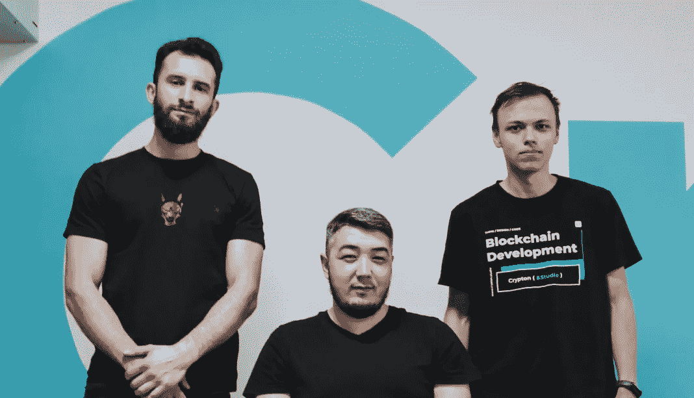

# 高级/中级/初级区块链开发者有什么区别？

> 原文：<https://medium.com/coinmonks/what-are-the-differences-between-senior-middle-junior-blockchain-developers-39a98ff3a050?source=collection_archive---------37----------------------->

在我们公司，有不同级别的开发人员:初级、中级和高级，都在 [Crypton 外包。工作室](http://crypton.studio/)和在 [Crypton 的杰出表现。突出](https://outstaff.crypton.studio/)。

首先，我们来看看它们之间有什么不同。

# 少年

是一个刚刚开始编程之路的开发者。一个人已经掌握了语言的语法，可以编写简单的程序/脚本。

# 中间

是一个已经有一些编程经验的开发人员。他已经可以独立完成复杂的任务，但他需要指导。

# 学长

是一个懂几种编程语言，能从零开始实现项目架构，并考虑到项目的未来发展，选择适合职权范围的技术栈的开发人员。

完成 [Crypton 工厂](https://factory.crypton.studio/)实习后，有一个重点是大三马上上项目，积累经验，不做小任务。因此，区块链开发领域与其他 IT 领域非常不同。

等级之间的过渡通过分级发生。当学习新技术时，程序员的技术背景会增长，这种转变成为可能。

# 例如，初级区块链开发人员必须:

–了解主要的区块链以太坊，BSC，多边形，和图书馆，

–了解协议的工作、基本的 web3 和模式；

–能够编写关于可靠性的智能合同:打桩、农业、代币、NFT 市场、道、跨链桥、IDO 平台。

–编写干净的代码，并用测试覆盖功能。

前一个半月，大三有导师，然后掌握所有必要的知识，自己管理。此外，初级代码总是要经过中级开发人员的代码审查。

# 中级开发人员的知识面已经广得多了，他知道:

-如何创建一个架构；

–坚固性版本之间的差异；

–了解大量其他系统和协议，并拥有相关经验

–知道如何在基层与 Solana 合作。

# 年长的

拥有以上所有的知识，以及信心和对一致实相的深刻理解，对索拉纳、Near、Polkadot、Terra 协议和生态系统的经验。

你是什么级别的？

阅读 https://crypton . studio/blog/The-difference-between-junior，middle，senior-区块链开发者的完整文章

> 加入 Coinmonks [电报频道](https://t.me/coincodecap)和 [Youtube 频道](https://www.youtube.com/c/coinmonks/videos)了解加密交易和投资

# 另外，阅读

*   [BigONE 交易所点评](/coinmonks/bigone-exchange-review-64705d85a1d4) | [电网交易 Bot](https://coincodecap.com/grid-trading)
*   [氹欞侊贸易评论](https://coincodecap.com/anny-trade-review) | [CoinSpot 评论](https://coincodecap.com/coinspot-review)
*   [新加坡十大最佳加密交易所](https://coincodecap.com/crypto-exchange-in-singapore) | [购买 AXS](https://coincodecap.com/buy-axs-token)
*   [投资印度的最佳加密软件](https://coincodecap.com/best-crypto-to-invest-in-india-in-2021) | [WazirX P2P](https://coincodecap.com/wazirx-p2p)
*   [西班牙 5 大最佳文案交易平台](https://coincodecap.com/copy-trading-spain)
*   [Pionex 双重投资](https://coincodecap.com/pionex-dual-investment) | [AdvCash 审查](https://coincodecap.com/advcash-review) | [支持审查](https://coincodecap.com/uphold-review)