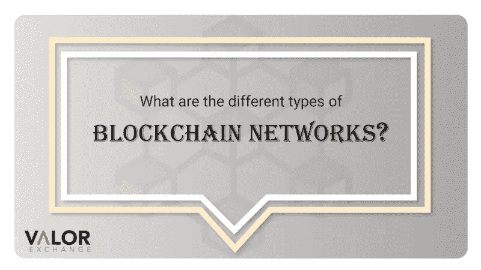

# 区块链网络有哪些类型？

> 原文：<https://medium.com/coinmonks/what-are-the-types-of-blockchain-networks-2685b20a589a?source=collection_archive---------53----------------------->

看到不同类型的区块链可能有点奇怪，尤其是如果你是密码行业的新手。许多区块链从事不同的加密项目。以太坊有一个，其他一些[的另类硬币也有。](https://valorexchange.com/blog/post?slug=introduction-to-altcoins-for-beginners)然而，在这些不同的区块链生态系统中有不同类型的区块链。这篇文章谈到了区块链的类型，它们的区别和用途。

**有权限和无权限的区块链**

区块链有两种主要的分类。有允许的和不允许的区块链。

许可的区块链或私人区块链是不公开的。只有特定的用户可以访问它。根据区块链管理员的授权，这些用户只能在区块链上执行特定的操作。

然而，未经许可的区块链也被称为公开的或不受信任的区块链。在这些类型的区块链中，任何人都可以参与验证区块链上的交易的过程。它们是分散的，更安全，因为它们有许多验证器和节点。

许可区块链往往更有效，因为区块链网络是受限制的。无权限的往往有许多验证者，他们必须确认一个需要时间的交易，但由于同样的原因，他们更安全。

**区块链的种类**

区块链结构有四种类型。

**公共区块链:**这些是未经许可的区块链。他们允许任何人加入，并且是分散的。这些类型的区块链主要用于交换和开采加密货币。矿工确认交易并获得奖励。这些类型的区块链的例子有比特币、以太币、莱特币等。

**私人区块链:**这些是由单一组织控制的部分中央集权的区块链。在私有区块链中，中央权威机构确定谁验证或可以成为区块链中的节点。节点有时没有被赋予同等的操作权限。这些区块链的一些例子是 Ripple、Hyperledger 等。

区块链财团:这些是被许可的区块链，由一群组织控制，而不是一个实体。他们比私人区块链更加分散，因此更加安全。然而，这并不容易，因为它需要各组织之间的合作。

**混血区块链**:这些区块链试图结合私人和公共区块链的最可取的品质。这些并不完全对所有人开放，但仍然非常安全和透明。这些由一个组织控制。

区块链的成员可以决定他们希望开放区块链的哪些部分，哪些部分是私有的。

**特许区块链的优势**

快速:在这些类型的区块链下的交易通常比其他交易更快。这是因为使用区块链的验证器或节点数量有限。因此，有限数量的节点可确保交易被快速验证并添加到区块链中。

**可扩展:**它们是可扩展的，提供了一种可定制的区块链技术。如果一个组织想要 30 个节点，它可以很容易地做到。

**许可区块链的缺点**

**安全性:**区块链上的节点或参与者的数量有助于保持其安全性——数量越少，区块链的风险越大。此外，由于这些类型的区块链不是完全集中的，这可能导致黑客访问中央管理系统并入侵区块链。

**集权化:**他们受到自己中心身份的限制。系统由管理权限监控，这与激发区块链和加密运动的去中心化目标相矛盾。

**免许可区块链的优势**

**安全:**这些区块链有许多节点和验证器，这使得它们比权限区块链更快、更可信。网络越广，跟踪交易的节点就越多。

区块链是透明的，对所有人开放，所以没有人可以显示虚假交易。

**未经许可的区块链的弊端**

**交易时间变慢**:交易确认的速度比允许的区块链慢。这是由于网络的规模。有许多节点必须验证事务。

**可伸缩性:**缓慢的交易完成率会显著影响这些区块链。这也会导致可伸缩性问题。

**总之:**区块链技术有两大类，它们都有好坏之分。这完全取决于应用程序。

> 加入 Coinmonks [电报频道](https://t.me/coincodecap)和 [Youtube 频道](https://www.youtube.com/c/coinmonks/videos)了解加密交易和投资

# 另外，阅读

*   [网格交易机器人](https://coincodecap.com/grid-trading) | [Cryptohopper 审查](/coinmonks/cryptohopper-review-a388ff5bae88) | [Bexplus 审查](https://coincodecap.com/bexplus-review)
*   [7 个最佳零费用加密交易平台](https://coincodecap.com/zero-fee-crypto-exchanges)
*   [氹欞侊贸易评论](https://coincodecap.com/anny-trade-review) | [霍比保证金交易](/coinmonks/huobi-margin-trading-b3b06cdc1519)
*   [分散交易所](https://coincodecap.com/what-are-decentralized-exchanges) | [比特 FIP](https://coincodecap.com/bitbns-fip) | [Pionex 评论](https://coincodecap.com/pionex-review-exchange-with-crypto-trading-bot)
*   [用信用卡购买密码的 10 个最佳地点](https://coincodecap.com/buy-crypto-with-credit-card)
*   [最好的卡达诺钱包](https://coincodecap.com/best-cardano-wallets) | [Bingbon 副本交易](https://coincodecap.com/bingbon-copy-trading)