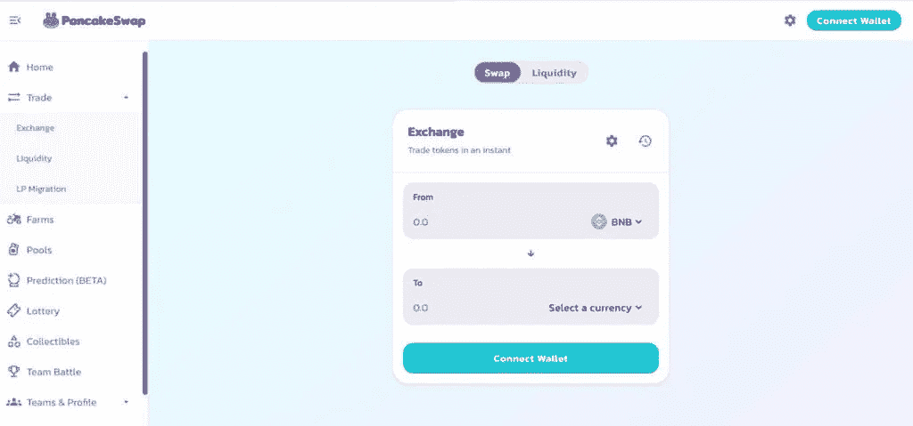

# 什么是令牌交换&它们是如何工作的？

> 原文：<https://medium.com/coinmonks/what-are-token-swaps-how-do-they-work-3af70a04ec7c?source=collection_archive---------5----------------------->

## 令牌交换简要指南

Token Swap

**令牌交换**就是这样一个创新的进步，旨在减少开销成本和将一种加密资产交换为另一种所需的时间。在本文中，我们将浏览令牌交换的简要指南，**什么是令牌交换，它们是如何工作的**，为什么需要它们，以及您可以交换令牌的各种方式。让我们开始吧！

加密货币行业致力于创新和简化数字资产的存储、处理和使用方式。这显然消除了曾经与加密空间相关联的复杂性，从而改善了整体用户体验。

# 什么是代币互换？

T4 代币交换是将数字代币从一个区块链转移到另一个。当一个项目在一个区块链上筹集资金，然后在主网发布后将其令牌迁移到一个单独的专有区块链时，经常会发生这种情况。

出于各种原因，区块链项目可能会选择使用其他区块链网络。项目的本地令牌必须可以与另一个与新网络兼容的令牌交换，后者必须由开发团队提供。

市场上存在许多交易服务，允许用户购买和出售加密货币，以换取传统货币或其他加密货币。由于流动性和每个交易所可访问的交易对数量有限，想要在两个加密令牌之间直接交易的用户可能会发现这是不可能的。

对于鲜为人知的代币来说尤其如此，这些代币通常只在少数交易所出售。用户不能使用法定货币，而必须使用最著名的加密货币之一，如 BTC 或 ETH，作为中介。

# 令牌交换、原子交换和令牌迁移—它们有什么区别？

令牌交换与令牌迁移同义。同样，术语“硬币互换”和“硬币迁移”意思相同。然而，原子互换完全不同，它涉及在一个单独的区块链上通过智能合约交换加密货币。这一过程消除了对集中式中介的需要。

术语**原子交换**的产生是因为原子在概念上是不可分的。此外，原子贸易本质上是一种要么全有要么全无的事情。当买方和卖方完全按照他们同意的方式进行交易时，原子互换就完成了，否则，交易根本不会发生。

至于**令牌迁移**，并不是说用一个令牌换另一个令牌，而是用一个新令牌完全替换一个令牌，这个新令牌在交换发生之前并不存在。一般来说，如果人们在谈论原子互换，他们关注的是购买和销售。但是，令牌交换涉及系统升级或令牌更改。

Token Swaps

# 代币互换是什么水平？

如果我们从购买者的角度来看，那么令牌交换的主要动机是将特定的令牌转换成另一个加密货币令牌。对于需要将他们当前的密码改造成不同的并获得优势的客户来说，这是一种简单的方式。许多交易平台已经理解了对交换的需求，因此他们推出了加密到加密的商务特性，以更专业的方式为买家服务。

如果我们从建设者的角度来看代币交换，那么第一个动机几乎完全不同。要确定一个区块链社区，需要一定数量的资金来提供代币供买家购买。为了实现这个目标，构建者在一个已经存在的区块链社区上构建了一个第二层令牌。这对建造者来说非常有用，因为它允许他们在建造自己的区块链社区的同时，在区块链社区使用他们的代币。

# 令牌交换是如何工作的？

作为投资者，如果代币互换发生在交易所平台上，你将不必主动做任何事情。许多交换平台只是处理代币交换，然后作为新代币记入您的帐户。这可能非常简单，只需几个步骤，您就可以进行令牌交换。

另一方面，当你把令牌放在钱包里时，这个过程变得有点复杂，因为它依赖于每个区块链项目的迁移。一般来说，如果您是令牌持有者，您必须在令牌交换截止日期之前注册您的令牌，以确保它们迁移到新区块链。这个过程称为映射。

# 为什么会发生令牌交换？

与传统的股票发行相比，区块链和代币使公司能够接受投资，并给予他们各种选择和控制权。然而，要建立区块链的基础，即“mainnet”，需要投资。这就产生了一个矛盾的情况，区块链本身需要投资来提供代币(作为一种投资选择)。

解决这个问题的一个好办法是在现有的区块链上创建一个令牌。一些区块链可以通过智能合约功能在其本机令牌上创建第二层。因此，组织在建立自己的区块链时，在其他区块链上有他们的标记。创建自定义令牌的著名区块链之一是以太坊和 ERC-20 令牌。事实上，ERC-20 标准在 2017 年 11 月实施后引起了新硬币的爆炸。

# 如何支持令牌交换？

令牌交换通过注册和审计过程得到支持，或者通过加密货币交换得到促进。

在第一种情况下，区块链项目的开发者逐渐邀请代币持有人注册他们的代币，然后他们通过支持的钱包认可这些代币。在代币交换日之后，旧代币通常会被烧掉，然后由官方资产来替换它们。在另一种情况下，代币持有者被邀请在加密货币交易所存储他们的资金。在这一过程中，交易所将停止为该部门提供任何交易选项，并将对不良资产进行审计并将其换成新的资产。

# 我如何能交换代币？

根据您希望交换的令牌对和交换方法，令牌交换过程会略有不同。但是有些事情你可以记下来，你是用交易所来交换代币，还是自己去做。首先，当你让交易所为你处理代币掉期交易时，应该注意的是，当前代币的交易通常会暂停，以免与可能正在进行的交易混淆。此外，用于空投或奖励的硬币创造和分配的硬币通常被停止。因此，互换之前的时间与互换的实际时间一样重要，因为交易所必须提前为某些事情做好准备。

以下是几种进行令牌交换的方法:

## 交易所的代币互换

进行代币交换最流行的方法之一是让交易所为你处理。旧令牌存储在钱包中，交换后，将创建一个新的钱包，交换的令牌将转移到该钱包中。一旦交换完成，装有旧代币的钱包就被销毁。在新代币开始交易后，您可以根据自己的喜好提取或交易代币。一般来说，交换比自己交换代币更容易，因为没有隐藏的费用，一切都是透明和直接的。

## 自己交换代币

您自己处理交换的过程通常是相同的。发行你手里硬币的平台/人会给你一个钱包下载或者一个在线网站注册。在这两种情况下，你都会得到两个钱包；一个是旧硬币，另一个是新硬币。然后旧令牌将必须被转移到特定地址。张贴这个，新帐户的钱包将被记入。然而，手动方法有更多的相关风险。

首先，由代币发行者创建的钱包和网站是专门为交换代币而创建的，因此对于那些不熟悉代币交换的人来说可能是新的。此外，这个过程可能会也可能不会像描述和设计的那样工作，所以如果你犯了一个错误，它将是永久的和不可逆转的。因此，手动掉期最适合那些在加密货币领域经验丰富的人。另外，此处描述的过程是手动交换的粗略概述，可能会因令牌对和其他因素而异。

# 代币互换有什么好处？

令牌交换在加密领域引入了许多增强功能。而且，如果你是一个投资者，那么知道你可能从这种操作中获得的第一个好处是有好处的。

*   令牌交换的一个重要的显著好处是它简化了加密到加密的商业操作。这些交易不仅成本低、简单，而且非常安全。您可以被允许与每个托管和非托管交易所进行交易。一些交易所甚至已经消除了将现金运送到你的加密交换交易所来进行直接的加密对加密交易的必要性。
*   相关的交易和令牌交换过程被保存在一个序列上，最终增加了信息完整性，这被认为是最好的优点之一。也可以向客户提供令牌交换的原子性与原子交换的安心。
*   令牌交换的另一个非常重要的好处是，由于合理的合同特征，交易变得非常划算。这意味着买家将有能力节省一些钱。

这些都是有用的和真实的选项，帮助客户毫无困难地进行交易。在讨论代币交换特征时，安全、用户友好、成本有效和容易交易是大多数专家承认和称赞的主要亮点。

许多交易所还接受了代币交换的特性，因此他们坚持努力提高消费者的专业技能。像 [Defi](https://blog.cryptostars.is/defi-in-crypto-the-top-5-defi-coins-to-invest-in-2022-1f25e05cf7a4) 和 [NFTs](/coinmonks/what-are-nfts-non-fungible-tokens-explained-f3a3d8d18ed7) 这样的短语在过去几年才开始引人注目，现在已经开始进行代币互换操作。这展示了代币交换的优势是多么富有成效，以及它们将很快在那里爆发的方式。

# 代币交换的缺点是什么？

现在，我们相当清楚什么是令牌交换，以及它如何支持加密领域的购买者和构建者。然而，除了这些优点，还有一些东西可能对你的眼睛不好。

令牌交换还会带来一些你必须注意的缺点，在这里我们会帮助你。此外，现在我们可以讨论与加密世界的这一新兴特征相关的主要危险。

*   顾客所熟悉的许多致命缺点之一是缺乏隐私。代币交换是公开的，给许多人带来了隐私问题。
*   每个事件之间的信念也将是一个优先事项。首先，对顾客来说，相信任务的领导者是很重要的。第二，客户应该有足够的信心，该方法可以按照协议完成。但是当它缺少某个地方时，它可能会成为问题的根本解释。
*   在一个区块链社区中，没有一个管理当局能给人带来多少好处，然而，同样有效的还有威胁。没有任何增加的权力会给一些寻求解决的问题提供开端。例如，如果在交换过程中有一件事出错了，没有人会帮你解决这个问题。这就是为什么大多数专家在课程过程中努力构建每个事件都遵守的可靠协议。
*   另一个主要威胁是最后期限。如果有人没有在给定的时间内交换他们的令牌，那么它可能会完全放错地方。额外确切地说，你之前的硬币会失去效用，零钱甚至会拆除它，以便零钱的其他每个服务都无法承认它。

通常，令牌交换操作被认为是成本有效的，然而，通常情况可能并非如此。有些交易所可能会收取额外的价格，从而提高买卖费用。

# 最佳代币交换平台

## [**ChangeHero**](https://changehero.io/)

这是一个最好的加密交换平台，允许你立即用卡购买加密。此外，您可以交换加密与加密即时没有创建任何帐户。

ChangeHero

## [简单交换](https://simpleswap.io/)

它被集成到最大的加密货币交换平台中，允许直接转移到您的硬件钱包中的加密货币的无限交换。

Simpleswap

## [ShealthEX](https://stealthex.io/)

这是一个用户友好的加密交易所，自 2018 年 10 月开始运营。该平台提供各种功能，如即时交易，没有限制，浮动和固定汇率等。

ShealthEX

## [多变](https://changelly.com/)

它是最古老和最值得信赖的平台，因为它有几个功能，如即时交换或交换和附属程序。高级版本 Changelly Pro 是为高级和有经验的用户设计的。

Changelly

## [Uniswap](https://app.uniswap.org/#/swap?chain=mainnet)

另一个顶级的[分散交易](https://blog.cryptostars.is/what-are-decentralized-exchanges-how-do-dexs-work-4e54fd477e0e)是 Uniswap，在这里你可以交易超过 50000 个交易对的任何以太币。它的升级版 Uniswap V3 允许用户计算时间加权平均价格(TWAP)和几何平均 TWAP。

Uniswap

## [煎饼互换](https://pancakeswap.finance/)

PancakeSwap 是一个[去中心化的交易所](https://blog.cryptostars.is/what-are-decentralized-exchanges-how-do-dexs-work-4e54fd477e0e)建成，是比特币智能链上最大的自动化做市商(AMM)交易所。PancakeSwap 是一个以早餐为主题的平台，涉及到基于食物的代币的使用。

PancakeSwap

## [SushiSwap](https://app.sushi.com/en/swap)

SushiSwap 是一个[去中心化的交易所](https://blog.cryptostars.is/what-are-decentralized-exchanges-how-do-dexs-work-4e54fd477e0e)，运行在以太坊区块链上。就像 Pancakeswap 一样，它通过提供良好的激励来促进其用户更多地参与。此外，它还运营一个定制的自动做市商(AMM)，确保两种加密货币资产之间没有流动性问题和自动交易。

SushiSwap

# **代币互换背后的动机**

对潜在原因的思考是另一个重要的组成部分，可以帮助更好地理解令牌交换的概念。企业可以使用区块链和代币来吸引投资，同时保持对许多选择的控制和访问。

与发行股票的传统方法相比，区块链和代币可以为企业提供更多的灵活性。另一方面，为区块链网络奠定基础需要大量投资。因此，出售代币作为投资选择需要投资区块链。

在这些情况下，最佳选择是在现有区块链之上创建第二层令牌。在这种情况下，智能合约功能可以帮助在本机令牌上创建第二层。

因此，代币互换可能有助于企业发展自己的区块链，同时也允许它们在其他区块链操作代币。凭借其 ERC-20 代币，以太坊是创造定制代币最常见的例子之一。

随着 ERC-20 标准的实施，代币互换智能合约功能得到了广泛的认可，导致了一系列新硬币的出现。

在开始代币交换之前，你应该知道以下 5 件事:

## 1.别忘了以太坊的煤气费

以太坊允许项目使用智能合约来生产 ERC20 令牌。这些硬币必须通过以太坊进行处理，这就需要支付汽油费。根据市场交易量，汽油费可能会很贵，这会降低你每笔交易的利润。这对于转换来说更糟糕，因为某些方法需要多次硬币交换才能获得任何优势。

## 2.了解兑换费用

除了汽油之外，消费者还必须考虑交换费，这些费用差别很大。在完成您的交易之前，加密交换网站会将此列在其常见问题或突出显示。

重要的是，仔细检查你期望从每次互换中获得的加密货币的数量。一些网站会显示你想要的代币的等值美元，可能比你预期的要少。

## 3.使用合适的钱包

在将新转换的加密货币发送到您的钱包之前，请确保它受支持。一些原本是 ERC20 令牌但后来迁移到其本机协议的令牌将很难迁移。在您完成交易之前，请仔细检查您是否涵盖了所有潜在的差异领域。

## 4.考虑流动性和滑动

当交易以不同于开始时的价格执行时，这就是所谓的滑点。由于加密货币市场的不可预测性，在某些交易中滑点是不可避免的。一些平台对滑点进行限制，如果滑点达到某个阈值，就阻止交易执行。

你可能会认为，当谈到流动性时，不管金额多少，转换利率都会保持不变。事实完全不是这样。交换率根据可用于交换的加密货币数量而波动。改变您的交易将吸引流动性有限的加密货币为您提供更好的利率。

## 5.遵循可靠的安全程序

尽可能使用双因素身份验证来访问您的钱包和其他与加密操作相关的帐户。不要和任何人分享你的私钥，也不要直接在网站上使用。如果一个提议看起来好得不像真的，它很可能就是真的。

只使用可靠的交换，并记住它们的集中性质。当你将加密货币存储在中央交易所时，你就放弃了对它的完全控制。如果出现问题，您将无法访问您的加密，直到问题得到解决。

# 结论

**代币交换**可能看起来很复杂，但只要有正确的知识和资源，就可以轻松完成。选择交换还是自己交换代币是个人决定。许多人喜欢自己进行互换的主要原因是意识形态，因为他们不想依赖第三方。另一方面，一些用户放心地信任交易所为他们进行令牌交换。然而，并不总是有可能得到您正在寻找的确切的交换对。无论如何，**代币互换**不需要任何专业知识，你就可以进行。只要你认真地按照步骤，并遵守时间表，你应该能够管理好它。

# **总结**

我希望，你能完全理解**代币交换的简要指南！如果你有任何与此相关的问题，请在评论区告诉我。在 LinkedIn 上关注我，保持联系→[https://www.linkedin.com/in/ishanshahzad/](https://www.linkedin.com/in/ishanshahzad/)**