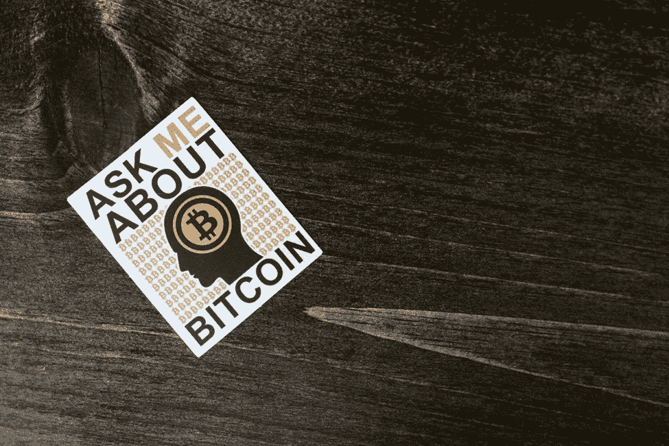
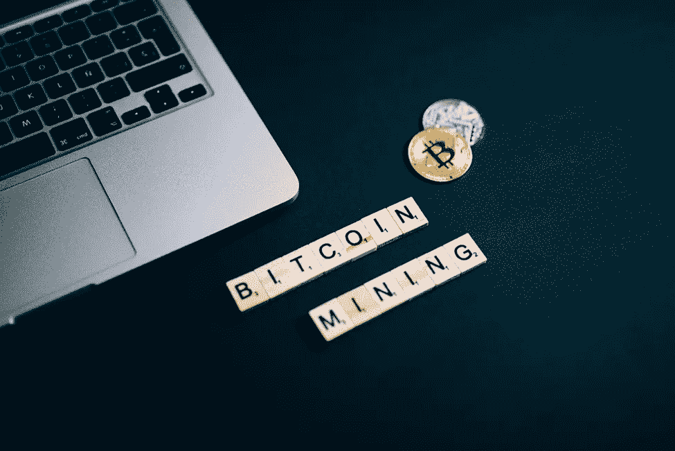

# 比特币背后是什么？

> 原文：<https://medium.com/coinmonks/what-backs-bitcoin-8fb4e5ede0c6?source=collection_archive---------25----------------------->

比特币为什么有价值？为什么比特币的价格一直在波动？比特币只是一种时尚吗？我相信你已经遇到这些问题几十次(如果不是几百次的话)。我知道我有。这些是关于比特币和其他数字货币的一些最常见的问题。

为了完全理解比特币的工作原理，并帮助你回答这些问题，你需要从头开始。我们先来定义一下比特币是什么，它是如何工作的。

# 比特币是什么？

来自 Pexels.com 的照片

比特币是一种数字货币，它是通过一种被称为密码术的技术实现的。它是分散的，因为它没有任何形式的中央权威。比特币可以像任何其他形式的货币一样用于购买或出售商品。

比特币交易的独特之处在于它以点对点的方式运作。这仅仅意味着在交易发生时没有任何中间人。传统上，交易要么由中介(第三方)验证，要么由买卖双方之间的信任来验证。

一般来说，在比特币或加密货币的情况下，使用加密技术来验证交易。那么，什么是密码学呢？crypto 这个词的字面意思是隐藏或秘密。我们不用技术术语来解释什么是密码学，而是用一个简单的类比。

假设你想给你的朋友发送一条秘密消息，但是这条消息有可能会落入坏人之手。所以，你和你的朋友想出了一个只有你们两个知道的秘密代码。当互相发送信息时，你把它们隐藏在你们共同创造的代码中。这样你就可以确定只有你的朋友，也就是预定的接收者，可以解释代码。

照片由 [**罗德尼制片**](https://www.pexels.com/@rodnae-prod?utm_content=attributionCopyText&utm_medium=referral&utm_source=pexels) 出自 [**派克斯**](https://www.pexels.com/photo/white-photograph-on-the-table-8369834/?utm_content=attributionCopyText&utm_medium=referral&utm_source=pexels)

这正是密码术，只是在比特币的情况下，计算机使用两把钥匙创建代码。一个**公钥**，通常是接收者的地址，以及一个**私钥**，只有接收者知道。公钥认证交易，而私钥保证交易的安全性。

# 比特币的工作原理

一种被称为区块链技术的技术为比特币提供了动力。简而言之，区块链是一个以块为单位存储数据的开源公共分类账。顾名思义，这些块是相互链接的。数据存储/记录在这些块中。

存储在区块链上的数据被称为不可变数据(不可更改)。数据一旦存储在区块链中，就无法更改或删除。这是因为在区块链中，每个新块都依赖于底层块才能存在。因此，我们只能将数据添加到区块链上，而不能更改或删除区块链上已经存在的数据。

就比特币而言，这是通过**哈希算法实现的。**哈希是一种加密函数，它接受输入，执行数学运算，并将其转换为哈希代码或哈希值。这个哈希值用于通过比特币挖掘过程创建新的区块。

值得注意的是，哈希是单向操作。没有办法计算出哈希值来确定输入，因此区块链具有不变性。

# 比特币挖矿

比特币挖矿是专门的计算机(矿工)创造新的比特币作为解决数学方程的奖励的过程。从理论上讲，新的比特币是作为在比特币网络上确认交易的奖励而提供的。

照片由[奥利亚·科布鲁斯娃](https://www.pexels.com/@olyakobruseva?utm_content=attributionCopyText&utm_medium=referral&utm_source=pexels)从[派克斯](https://www.pexels.com/photo/scrabble-tiles-on-the-table-8358047/?utm_content=attributionCopyText&utm_medium=referral&utm_source=pexels)拍摄

当计算机能够计算出新块的正确散列值时，交易被确认。然后，等待确认的事务存储在这个新挖掘的块中。这种操作需要大量的电力、时间，甚至人力资源才能成功。交易在几分钟内确认。这被称为工作证明，有助于比特币的价值。

采矿作业需要大量的计算能力，因此有“工作”一词。理解工作证明机制至关重要，这将有助于我们回答比特币为什么有价值的问题。

既然你已经对比特币是什么、如何工作有了基本的了解，那就让我们来谈谈比特币，以及支撑比特币的到底是什么。任何关于比特币的支撑因素及其价值的争论都必须涉及法定货币。这是因为它已经使用了十多年。

**关于作者**

我是一个 23 岁的肯亚区块链爱好者。我坚信这项技术以及它能做什么，尤其是在整个非洲。为了回报我的社区，我写了一些关于区块链技术、加密货币和更广泛的“Web 3.0”的教育内容，试图让尽可能多的人投资这个领域。