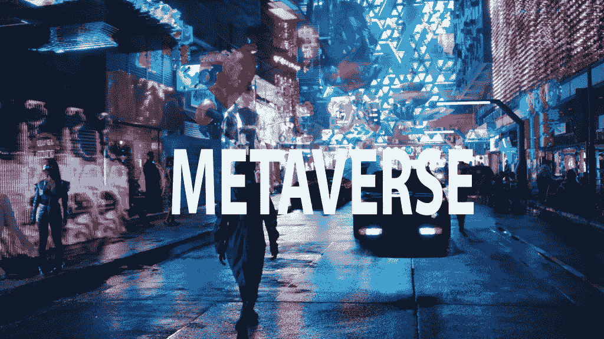

# 2022 年你能在元宇宙做些什么？

> 原文：<https://medium.com/coinmonks/what-can-you-actually-do-in-the-metaverse-in-2022-cef0de3bf9cb?source=collection_archive---------21----------------------->

## 2022 年的元宇宙

Main image of the metaverse

元宇宙经常以如此未来的术语表达，以至于很难理解你今天怎么会参与其中。但事实是，类似元宇宙的世界已经存在了几十年，你可能已经经历过其中的一些，而不一定意识到这一点。

让我们看看你能在 2022 年的**元宇宙做些什么！**

# 什么是元宇宙来着？

根据风险投资家马修·鲍尔的框架，元宇宙是一个持续的在线世界，模糊了现实和虚拟现实之间的界限。远不止是一场使命召唤比赛，元宇宙指的是一个 24/7 的在线世界，这个世界的经济刺激了一个新的创造者和基础设施提供商的网络。至关重要的是，这种经济围绕着可互操作的游戏内资产。这一概念与我们今天使用的“围墙花园”——封闭的生态系统——大相径庭；Ball 提供了一个反冲击枪的外壳例子，它可以很容易地变成堡垒之夜武器的装饰。

虽然马克·扎克伯格的 Meta(前脸书)对元宇宙有自己的想法，但加密货币社区认为区块链技术非常适合这个新奇的网络世界。《沙盒》和《分散的土地》等密码游戏提供了创造者主导、密码和 NFT 驱动的经济如何运转的早期愿景。所以，这就是你今天在元宇宙能做的。

# 在虚拟世界中构建、探索和游戏

像《我的世界》和 Roblox 这样的游戏在近十年的大部分时间里都在提供类似元宇宙的体验；《第二人生》和《Eve Online》自 2003 年以来一直生机勃勃，《魔兽世界》于 2004 年诞生。

《第二人生》是最接近元宇宙的类似作品之一，因为它以创造者为主导的经济和庞大的沙盒世界。在“第二人生”中，你可以做任何你喜欢的事情，一些人已经被记录在游戏中度过一生，依靠虚拟土地生活，收获游戏的游戏内货币林登币，并参加活动。

在 21 世纪 20 年代，像沙盒和分散的土地这样的加密游戏正在通过向组合中添加数字资产来颠覆视频游戏经济。你不仅可以将你自己的不可替换的代币(NFT)导入游戏并购买虚拟土地，还可以使用游戏的可替换治理代币来改变你将要居住、探索和建造的虚拟世界的参数。

两者都由加密货币驱动——沙盒使用可替换的沙令牌作为游戏内货币，并使用 NFT 来代表土地和其他游戏原生项目，即装饰你的化身的资产类型，而分散土地拥有可替换的魔法令牌和虚拟资产的等效非可替换物。

要创建帐户，您只需连接一个加密钱包，如 MetaMask。不过，在分散式游戏中，不需要连接加密钱包就可以作为客人玩游戏。沙盒在技术上处于 alpha(测试阶段)，第一季已经关闭，所以在 Alpha 第二季发布之前你不能玩它，发布日期尚未确认。

抛开密码经济学不谈，这些游戏和其他沙盒游戏一样。你可以在游戏各自的虚拟世界中漫游，与急于垄断市场的品牌和名人一起闲逛。在虚拟空间，比如购物中心、美术馆或广场，你可以四处走动，与人交谈，玩游戏，建造房屋或参加活动。分散之地甚至举办自己的音乐节。不幸的是，尽管现代电脑游戏图形有所进步，但许多新游戏看起来并不比 2003 年的《第二人生》更好。但神奇之处在于，至少在理论上，在于你可以与你的虚拟兄弟建立关系。

# 为了工作或娱乐，与来自任何地方的人见面

元宇宙有很多休闲场所。虽然你当然可以聚集在巨大的开放世界中，如沙盒和分散的土地，但你也可以在空间等平台上玩定制的房间。这些应用程序是专门为活动、会议和集会设计的。您可以使用 Web 2 登录(如 Google)或 Web 3 登录(如 MetaMask)来登录 Spatial。空间虚拟世界被分隔成房间；您可以参观预制的房间或创建自己的房间。空间图库支持 NFT。你可以在手机、Steam、浏览器或通过 Oculus VR 耳机在 Spatial 的世界中移动。

虚拟现实在波尔的元宇宙标准之一上很强:存在感。戴上虚拟现实耳机，比如 HTC Vive、Valve Index 或 Meta(以前的 Oculus) Quest，将自己投入到网络空间中。Meta(前脸书)正在为其 VR 头戴设备建立一个社交中心，Steam 的 VR 软件预装了一个虚拟家庭。像虚拟现实聊天这样的游戏先于加密，并允许你进入满是其他人的房间，他们戴着虚拟现实耳机，穿着他们喜欢的任何化身。

像 MetaHub 这样的公司正在为会议和商业活动创建虚拟的聚会场所，分散之地在 2021 年举办了第一届音乐节——尽管艺术家们在第二人生酷起来之前很久就已经在这样做了。闲逛是元宇宙的界限开始变得模糊的地方，也是市场宣传开始瓦解的地方。

Zoom 是元宇宙的一个重要组成部分，因为它连接工作场所并引发了在家工作的革命吗？或者，正如马克·扎克伯格在他的 Meta keynote 中提到的那样，这是一种无法令人信服的现实替代方案，用屏幕上的一排排面孔取代了面对面的互动？

# 创建一个看起来像你的 3D 头像…或者不像

你的头像是你元宇宙身份的重要组成部分。对一些人来说，像 CryptoPunks 或 Bored Ape Yacht Club 这样的个人图片 NFT 对 Discord 和 Twitter 来说就足够了，这些大多是基于文本的平台，2D 的图片就足够了。对于 3D 领域，Ready Player Me 等应用程序提供可组合的数字身份，据称可用于 1330 个应用程序和游戏，包括耐克的 RTFKT、Somnium Space 和 VR Chat。你也可以从 RTFKT 购买 NFT 运动鞋，或者从其即将推出的“化身项目”中购买一个化身，尽管还不清楚哪些游戏会让你“穿”这些。

在 Somnium Space，一个基于以太坊的虚拟现实开放世界，类似于分散之地，你可以导入一个准备好的玩家我的头像，它只不过是一张自拍。根据 Ball 的框架，这满足了互操作性的标准——无论您使用哪个平台或应用程序，都能够随身携带您的数字资产。

# 投资虚拟土地、NFT 或代币

当然，如果你并不真的对脱离现实感兴趣，你可以投资时髦的虚拟世界。有许多方法可以解决这个问题。你可以投资 NFT 头像滴剂，就像耐克或阿迪达斯提供的那样。你可以推测虚拟土地或游戏中的物品，就像 Axie Infinity、分散土地和沙盒上提供的那些。

你也可以投资于这些游戏提供的可替换代币，这些代币起到游戏内货币的作用。如果你不确定投资哪种股票，你可以投资元宇宙指数基金，比如 Index Coop 提供的元宇宙指数(MVI)。MVI 根据当时最大的元宇宙硬币重新平衡其投资组合。

如果你不喜欢加密，你可以投资虚拟现实和元宇宙公司的股票。Meta 是一家对虚拟和增强现实的未来押注很大的公司，该公司将在 2014 年至 2023 年期间在这个概念上花费 700 亿美元。虚拟现实、元宇宙股票以及私人投资也在讨论之列。

## 在 Linkedin 上关注我，保持联系

[https://www.linkedin.com/in/ishanshahzad/](https://www.linkedin.com/in/ishanshahzad/)