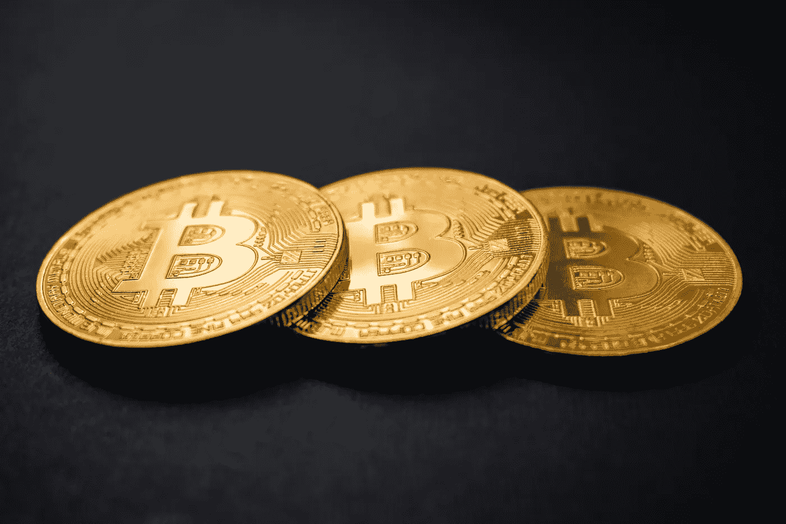

# 用比特币可以买什么？

> 原文：<https://medium.com/coinmonks/what-can-you-buy-with-bitcoin-777488603ed4?source=collection_archive---------61----------------------->

Source photo Unsplash.com

当比特币在 2009 年推出时，它旨在成为日常交易的媒介，让人们可以轻松购买从一杯咖啡到一台电脑甚至一套公寓的任何东西。它的轨道在发射后发生了很大的改变——它成为了众多非法行动的流行渠道。

然而，中本聪的发明不仅仅用于这个目的。正品的种类和…