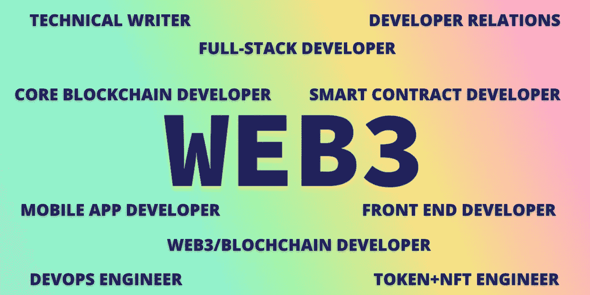

# 在 Web 3.0 中你能做什么？—从想法的海洋中啜饮一口。

> 原文：<https://medium.com/coinmonks/what-can-you-do-in-web-3-0-b66806e6694a?source=collection_archive---------28----------------------->

Ah $hit! Here we go again.

欢迎回到**“develouccino”的第二部分，**在这篇精心撰写的文章中，我将尝试向您概述作为开发人员在我们称之为 Web 3.0 的海洋中探索的机会。

# 介绍

每一个蓬勃发展的领域都有公平的机会，但在 **Web 3.0** 的情况下，该空间在某种程度上成为了最富有机会的社区之一。
在软件和信息技术领域，我们已经看到了各种各样的开发者。老实说，在咸的边缘，我们已经看到自动化接管了开发人员，欣赏不足，相同的旧开发程序和陈词滥调的更新工作接管了开发领域。在这种情况下，Web 3.0 带来了一股新鲜空气。我们观察到许多经验丰富的开发人员和新手带着一些贡献或新的项目想法进入这个领域。

# Web 3.0 中的开发者有哪些类型？

Yes! I custom made this one just for the visual appeal :)

开发商主要可以分为以下几类-

**区块链核心开发者:**核心区块链开发者负责构建和维护区块链架构，同时设计共识机制，主要做出关于区块链的有影响力的更新和决策。一个核心的区块链开发者应该熟悉区块链所遵循的所有机制和算法，也应该了解这个领域所有正在进行的技术细节。您将使用的主要技术栈将包括 **Golang** 、 **Rust** 、 **C++** 和 **Java** 。此外，数据结构**和算法**的流畅性也是必须的。

智能合同开发者:我把这个和后一个分类分开，仅仅是因为这个技能的原创性和它在区块链空间中的存在。当涉及到第三人称视角的 Web 3.0 空间时，智能合约开发者是最受欢迎的开发者。该角色包括设计、实施和测试智能合同升级和添加。此外，开发人员必须与社区和智能合同审计员合作来实现修复。一个聪明的合同开发者应该非常清楚区块链的概念。建议有 Web 应用程序开发的经验，并在**坚实(**最普遍的**)的流畅性。**此外，技能组合应该包括对智能合同的良好修订，因为第一份工作总是审计其中一份合同。

**区块链应用开发者:**非常明确地说，这不仅仅是你正常的移动开发。该领域包含大量角色，涉及创建基于区块链的**应用。**该角色涉及产品开发渠道的许多环节，这些将在下一个讨论主题中解释。

Just an image to lift you up after all the content :)

# 区块链应用开发者

**前端开发人员:**负责创建支持区块链创意的前端设计和 UI 的开发人员。这些是需求之一，也是进入这个领域的一个非常好的机会。技能要求包括基本的 Web2 技术堆栈- ReactJs、TypeScript 或 JavaScript，以及一些关于 etherJs 和 web3Js 的知识。

**后端开发人员:**后端开发人员是任何领域，团队中受人尊敬的成员之一。主要原因是他们拥有大量的技术，在 Web 3.0 中，后端开发人员处理 API、子图和数据库。这个开发者处理 dApp 的舒适的进行。这也需要对区块链和智能合约有深入的探索性知识。

**移动开发者:**根据我在这个领域的经验，目前有很多好的 Web3 应用。这个领域的移动开发人员与 web 前端开发人员非常相似，技术架构也有些相同。不过，使用 **React Native** 非常普遍，这是一个很好的探索机会。

# 您可以探索的机会！

**开发-运营工程师:**这是我们讨论过的角色之一，是一个帮助平衡软硬件开发和运营的多面手。工程师要确保机器的一切都运转良好，包括基础设施开发、编码和系统管理。
准确地说，这是一个资深开发者的工作，因此可以由已经玩了相当长时间 Web2 游戏的有经验的开发者来探索。

**JavaScript / TypeScript 开发人员:**这是一个利基角色，任何做过工业 JavaScript 编码的开发人员都可以探索，开发人员确保在 Web3 平台上创建解决方案。这种角色主要出现在与服务相关的项目中。
Tech Stack 要求包括-熟练掌握 JS 和 TypeScript，熟练使用 EtherJs 和 Web3Js，以及数据结构和算法经验。

对于一个新项目来说，社区拓展和建设是一项艰巨的任务，技术细节很容易被其他开发人员采用。开发人员确保作为他们项目的代表接触其他项目或开发人员，这可以通过文章( ***)这就是我现在正在做的…*** )、视频或社交媒体。

# 结论

正如我经常提到的，这个领域现在正充满机遇，而且**“是的！熊市不会让世界停止运转。”我建议任何资深人士了解这个领域，探索上面解释的角色，直到你找到自己的口味。对于即将到来的开发者来说，走少有人走的路总是令人兴奋的！努力获得一些新技能，从中发展一些东西，为这个领域做出贡献。**

> ***签约下线！你的发展已经交付。***
> 
> 加入 Coinmonks [电报频道](https://t.me/coincodecap)和 [Youtube 频道](https://www.youtube.com/c/coinmonks/videos)了解加密交易和投资

# 另外，阅读

*   [美国最佳加密交易机器人](https://coincodecap.com/crypto-trading-bots-in-the-us) | [变化回顾](https://coincodecap.com/changelly-review)
*   [在印度利用加密套利赚取被动收入](https://coincodecap.com/crypto-arbitrage-in-india)
*   [Godex.io 审核](/coinmonks/godex-io-review-7366086519fb) | [邀请审核](/coinmonks/invity-review-70f3030c0502) | [BitForex 审核](https://coincodecap.com/bitforex-review)
*   [5 款最佳免费加密货币制图工具](https://coincodecap.com/crypto-charting-tools)
*   [最佳比特币保证金交易](/coinmonks/bitcoin-margin-trading-exchange-bcbfcbf7b8e3) | [萝莉点评](/coinmonks/lolli-review-e6ddc7895ad8) | [比特币保证金交易](https://coincodecap.com/bityard-margin-trading)
*   [创造并出售你的第一个 NFT](https://coincodecap.com/create-nft) | [密码交易机器人](/coinmonks/crypto-trading-bot-c2ffce8acb2a)