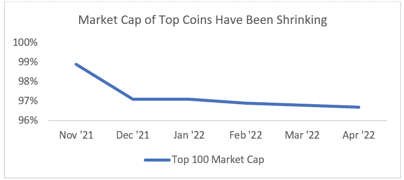

# 什么会出错…

> 原文：<https://medium.com/coinmonks/what-could-go-wrong-7cc494c40b8?source=collection_archive---------16----------------------->

这真的重要吗？

所以我们在之前的文章中描绘了一个场景(可能是我一厢情愿的基本案例),关于我们如何找到一个软着陆。现在什么会出错呢？

简单地说，如果需求水平的下降未能导致随后供应面通胀的及时平息，在这种情况下，我们可能会看到持续和更大规模的需求破坏发生。我们所看到的通胀有很大一部分源于大宗商品价格的上涨——特别是油价上涨推高了供应链成本以及塑料(由石油和天然气的衍生品制成)等投入品的成本。虽然我们已经看到石油需求下降，因此我们应该会有净负需求，但对俄罗斯石油的禁令将有效地造成人为的供应减少，使价格上涨和通胀持续。欧洲已经宣布禁止从俄罗斯进口 18%的石油，虽然实际上并不是所有的都可以执行，但这将抬高从北美和中东等其他地区出口的石油价格。

Source: EIA, BBC

投资者也将关注中国和那里的 COVID 环境。中国消耗的石油比整个欧洲都多，尽管他们已经改变了管道和支付方式，以便更容易地与俄罗斯石油生产商交易，但他们仍然从多样化的全球来源进口石油。由于 COVID，中国已经关闭了大约 28%的 GDP(从市场上消除了 0.5 兆桶/天至 1 兆桶/天的石油需求)，北京和上海等城市的重新开放将增加需求，并对油价和全球通胀压力产生后续影响。我们看到，重新开工的速度比市场预期的要快得多，比如上海的特斯拉工厂已经达到了 70%的产能。

持续上升的通胀压力和投入价格最终可能会消耗消费者支出，并使支出低于趋势水平(尤其是在储蓄继续减少的情况下)。这可能与企业利润率的下降同时发生，随着收益开始减少，这将迫使企业重新考虑其招聘和支出模式，并导致失业率上升。考虑到消费者占大部分发达经济体 GDP 的 60——70 %,这些领域的大幅减速可能引发衰退。在这种情况下，衰退可能会持续更长时间，复苏取决于供应面压力何时最终消除。

然而，上图所示的消费者支出目前仍然相当稳定，即使在我们迄今为止看到的高油价中，高油价保持现状的时间越长，消费者对石油的需求就越有弹性(短期约为-0.1，长期约为-0.4)。当然，尽管名义上油价可能看起来很高，但我们必须将其置于经通胀调整的背景下，才能真正理解其对商业周期的影响。

Source: FRED

尽管如此，随着通胀动态和增长担忧之间的关系继续演变，中国重新开放、消费者支出趋势和失业数据将是至关重要的。

然而，从长远来看，基本面通常会胜出，而加密的基本面是以持续采用和网络增长为特征的。随着全球采用的扩大，无论你的估值框架是梅特卡夫定律之一，还是每日交易量 x 活跃用户数，甚至是基于自由现金流的贴现现金流，都不能否认加密估值将相应增加。如果说有什么不同的话，那就是过去几年极大地推动了这种采用趋势。

Source: McKinsey Survey: How COVID-19 Has Pushed Companies Over the Technology Tipping Point

撇开 COVID 不谈，即使是俄乌战争也有助于增加采用曲线。看看俄乌战争，俄罗斯和乌克兰的公民很快意识到，你的钱不是你的资产，而是别人的负债。这些政府很快意识到，战争不仅仅是通过军事力量发动的，而是通过货币和银行账户。在一个 90%的交易都以美元完成的世界里，其他所有人都明显处于劣势。虽然单一全球储备货币的概念并不新鲜(葡萄牙、西班牙、荷兰、法国和英国的货币是最后五种)，但过去几十年来的互联性和全球化才是。正因为如此，每个人的资金流都是相互联系的。随着更强大的国家有能力打开和关闭其他国家的资本水龙头，世界上更依赖的国家正在意识到其后果。政府现在理解了不受其他政府单方面控制的货币对的重要性，无论你对战争中各种参与者使用加密货币的看法如何，都不能否认全球结算时间近乎即时的分散资产的有用性。

我们看到这一认识的后果在乌克兰实时发生。在 2 月 17 日那一周，乌克兰议会通过了一项加密货币合法化的法案，2 月 26 日，副总理米哈伊洛·费多罗夫在加密推特上寻求支持。一周之内，9.5 万名捐款人凑集了 3800 万美元的以太坊和其他替代硬币。以太坊的联合创始人、波尔卡多特的创始人加文·伍德(Gavin Wood)将 560 万美元的波尔卡多特捐赠给了乌克兰政府。乌克兰的比特币钱包积累了超过 1000 万美元。截至 3 月底，通过所有加密货币的组合，至少已筹集了 1 亿美元支持乌克兰。

不管短期波动性如何，crypto 的未来可能会持续增长和扩张，虽然有一句谚语说水涨船高，但这并不是说没有不相关的机会。人们只需将今天的 10 大密码与 2018 年的 10 大密码进行比较，就可以看出盲目遵循传统的市场思维会如何将投资者引入歧途。

Source: coinmarketcap.com

最近，我们目睹了另一个市场信念的崩溃——替代币只是比特币和以太坊的更高测试版，价格略有滞后。前 100 名和其余 100 名之间的贝塔结构的细分(因此小型和微型股优于大型和中型股)表明，这是不准确的。

Source: coinmarketcap.com

另外，由于 STEPN 等代币项目的受欢迎程度激增，一些新的子行业正在形成，这些代币项目奖励持有运动鞋 NFT 的用户活跃。随着 Moonbeam 等项目的增长和 Polkadot 副链的使用，第 1 层的定义线变得越来越模糊。即使在大型项目中，也存在巨大的信息错位，这一点可以从今年早些时候 Luna 的过山车之旅中看出。所有这些都没有涉及到 NFTs 领域和那里存在的定价复杂性。

因此，当我们处在一个宏观经济占优势、风险资产相关性趋向于 1.0 的环境中时，基本面分析的需求变得越来越重要。随着加密技术的不断成熟和发展，就像任何资产类别一样，无论是股票、债券还是商品，行业专家、研究团队和专门的信息收集的杠杆作用将在未来几十年中区分赢家和输家。

> 加入 Coinmonks [电报频道](https://t.me/coincodecap)和 [Youtube 频道](https://www.youtube.com/c/coinmonks/videos)了解加密交易和投资

# 另外，阅读

*   [7 大副本交易平台](https://coincodecap.com/copy-trading-platforms) | [买币点评](https://coincodecap.com/buycoins-review)
*   [MyConstant 点评](https://coincodecap.com/myconstant-review) | [8 款最佳摇摆交易机器人](https://coincodecap.com/best-swing-trading-bots)
*   [Godex.io 审核](/coinmonks/godex-io-review-7366086519fb) | [邀请审核](/coinmonks/invity-review-70f3030c0502) | [BitForex 审核](https://coincodecap.com/bitforex-review)
*   [10 本关于加密的最佳书籍](https://coincodecap.com/best-crypto-books) | [英国 5 个最佳加密机器人](https://coincodecap.com/uk-trading-bots)
*   [ko only 回顾](https://coincodecap.com/koinly-review) | [Binaryx 回顾](https://coincodecap.com/binaryx-review)|[Hodlnaut vs CakeDefi](https://coincodecap.com/hodlnaut-vs-cakedefi-vs-celsius)
*   [MoonXBT vs Bybit vs 币安](https://coincodecap.com/bybit-binance-moonxbt) | [硬件钱包](/coinmonks/hardware-wallets-dfa1211730c6)
*   [火币交易机器人](https://coincodecap.com/huobi-trading-bot) | [如何购买 ADA](https://coincodecap.com/buy-ada-cardano) | [Geco？一次审查](https://coincodecap.com/geco-one-review)