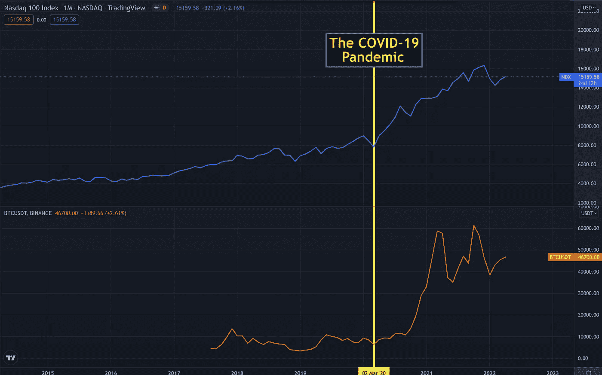

# 接下来会发生什么？

> 原文：<https://medium.com/coinmonks/what-could-happen-next-54ffce970879?source=collection_archive---------61----------------------->

接下来会发生什么，比我们在 2022 年第一季度经历的更糟糕？

众所周知，从疫情的早期阶段开始，我们已经看到了科技股和加密资产价格的大幅上涨。这两种类型的资产一起移动并不是巧合。因为在最基本的层面上，两者都是同一事物的不同表现。但后者更分散，更安全。这意味着普通人可以通过投资于一个更安全但目前更不稳定的环境来增加他们的资本。

 [## 印钞机走 Brrr！- GIPHY 剪辑

### 印钞机 Go Brrr(原剪辑！)

giphy.com](https://giphy.com/embed/qXR53U25GPeocwivdd/video) 

股票市场和密码市场的增长是由封锁和西方中央银行改善供给的措施引起的。《疫情时报》。随着美联储发行更多货币导致低利率，人们开始寻找替代投资工具。此外，一级防范禁闭向我们展示了科技是未来。因此，越来越多从未涉足股票市场或证券交易所的人开始将资金投入到与科技相关的投资工具中。

Stop and Think!

可以说，停下来环顾四周，让我们中的一些人变得更有远见。

US Inflation Rate

在 2022 年第一季度，有迹象表明疫情的影响正在减弱，通胀率正在上升，这使得发达国家央行的观点变得更加鹰派。正如我们在上面的图表中看到的，美国经历了自 1982 年以来最高的通货膨胀率。这种增长最初被认为是市场对各国央行为减少疫情的影响而采取的经济政策的反应。然后第三次世界大战的审判已经由俄罗斯政府开始。对于试图治愈疫情创伤的世界经济体来说，这可能是最糟糕的情况。西方与普京之间的审判和政治问题使得天然气价格大幅上涨。所以进一步提高了西方国家的通货膨胀率。

BTC Weekly Price Chart

不足为奇的是，3 月份美联储和其他央行已经开始提高利率来冷却经济。就在利率宣布之前，加密市场开始从底部上升。BTC 已经从 36.000 美元到 42.000 美元的价格区间恢复到 46.000 美元到 48.000 美元的价格区间。

It is our only home!

接下来会发生什么，比第一季度更糟糕？核战争？如果发生核战争，我想我们大多数人都不会有足够的时间去考虑钱的问题。顺便说一下，加密市场也对它进行了定价。加息？市场也已经对此进行了定价。在我看来，美联储预先宣布的进一步加息只会导致加密资产价格的修正。

The future…

此外，随着新的投资者和企业家的出现，加密世界正在与日俱增。新的强大项目开始使用区块链技术。从技术角度来看，没有区块链技术的元宇宙比梦想更抽象。因此，我们比以往任何时候都更需要区块链的科技项目。我们也需要区块链在一个更加敌对的世界里保护我们的首都。

总而言之，我对 2022 年剩余时间的加密市场的看法是乐观的，除非核战争发生。

感谢阅读…

> 加入 Coinmonks [电报频道](https://t.me/coincodecap)和 [Youtube 频道](https://www.youtube.com/c/coinmonks/videos)了解加密交易和投资

# 另外，阅读

*   [CoinFLEX 评论](https://coincodecap.com/coinflex-review) | [AEX 交易所评论](https://coincodecap.com/aex-exchange-review) | [UPbit 评论](https://coincodecap.com/upbit-review)
*   [AscendEx 保证金交易](https://coincodecap.com/ascendex-margin-trading) | [Bitfinex 赌注](https://coincodecap.com/bitfinex-staking) | [bitFlyer 审核](https://coincodecap.com/bitflyer-review)
*   [麻雀交换评论](https://coincodecap.com/sparrow-exchange-review) | [纳什交换评论](https://coincodecap.com/nash-exchange-review)
*   [支持卡审核](https://coincodecap.com/uphold-card-review) | [信任钱包 vs MetaMask](https://coincodecap.com/trust-wallet-vs-metamask)
*   [Exness 回顾](https://coincodecap.com/exness-review)|[moon xbt Vs bit get Vs Bingbon](https://coincodecap.com/bingbon-vs-bitget-vs-moonxbt)