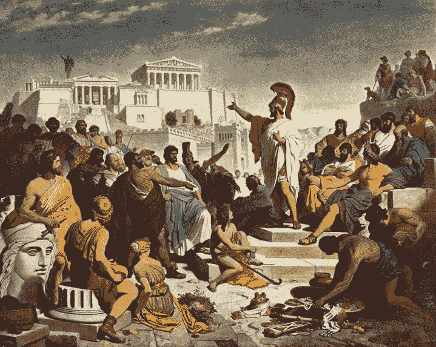

# 什么是真正的去中心化，什么不是

> 原文：<https://medium.com/coinmonks/what-decentralisation-really-is-and-what-it-is-not-c1c4c0c26ec8?source=collection_archive---------15----------------------->

随着西方政府和公司对普京入侵乌克兰的反应，区块链技术很快成为了一种暗示。虽然一些立法者很快认为俄罗斯精英可以利用加密来逃避制裁，但争论似乎正在趋于解决:[这种情况似乎极不可能发生](https://cointelegraph.com/news/experts-reject-concerns-russia-will-use-crypto-to-bypass-sanctions-totally-unfounded)。此外，加密资产在很大程度上[受到制裁](https://decrypt.co/94440/switzerland-says-freeze-russian-crypto-assets-report)。

然而，有些人质疑国际政府在区块链地区实施制裁的合法性。上周 [Metamask 和 OpenSea】阻止伊朗伊斯兰共和国和委内瑞拉用户的行动凸显了这个问题——即使取消委内瑞拉用户的访问](https://www.cryptonary.com/users-from-venezuala-and-iran-cannot-access-metamask-and-opensea/)[被证明是一个“简单的”技术错误](https://decrypt.co/94315/ethereum-infura-cuts-off-users-separatist-areas-ukraine-accidentally-blocks-venezuela)，而不是一个政策决定。有些声音甚至提到了“暴政的特洛伊木马”和“审查制度”,因为他们认为这个系统没有彻底去中心化。这种观点认为，去中心化是与政府监管相违背的。

# 去中心化——新环境下的旧概念

没有单一的教科书或学术定义。太多时候，我们看到去中心化的方法是相当短视的——由计算机科学和它的社区制造，由计算机科学和它的社区制造，为计算机科学和它的社区制造。我们德邦公司认为，有一个(或许有点不太可能)候选人可以丰富我们的理解:政治科学。幸运的是，我们中的一些人也有这方面的专业知识。

Nineteenth-century painting by Philipp Foltz depicting the Athenian politician Pericles delivering his famous funeral oration in front of the Assembly. Source: [Wikimedia Commons](https://commons.wikimedia.org/wiki/File:Discurso_funebre_pericles.PNG)

事实上,(去)集权化的问题非常接近这一学科的核心:“善治”。对善政的追求与人类历史一样悠久。我们可以回顾史前狩猎采集社区可能的决策过程；古希腊的城邦就像雅典，罗马共和国，欧洲中世纪的自治大学或修道院……民主的理念——当没有一个人，而是社区的每一个人都是最高权威，平等地根据法律做出决定——经历了很多变化和突变。它发展了真正重要的概念，如正当程序、法治或分权。它与社会价值观紧密相连，也许法国大革命最雄辩地表达了这一点:自由、平等、博爱。这些想法、价值观和概念是[的理想类型](https://en.wikipedia.org/wiki/Ideal_type)——难以完全实现，但却是决策的指导原则。

技术在良好的民主治理中的作用是毋庸置疑的。传播思想、让人们直接接触、建立沟通渠道对社会决策产生了深远的影响。想想印刷机的[发明:它彻底改变了大众对社会生活、学习和商业的参与——打破了欧洲中世纪天主教会扣人心弦的信息垄断。互联网也有同样的属性，但规模更大，有望实现更即时、多元化和无障碍的参与。但由于很少有政府能够真正实现多元化民主的所有理想，到今天，我们看到当前的 Web2.0 互联网未能实现太多令人振奋的承诺。相反，大型科技给我们带来了几乎无所不能的垄断、更少的选择和更少的自由，以及悄悄蔓延的监控资本主义。与预期目标相反的局面已经形成:集权企业与垂直集权企业。](https://www.youtube.com/watch?v=uQ88yC35NjI)

真正去中心化的互联网 web3.0 旨在取代和修复这一点。

> **一个由社区领导、但基于规则的参与式数字网络，在这个网络中，经过深思熟虑的民主决策会被自动、即时、公正地执行。**

它需要一个尊重民主制定的规则，同时维护个人人权的空间。简而言之，个人和社会的权利和利益平衡。

# 对去中心化和隐私的误解

这澄清了什么是非集中化——也不应该是。当然，它绝对不能是专制的:没有一个或几个人、实体能够单独制定规则。但它也不能是一个完全没有规则的空间。分散化不可能是无法无天，它不是无政府状态。这样的空间不适合亲社会的使用。它将充斥着有害和欺诈性的内容，强者将掠夺弱者，最终实际上对任何人都没有好处。这种动机会让我们陷入无法打破的邪恶循环。所以，很明显

> 我们想要的是更接近良好治理的理想，而不是根本没有治理。

许多人——错误地——不想要区块链空间的控制(事实上，在一个去中心化的网络中这是一个强烈的词)或规则和法律的原因是为了保护每个人的隐私权。但无论如何，认为区块链的交易和互动无法追踪是错误的。区块链的要点是一个公开分发和可验证的分类账，跟踪所有交易的公开记录。当然，它可以是匿名的——但也可以不加掩饰。正如币安创始人[所说](https://www.binance.com/en/blog/leadership/ukraine-russia-sanctions-and-crypto-421499824684903532):*“……世界各国政府已经非常擅长追踪(区块链的交易)。”*

因此，是时候去除区块链阴暗的、难以追踪的形象了，因为它从来就不是一个正确的开始。区块链技术旨在创建一个开放、透明的信任系统。没有公开性、可追溯性，以及最重要的透明性，信任就无法存在。

良好的治理和隐私并不矛盾。隐私和可追溯性又是两回事。

一个透明的系统匿名是完全合理和可能的。它的成员只需要承认社会控制是存在的——就像现实生活的方方面面一样:家庭、朋友、学校、宗教、邻里和国家都限制我们的行为。逃避各种形式的社会控制肯定是可能的。但是，一个人也需要接受它的所有缺点:没有家人和朋友的支持，没有像教育和医疗保健这样的国家服务。一个人也可以决定不参与经济活动——但是种植自己的食物和制作自己的衣服是困难的。正如政治哲学家托马斯·霍布斯所说，这样的生活将是“贫穷、肮脏、野蛮和短暂的”

去中心化的 web3.0 的逻辑是一样的:我们需要接受系统架构的底层透明性，以便为所有人享受无缝、安全和可信的交易。因此，如果有人犯了已被证实的罪行，隐私可能会受到限制——就像今天在西方民主国家一样。为了确定什么是犯罪以及如何确定，我们需要对分散的网络进行良好的治理:多元化的社区决策和正当程序，以处理个人人权和民主社会利益之间的微妙关系。

事实上，这是 web3.0 有史以来第一次承诺高效完成的任务。在更早的时候，人类还没有技术来远距离连接个人，使他们之间的沟通高效透明，并确保在大众社会环境中公平、透明地执行民主决策。我们今天最接近的是西方民主国家。尽管他们有缺点，我们都需要遵循他们的法律来维持信任和秩序。随着时间的推移，错误将被超越

> web3.0 技术是我们迄今为止创造一种真正多元化、参与性、高效且快速的方式来审议、决策以及使用智能合同公正地实施决策的最佳机会。

# 我们如何看待德邦在信任革命中的作用

要兑现这些承诺，人类还有很长的路要走。我们不仅需要在技术上进步，还需要在社会和商业实践以及个人行为上进步。仅仅创造一个系统是不够的；我们需要好好利用它。作为组织和个人，我们也必须更多更好地沟通，对我们的观点和行动更加透明和诚实。

当然，我们不排除对区块链基础建筑的担忧。但在这个新生的领域，我们看到人们的担忧有点言过其实——例如，关于[摩根大通在 ConsenSys 的股份](https://protos.com/consensys-lawsuit-jpmorgan-owns-critical-ethereum-infrastructure/)，ConsenSys 拥有 Infura，MetaMask 使用该公司的服务。我们现在应该担心的不是正在蔓延的垄断。更确切地说，缺乏透明度是在 DeFi 中建立信任的关键。如果我们有关于这些公司、它们的关键人物、它们之间的关系和交易的清晰、简单而详细的信息，我们就能更好地信任它们。

这就是为什么德邦作为一个开源的 web3.0 平台特别致力于公开运营:对公司的所有权结构、关键活动和人员保持透明，以及对正在发生的一切进行清晰和频繁的沟通。

透明是一项永无止境的工作；我们正在努力工作。加入我们为 DeFi 提供下一级标准的旅程。

推特: [@DebondProtocol](https://mobile.twitter.com/debondprotocol)

网址:【https://debond.net/ T3

球场甲板:【shorturl.at/ozBT1 

白皮书:[shorturl.at/yWZ03](https://github.com/DeBond-Protocol/DOC/blob/main/DEBOND_Whitepaper_v1.pdf)

产品时间表:我们的前端演示可在这里[https://debond-protocol.github.io/](https://debond-protocol.github.io/)(在 HECO 链中使用测试乙醚进行一些操作)。

> 加入 Coinmonks [电报频道](https://t.me/coincodecap)和 [Youtube 频道](https://www.youtube.com/c/coinmonks/videos)了解加密交易和投资

# 另外，阅读

*   [印度的加密交易所](/coinmonks/bitcoin-exchange-in-india-7f1fe79715c9) | [比特币储蓄账户](/coinmonks/bitcoin-savings-account-e65b13f92451)
*   [OKEx vs KuCoin](https://coincodecap.com/okex-kucoin) | [摄氏替代品](https://coincodecap.com/celsius-alternatives) | [如何购买 VeChain](https://coincodecap.com/buy-vechain)
*   [币安期货交易](https://coincodecap.com/binance-futures-trading)|[3 commas vs Mudrex vs eToro](https://coincodecap.com/mudrex-3commas-etoro)
*   [如何购买 Monero](https://coincodecap.com/buy-monero) | [IDEX 评论](https://coincodecap.com/idex-review) | [BitKan 交易机器人](https://coincodecap.com/bitkan-trading-bot)
*   [CoinDCX 评论](/coinmonks/coindcx-review-8444db3621a2) | [加密保证金交易交易所](https://coincodecap.com/crypto-margin-trading-exchanges)
*   [红狗赌场评论](https://coincodecap.com/red-dog-casino-review) | [Swyftx 评论](https://coincodecap.com/swyftx-review) | [造币厂评论](https://coincodecap.com/coingate-review)