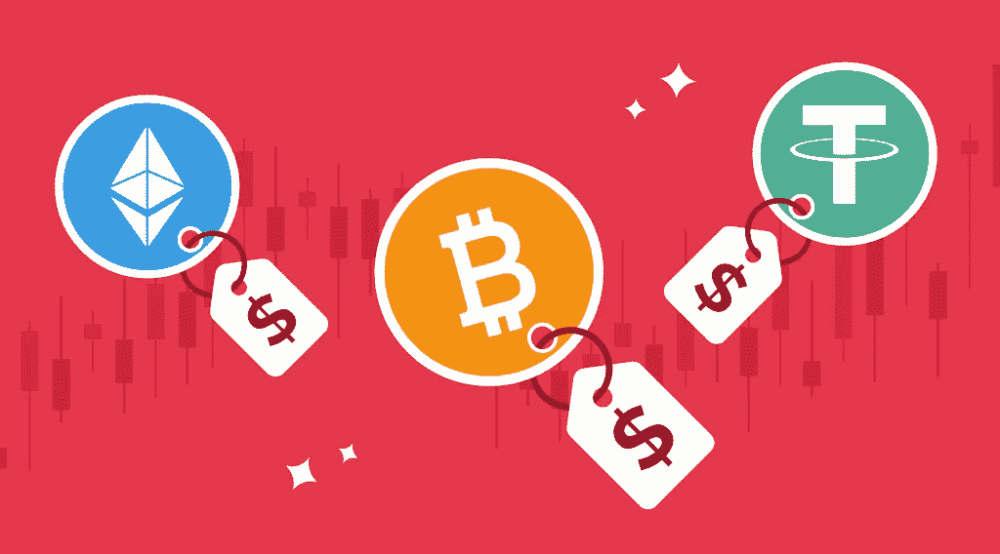

# 是什么决定了加密货币的价格？

> 原文：<https://medium.com/coinmonks/what-determines-the-price-of-a-cryptocurrency-e0fae5cde307?source=collection_archive---------51----------------------->

加密货币是一种数字资产，可以在不需要政府或银行等中央货币机构的情况下流通。它们是使用加密技术创建的，使人们能够安全地购买、出售或交易它们。在新的 [StealthEX](https://stealthex.io/) 文章中，阅读更多关于决定加密货币价格的因素。

如今，数字货币越来越受欢迎，随着世界似乎正在走向新的经济危机，许多人开始考虑购买 crypto。一些人甚至用高波动性的加密硬币取代了股票或指数基金等更传统的投资资产，而另一些人则梦想投资数字资产，但却没有完全理解它们背后的机制以及到底是什么让加密价格上下波动。

比特币和大多数其他加密货币由一种名为区块链的技术支持。区块链技术不仅可用于资金转移、借贷和金融交易，还可用于房地产、数据存储、投票和物流等领域。所有这些都有助于加密货币的发展，这本质上是决定加密货币价格的因素之一。

# 如何确定加密价格？

几乎没有任何投资爱好者没有试图了解加密货币为什么会波动，以及是什么影响加密货币价格。

总而言之，有很多因素，包括:

*   经济
*   生产成本
*   供求
*   交易所的可用性
*   治理法规和法律要求
*   竞争
*   媒体等。

让我们仔细看看是什么影响加密价格。

# 经济

由于比特币和其他加密货币不是由央行发行或由政府支持，通常影响货币价值的货币政策工具、通胀率和经济增长指标对数字资产的影响较小。然而，由于比特币和许多其他加密货币的全球化和去中心化性质，它们受到世界上几乎每个国家的宏观经济事件的影响。

# 生产成本

通过验证交易和生成货币单位来建立区块链的人是矿工。然而，矿工只是一台运行程序的计算机，它能解决越来越难的算法，而奖励是一种新的货币单位。采矿是一项能源高度密集的作业。根据一些估计，国际比特币采矿消耗的电力比瑞士还多。最终，每个矿商都以生产成本最低为目标。很明显，为什么生产密码的成本会推动密码价格的上下波动。

# 供求

加密硬币的供应在决定其价格方面也起着至关重要的作用。稀缺资产更可能有高价，而大量存在的资产会有低价。一个完美的例子是比特币:它的创造速度每四年降低一次，这个过程被称为减半。因此，比特币的未来供应正在耗尽，这增加了需求。

# 交易所的可用性

加密交易所是一个让你买卖加密货币的平台。交易所反映了他们提供的加密货币的当前市场价格。如果一枚硬币稀缺或有需求，这将推动加密货币的价格上下波动。

# 治理法规和法律要求

根据 ADBI 研究所的研究，有效的治理机构与对加密货币较少限制的监管立场相关。他们的研究结果表明，在向新形式的金融技术开放之前，一定水平的机构质量可能是必要的。加密货币监管显然正在发展。例如，美国证交会前主席杰伊·克莱顿(Jay Clayton)曾在 2019 年和 2020 年表示，BTC 和联邦理工学院不是证券，这使它们免受治理法规的约束。沃顿商学院法律研究和商业伦理教授布莱恩·范斯坦评论说:“当一个国家实施新的限制时，我们不会看到密码交易员逃离该管辖区，前往更宽松的国家。然而，当各国制定反洗钱措施时，我们可以看到价格下降。”

# 竞争

现有数千种不同的加密货币，每天都有新的项目和代币推出。新的代币可以很容易地进入市场，但创造一个可行的代币还依赖于建立一个代币用户网络。区块链上的一个有用的应用程序可以快速建立一个网络，特别是如果它改进了竞争对手区块链的限制。如果一个新的竞争者获得势头，它从现有的竞争中获取价值，从而随着新的竞争者的代币看到其代币价值增加，使另一方的价格下降。

# 媒体

社交媒体和其他媒体渠道可能会导致加密货币价格波动。来自埃塞克斯大学的凯莉·安·库尔特耶分析了影响比特币 2018 年和 2019 年价格变化的加密媒体文章。她展示的图表显示了两年内 5%最负面的变化，所有这些变化都与比特币价格下跌有关，这支持了一个事实，即这些广义的话语是敏感的主题，对资产的波动性有很大影响。社交媒体方面也有助于提高某些加密硬币的受欢迎程度。

# 如何预测比特币价格走势？

那么，我们如何预测价格行为呢？一般来说，比特币和密码的价格波动非常大。例如，比特币在 2021 年 11 月暴涨，达到近 69，000 美元的历史新高。然而，在不到三个月的时间里，BTC 价格下跌至每枚 35，000 美元左右，考虑到此前的上涨，这就更加令人吃惊了。一些专家声称，BTC 将在 2022 年跌至 10，000 美元，几乎抹去过去一年半的所有收益。一些分析预测，加密交易所可能会遭受大规模黑客攻击，最早将于 2022 年秋季发生，这将导致比特币的进一步监管，价格大幅下跌，以及整个加密格局的变化。

比特币和其他加密货币的未来价格将在很大程度上取决于法律要求和新法规、全球经济和媒体，因此几乎没有人对“比特币价格会上涨吗？”这个问题有明确的答案。

投资加密货币是一项严重的风险，不应该掉以轻心。最好评估所有风险，做出明智的决定。然而，如果你愿意购买或交换数字资产，你可以使用 StealthEX 服务。

## 如何购买加密货币？

要购买现有加密软件或将现有加密软件转换为其他资产，您只需遵循以下简单步骤:

1.  选择兑换的货币对和金额。例如，BTC 到瑞士联邦理工学院。
2.  提供硬币将被转移到的收件人地址。
3.  移动你的加密货币进行交易。
4.  接受你的 ETH 硬币。

确保在[媒体](https://stealthex-io.medium.com/)、[推特](https://twitter.com/Stealthex_io)、[电报](https://t.me/StealthEX)、 [YouTube](https://www.youtube.com/channel/UCeES_XBesX76ge7xf1meuSw) 和 [Reddit](https://www.reddit.com/user/Stealthex_io) 上关注我们，获取 [StealthEX.io](https://stealthex.io/) 更新和关于加密世界的最新消息。

*请确保在投资前始终研究任何加密货币并评估风险。*

*原载于 2022 年 5 月 20 日*[*https://stealthex . io*](https://stealthex.io/blog/2022/05/20/what-determines-the-price-of-a-cryptocurrency/)*。*

> 加入 Coinmonks [电报频道](https://t.me/coincodecap)和 [Youtube 频道](https://www.youtube.com/c/coinmonks/videos)了解加密交易和投资

# 另外，阅读

*   [TraderWagon 回顾](https://coincodecap.com/traderwagon-review) | [北海巨妖 vs 双子星 vs BitYard](https://coincodecap.com/kraken-vs-gemini-vs-bityard)
*   [如何在 FTX 交易所交易期货](https://coincodecap.com/ftx-futures-trading) | [OKEx vs 币安](https://coincodecap.com/okex-vs-binance)
*   [OKEx vs KuCoin](https://coincodecap.com/okex-kucoin) | [摄氏替代品](https://coincodecap.com/celsius-alternatives) | [如何购买 VeChain](https://coincodecap.com/buy-vechain)
*   [ProfitFarmers 点评](https://coincodecap.com/profitfarmers-review) | [如何使用 Cornix 交易机器人](https://coincodecap.com/cornix-trading-bot)
*   [如何匿名购买比特币](https://coincodecap.com/buy-bitcoin-anonymously) | [比特币现金钱包](https://coincodecap.com/bitcoin-cash-wallets)
*   [瓦济里克斯 NFT 评论](https://coincodecap.com/wazirx-nft-review)|[Bitsgap vs Pionex](https://coincodecap.com/bitsgap-vs-pionex)|[坦吉姆评论](https://coincodecap.com/tangem-wallet-review)