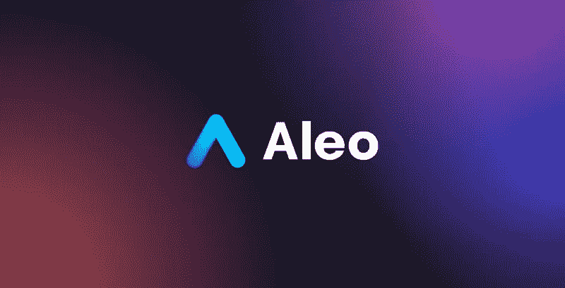

# 我觉得 ALEO 怎么样？

> 原文：<https://medium.com/coinmonks/what-do-i-think-about-aleo-9ceccb71d84e?source=collection_archive---------16----------------------->

2020 年，我偶然看到了这个项目，它立刻让我觉得非常有趣，非常有前途。

整个项目基于[零知识证明](https://www.aleo.org/post/bringing-zero-knowledge-to-the-world)技术，该技术允许用户和大公司公开共享信息，展示最终结果，同时对他们的数据保密。我们今天的生活变得越来越公开，我们都积极参与社交网络，互联网在当今社会的作用正在成为我们所有共同生活的一个组成部分。因此，我们所有的社交网络，我们所有的小工具都有我们的机密信息，很容易在公共领域找到。零知识证明技术将成为一种屏障，将我们的信息隔离，使之保密。

这个想法得到了 ALEO 项目的支持，还有不少其他有趣的事情值得思考和思考。今天我只是想让你熟悉这个项目，给你一点介绍，并向你介绍这项技术及其主要特点。

这个项目很吸引我，我想成为这个项目的形象大使。

https://www.aleo.org

 [## JavaScript 不可用。

www.twitter.com](https://www.twitter.com/aleohq)  [## 加入 Aleo Discord 服务器！

### 欢迎来到 Aleo 的官方不和谐服务器！第一个分散的、开源的私有协议…

不和谐. gg](https://discord.gg/aleohq) 

> 加入 Coinmonks [电报频道](https://t.me/coincodecap)和 [Youtube 频道](https://www.youtube.com/c/coinmonks/videos)了解加密交易和投资

# 另外，阅读

*   [比诺莫评论](https://coincodecap.com/binomo-review) | [斯多葛派 vs 3Commas vs TradeSanta](https://coincodecap.com/stoic-vs-3commas-vs-tradesanta)
*   [Capital.com 评论](https://coincodecap.com/capital-com-review) | [香港的加密借贷平台](https://coincodecap.com/crypto-lending-hong-kong)
*   [如何在 Uniswap 上交换加密？](https://coincodecap.com/swap-crypto-on-uniswap) | [A-Ads 审查](https://coincodecap.com/a-ads-review)
*   [WazirX vs coin dcx vs bit bns](/coinmonks/wazirx-vs-coindcx-vs-bitbns-149f4f19a2f1)|[block fi vs coin loan vs Nexo](/coinmonks/blockfi-vs-coinloan-vs-nexo-cb624635230d)
*   [本地比特币审核](/coinmonks/localbitcoins-review-6cc001c6ed56) | [加密货币储蓄账户](https://coincodecap.com/cryptocurrency-savings-accounts)