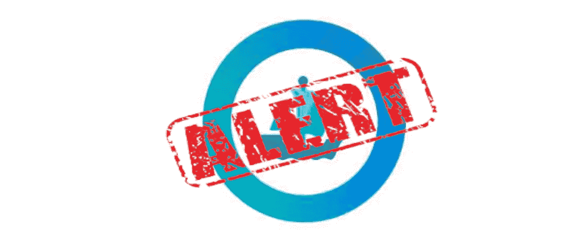

# NFT 和汽车有什么关系？

> 原文：<https://medium.com/coinmonks/what-do-nfts-have-to-do-with-cars-22e66979604a?source=collection_archive---------15----------------------->

## 两者都可以被偷

二月似乎是 NFTs 的月份。2021 年，当皮普尔以近 7000 万美元的价格出售他的 NFT 时，NFTs 一举成名。今年，最大的 NFTs 市场 OpenSea 可能遭到 2 亿美元的黑客攻击，这已经成为新闻。

这是一个“潜在的 2 亿美元的黑客攻击”,因为大多数被盗的非功能性桌面还没有转化为以太网。到目前为止，这名黑客已经成功窃取了[170 万](https://www.theverge.com/2022/2/20/22943228/opensea-phishing-hack-smart-contract-bug-stolen-nft)美元。

## 委托书

长话短说，用简单的英语来说，黑客已经向 OpenSea 用户发送了一份智能合同，如果用户签署了它，用户就签署了一份相当于黑客的“委托书”。这样，用户授权黑客将 NFTs 移出该特定地址。虽然权力被给予，黑客并没有立即执行它，而是在 OpenSea 宣布他们的迁移计划时执行事务，因为黑客被给予的权力是基于即将到期的合同。

 [## 以太坊 2.0 vs 符号(第 6 部分):不可替换的令牌

### 你是许多人中的一个；你是独一无二的。你拥有人类的共同特征，然而你是独一无二的…

medium.com](/coinmonks/ethereum-2-0-vs-symbol-part-6-non-fungible-tokens-42290ce34854) 

有了黑客的权力，黑客以 0 Eth 的价格出售这些 NFT，然后转手获利，让用户/所有者陷入困境。然而，从技术角度来看，所有这些交易看起来都是合法的，但从道德角度来看，肯定是不合法的。

## 所有权证书

“我认为 NFTs 应该保护我们的资产。”是的，但是保护有很多层次和方面。

NFT 是不可替代的令牌，是任何独特事物的所有权证书，实际上是任何事物的所有权证书。我们以汽车为例。在现实生活中，当你买了一辆车，你会得到一个汽车注册，上面有汽车的详细信息，汽车注册号码和你作为车主的信息。虽然你的名字在汽车登记上，但这并不能保护你的车不被偷。在最坏的情况下，一些小偷甚至会伪造一些文件，把他们的名字而不是你的名字写在汽车登记上。这就是发生在公海的事情。

"如果是这样的话，我为什么要使用 NFTs 呢？"你可能会问。NFTs 或区块链技术的主要好处是，只要你不泄露你的私钥，不签署任何你不确定的交易，那么你是相当安全的。如果你的账户被黑了，所有的交易记录都在那里，你会知道是哪个账户做了那些事。

很多时候，黑客攻击的原因是人为因素。因此，区块链技术可以保护你从技术方面与所有交易记录永久，它可以加快交易和进程，由于其透明度。然而，它不能防止任何涉及人类无知或粗心大意的灾难。最重要的是，没有人能逃过 [$5 扳手攻击](https://cryptosec.info/wrench-attack/)。所以，不要炫耀你的资产是明智的。

## 用透明减少繁文缛节

区块链想要做的是减少中介费用和交易时间。这是通过它提供的透明度实现的。一直如此，也将永远如此。没有任何技术可以修复人类的无知和粗心。您可以通过更多的提醒来缓解这种情况，但是，我们还没有被足够地提醒要警惕网络钓鱼攻击吗？不管怎么说，提醒总比没有提醒好。

## 教育是关键

我可能有偏见，因为我认为教育是一切的根源。当今技术变化如此之快，我们需要不断自我教育。

你可以用一些重要的东西来武装自己:

1.  保护您的私钥的方法。我敢打赌，您已经一次又一次地听说过您的私钥有多重要。不要分享它，让它离线，把你的资产存放在硬件钱包里。这些是保护你的资产的常用方法。关注新的安全方式和黑客攻击方式的发展。这是一场持久战。把它做得太安全会有一种危险，那就是你自己会忘记如何访问它。然而，这是必要的，这与保护你的其他非区块链资产没有什么不同。
2.  了解您正在与之交互的合同。如果您已经检查并确保您正在与正确的合同进行交互，那么您 90%受到保护。然而，大多数用户甚至不知道什么是合同地址，更不用说查看了。我必须承认，区块链探索者，例如[以太扫描](https://etherscan.io/)，即使对区块链季节用户来说也太复杂了。但就像投资股市一样，即使你不是沃伦·巴菲特，至少也不要像汤姆、迪克和哈里那样只根据提示进行投资。做你的研究，学习窍门。用知识保护自己。
3.  从别人的错误中学习。说起来容易做起来难。然而，这是减少我们损失的最好方法。如果不是戴上黑客的帽子，即使是有经验的智能合约用户也不会想到这种攻击。以后还会有其他的攻击，就像其他任何业务一样，你只能一直保护它，直到它不被保护为止。

> 铸造、销售、购买和交易非关税壁垒是一种商业行为，把它当作一种商业行为来对待。学习你所需要的任何东西来使它成功并受到保护，就像你为任何其他企业所做的那样。

*参考文献:*

1.  【https://twitter.com/opensea 号
2.  [https://www . the verge . com/2022/2/20/22943228/open sea-phishing-hack-smart-contract-bug-stocked-NFT](https://www.theverge.com/2022/2/20/22943228/opensea-phishing-hack-smart-contract-bug-stolen-nft)
3.  [https://twitter.com/0xfoobar/status/1495208279210876930](https://twitter.com/0xfoobar/status/1495208279210876930)

> 加入 Coinmonks [电报频道](https://t.me/coincodecap)和 [Youtube 频道](https://www.youtube.com/c/coinmonks/videos)了解加密交易和投资

# 另外，阅读

*   [3 commas vs . Pionex vs . crypto hopper](https://coincodecap.com/3commas-vs-pionex-vs-cryptohopper)|[Bingbon Review](https://coincodecap.com/bingbon-review)
*   [加密复制交易平台](/coinmonks/top-10-crypto-copy-trading-platforms-for-beginners-d0c37c7d698c) | [如何在 WazirX 上购买比特币](/coinmonks/buy-bitcoin-on-wazirx-2d12b7989af1)
*   [CoinLoan 评论【Crypto.com】|](https://coincodecap.com/coinloan-review)[评论](/coinmonks/crypto-com-review-f143dca1f74c)
*   [如何在加拿大购买加密货币？](https://coincodecap.com/how-to-buy-cryptocurrency-in-canada)
*   [无聊猿游艇俱乐部(BAYC)评论](https://coincodecap.com/bored-ape-yacht-club-bayc-review)
*   [5 款最佳加密交易终端](https://coincodecap.com/crypto-trading-terminals) | [最佳 DeFi 应用](https://coincodecap.com/best-defi-apps)
*   [最佳网上赌场](https://coincodecap.com/best-online-casinos) | [币安评论](/coinmonks/binance-review-ee10d3bf3b6e) | [BitMEX 评论](https://coincodecap.com/bitmex-review)