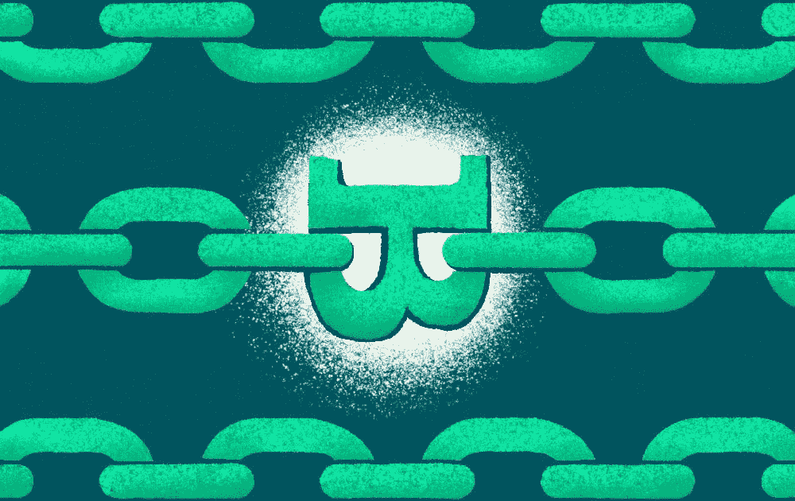
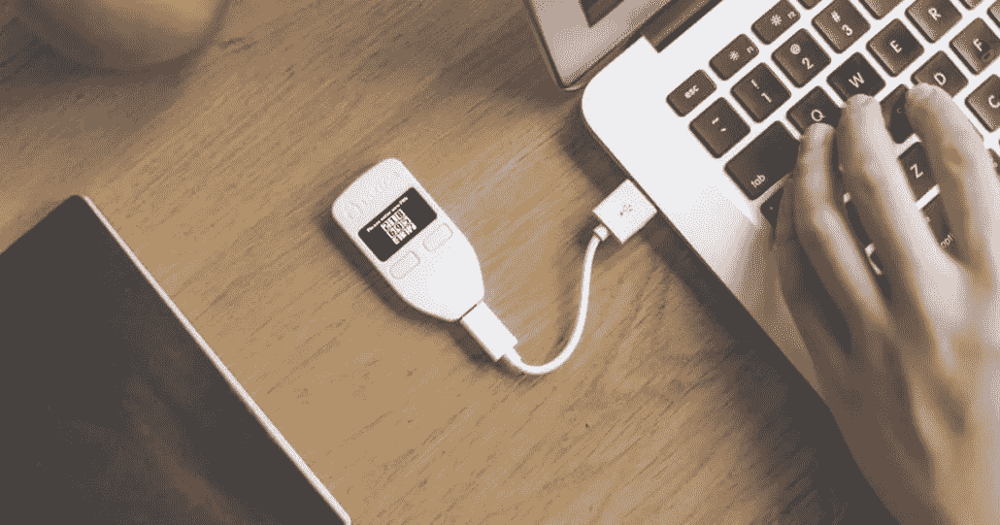

# 你对#加密货币了解多少？

> 原文：<https://medium.com/coinmonks/what-do-you-know-about-cryptocurrency-fd32fd412d09?source=collection_archive---------49----------------------->

亲爱的大家好！

我想澄清一些用户不知道的问题。

> **一种加密货币**

加密货币是一种由加密技术保护的数字或虚拟货币，几乎不可能被伪造或重复消费。许多加密货币都是基于区块链技术的分散式网络——由不同的计算机网络执行的分布式账本。

> **什么是加密货币？**

加密货币(或“密码”)是一种数字资产，可以在没有政府或银行等中央货币管理机构的情况下流通。相反，加密货币是使用加密技术创造的，使人们能够安全地购买、出售或交易它们。

> **加密货币的主要用途是什么？**

加密货币的主要观点是通过将权力和责任放在货币持有者手中来修复传统货币的问题。所有的加密货币都遵循货币的五大属性和三大功能。他们每个人还试图解决一个或多个现实世界的问题。

> **加密货币的好处**

使用加密货币，交易成本低至零——不像从数字钱包向银行账户转账的费用。此外，你可以在任何时间或晚上进行交易，并且没有购买和提取的限制。

> **加密货币的规范是什么？**

加密货币是一种不依赖银行验证交易的数字支付系统。相反，它是一个点对点系统，可以让任何地方的任何人发送和接收付款。加密货币支付不是在现实世界中携带和交换的实物货币，而是作为描述特定交易的在线数据库的数字条目存在。当您转移加密货币资金时，交易记录在公共分类账中。加密货币存储在数字钱包中。(冷钱包或热钱包)

> **什么是冷钱包？**

**冷钱包**是指**没有连接到互联网**的钱包，因此受到危害的风险要小得多。这些钱包也可以被称为离线或硬件钱包。

> **什么是热门钱包？**

一个热门的钱包将在线访问加密货币，它促进了所有者和最终用户之间的加密货币交易。存储在连接到互联网的程序中的一组私钥用于存储和发送不同的货币，如[加布币(GBR)](https://www.easyexchangepro.com/gabur)

> 加入 Coinmonks [电报频道](https://t.me/coincodecap)和 [Youtube 频道](https://www.youtube.com/c/coinmonks/videos)了解加密交易和投资

# 另外，阅读

*   [如何获得自己的。XYZ 领域？](https://coincodecap.com/xyz-domain)
*   [最佳加密交换平台](https://coincodecap.com/best-crypto-swap-platforms) | [最佳加密交易所](https://coincodecap.com/crypto-exchange)
*   [购买比特币印度](/coinmonks/buy-bitcoin-in-india-feb50ddfef94) | [Pionex 评论](/coinmonks/pionex-review-exchange-with-crypto-trading-bot-1e459d0191ea) | [加密交易机器人](/coinmonks/crypto-trading-bot-c2ffce8acb2a)
*   [n ave 零点回顾](/coinmonks/ngrave-zero-review-c465cf8307fc) | [Phemex 回顾](/coinmonks/phemex-review-4cfba0b49e28) | [PrimeXBT 回顾](/coinmonks/primexbt-review-88e0815be858)
*   最佳[区块链分析](https://bitquery.io/blog/best-blockchain-analysis-tools-and-software)工具| [赚比特币](/coinmonks/earn-bitcoin-6e8bd3c592d9)
*   [Cloudbet 赌场评论](https://coincodecap.com/cloudbet-casino-review) | [点火赌场评论](https://coincodecap.com/ignition-casino-review)
*   [加密套利](/coinmonks/crypto-arbitrage-guide-how-to-make-money-as-a-beginner-62bfe5c868f6)指南| [如何做空比特币](/coinmonks/how-to-short-bitcoin-568a2d0b4ae5)