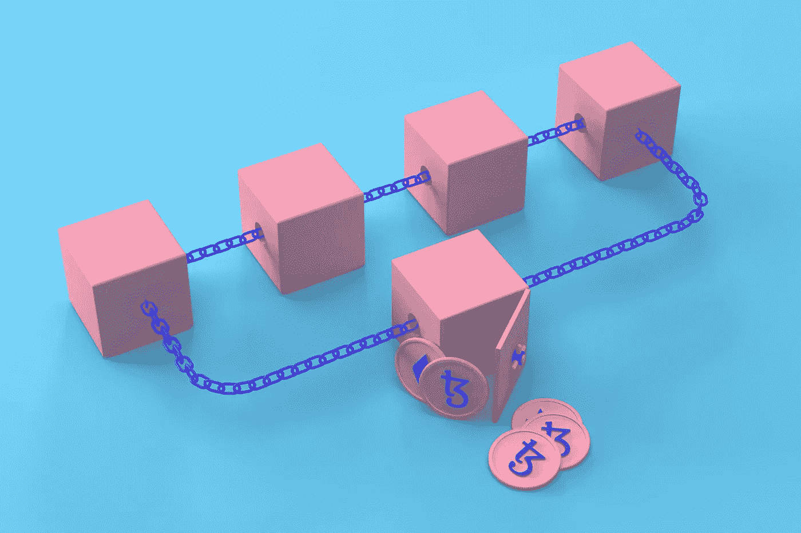
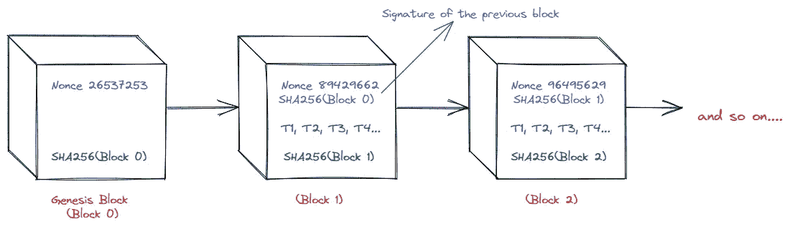

# 区块链中的区块是什么样子的？

> 原文：<https://medium.com/coinmonks/what-does-a-block-look-like-in-a-blockchain-e7d7fc6887b0?source=collection_archive---------32----------------------->

**嘿伙计们，**

希望一切都好。

太好了！

**今天我们将了解一下*阻塞*，以及它在区块链网络中是什么样子。**

我假设你知道*块*的结构。如果没有，请看我之前的文章[这里](/coinmonks/structure-of-the-block-inside-a-blockchain-network-7ad66ea5bea)。

**牛逼**。

那我们开始吧。:)

*布洛克*是区块链一家网络的负责人。没有积木，你就无法创造区块链。并且每个*块*相互链接。让我们看看怎么做。

如上图所示，一个*块*由 **Nonce、SHA256、之前的块签名和一些事务组成。**

**创世纪街区**

第一个*区块*称为*成因区块*或*区块 0* 。因为这个*块*不包含任何先前的块签名。

能有所了解？

太好了！

让我们看看其他部分。

**随机数**

每个*块*必须有一个*随机数*。一个*随机数*是由一个矿工创建的，他将*块*开采到一个区块链网络中。这些是通过挖掘算法以特定方式生成的。它包含一些值，并且不同于其他 *nonce* 值。

**SHA256**

*SHA256* 是一个简单的哈希算法，它将任意长度的数据压缩成固定长度的唯一字符串。每个*块*有不同的 *HSA256* 。

例如 ba 7816 BF 8 f 01 cfea 414140 de 5d AE 2223 b 00361 a 396177 a9cb 410 ff 61 f 20015 ad

**签名**

Genesis 块不包含*签名*。因为，正是*第一挡*，或者说*第 0 挡*。一旦 genesis *块*形成，*签名*将被添加到下一个*块*中。一个*签名*是前一个*块*的 HSA256 值。块 1 的*签名*值与块 0 的 SHA256 值相同。块 2 的*签名*值与块 1 的 SHA256 值相同。诸如此类。在这个*签名*值的帮助下，每个*块*与另一个*块*链接。

**交易**

每个*块*包含一些事务，但不是起源*块*。*交易*可以是任何事情，比如说，A 有 10 个硬币，B 有 20 个硬币，C 有 40 个硬币。a 转了 5 个硬币给 B，C 转了 10 个硬币给 B，这样每一个*交易*都存储在一个*块*中。

我想你对这个街区有所了解。

**太好了！**

如果你进一步需要任何帮助，设法与我联系。我很乐意解决你的疑惑。

在那之前，继续学习，保持微笑:)

感谢你阅读这篇文章。很快会看到你的新文章。

[LinkedIn](https://www.linkedin.com/in/sarojvrc/)[Twitter](https://twitter.com/iamsarojb)

> 加入 Coinmonks [电报频道](https://t.me/coincodecap)和 [Youtube 频道](https://www.youtube.com/c/coinmonks/videos)了解加密交易和投资

# 另外，阅读

*   [CoinFLEX 评论](https://coincodecap.com/coinflex-review) | [AEX 交易所评论](https://coincodecap.com/aex-exchange-review) | [UPbit 评论](https://coincodecap.com/upbit-review)
*   [AscendEx 保证金交易](https://coincodecap.com/ascendex-margin-trading) | [Bitfinex 赌注](https://coincodecap.com/bitfinex-staking) | [bitFlyer 审核](https://coincodecap.com/bitflyer-review)
*   [麻雀交换评论](https://coincodecap.com/sparrow-exchange-review) | [纳什交换评论](https://coincodecap.com/nash-exchange-review)
*   [支持卡审核](https://coincodecap.com/uphold-card-review) | [信任钱包 vs 元掩码](https://coincodecap.com/trust-wallet-vs-metamask)
*   [Exness 评论](https://coincodecap.com/exness-review)|[moon xbt Vs bit get Vs Bingbon](https://coincodecap.com/bingbon-vs-bitget-vs-moonxbt)