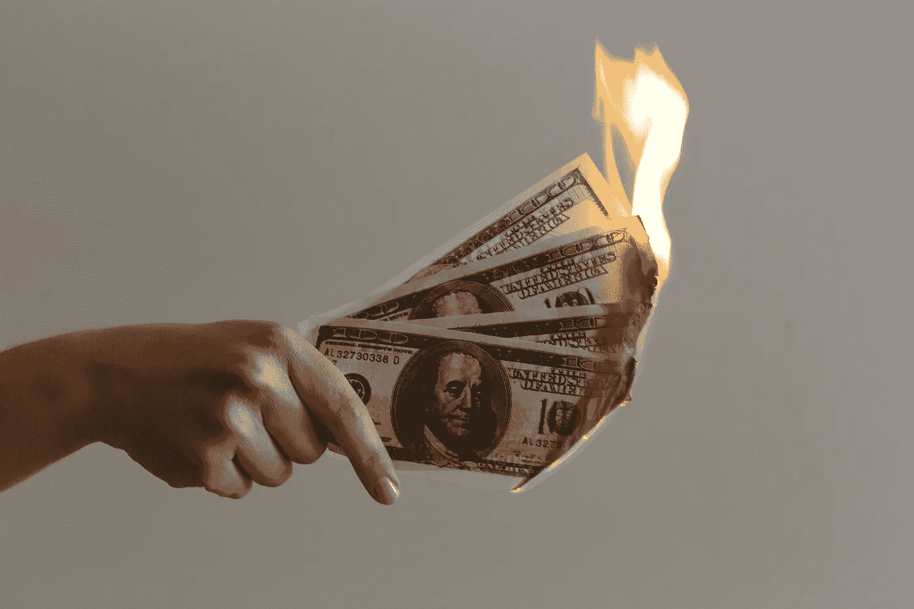

# 烧录密码是什么意思？

> 原文：<https://medium.com/coinmonks/what-does-burning-crypto-mean-a0216f1e1d61?source=collection_archive---------30----------------------->

Burning crypto 来自 2017 年的一次较老的牛市，最近受到了很多谈论，特别是某些具有超大供应量的加密货币。

你可能想知道烧加密货币意味着什么。嗯，就是你把它拔出来，插在棍子上，轻轻地放在营火里。哈哈，不，这并不意味着试图真正点燃加密货币。

我们将发现燃烧加密货币意味着什么，以及为什么它可能是一件好事。

# **什么是烧加密货币？**

焚烧加密货币意味着你从流通的货币中永久地移除了一定数量的代币。

你可以通过将加密货币发送到任何人都无法访问的死钱包来烧毁它们，因为没有人控制那个钱包的私钥。这意味着这些硬币永远不能从这个钱包送出，但是因为公钥是可用的，所以钱包可以接收代币。

想象一下你能控制那个钱包！哦，等等，那会毁了烧密码的整个想法。

你可能会问自己，“为什么有人想把他们的密码扔进一个没人会用的死钱包里？”你会问一个很好的问题。

# **烧 crypto 有什么意义？**

你想烧掉密码的主要原因是为了减少总供应量，从而造成通货紧缩。

当代币的供应量下降时，它们变得更加稀缺，更难获得，这使得它们更有价值。这就是黄金比香蕉更值钱的原因。

刻录密码应该会提高每个令牌的价格。

加密货币烧录大多是由项目的开发者完成的。这不仅仅是随机的人们为了社区的利益而放弃他们的投资。

想象一个非常真实的场景，你可以通过将市值除以流通中的代币数量来计算价格。如果一种加密货币的市值为 100 万美元，并且有 100 万枚硬币在流通，则每枚硬币的价格将为 1 美元。现在，想象一下，如果一个钱包烧掉了一半的硬币，50 万，剩下 50 万。市值是 100 万美元，但现在我们将这个数字除以 50 万，我们得到每枚硬币的价格是 2 美元。

数学就像魔术一样！

现在在一个更真实的场景中，没有人会烧掉一半的密码。我的意思是，这实际上发生在柴犬一次。

# **现实生活中一个烧密码的例子**

说到柴犬，它们实在是太可爱了，不是吗？无论如何，回到主题，说到柴犬，一个非常受欢迎的迷因硬币，这是一个肯定可以从燃烧他们的大量供应中受益的秘密。

大多数柴犬最响亮的投资者会站在山顶上大喊“ [**柴犬总有一天会达到一分钱**](https://www.cryptolovesh2o.com/blog-posts/will-shib-hit-a-penny-why-shiba-inu-will-never-hit-one-cent) ”嗯，对不起那些人，但它可能不会达到一分钱，除非他们开始燃烧大量的供应。

现在，柴犬的价值大约是 0.00000813 美元。在错误的方向上有很多零。他们知道一便士只代表一个零，对吗？

不管怎样，柴犬也有超过 549 万亿的硬币在流通。我算了一下，发现柴犬需要 5.49 万亿美元的市值才能达到目前的供应量。

如果柴犬设法烧掉他们的大量硬币，比如 449 万亿，那么他们只需要达到 1 万亿美元的市值就可以得到 1 美分。好吧，是的，这是不可能的。

# **总结**

请记住，燃烧密码是从流通供应中永久移除一定数量的硬币。硬币被送到一个没人能拿到的死钱包里会被烧掉。

任何人都会烧硬币的原因是为了让密码更稀缺，从而更有价值。当供给减少，需求不变时，价格也会提高。

从消耗供应中受益最大的加密货币是流通硬币数量非常高的加密货币，因为它们的价格通常非常低。焚烧他们的硬币可能有助于提高他们的价格。

噗！现在你知道烧密码意味着什么了。

> 加入 Coinmonks [电报频道](https://t.me/coincodecap)和 [Youtube 频道](https://www.youtube.com/c/coinmonks/videos)了解加密交易和投资

# 另外，阅读

*   [BigONE 交易所评论](/coinmonks/bigone-exchange-review-64705d85a1d4) | [电网交易机器人](https://coincodecap.com/grid-trading)
*   [氹欞侊贸易评论](https://coincodecap.com/anny-trade-review) | [CoinSpot 评论](https://coincodecap.com/coinspot-review)
*   [新加坡十大最佳加密交易所](https://coincodecap.com/crypto-exchange-in-singapore) | [购买 AXS](https://coincodecap.com/buy-axs-token)
*   [投资印度的最佳加密软件](https://coincodecap.com/best-crypto-to-invest-in-india-in-2021) | [WazirX P2P](https://coincodecap.com/wazirx-p2p)
*   [西班牙 5 大最佳文案交易平台](https://coincodecap.com/copy-trading-spain)
*   [Pionex 双投](https://coincodecap.com/pionex-dual-investment) | [AdvCash 审核](https://coincodecap.com/advcash-review) | [支持审核](https://coincodecap.com/uphold-review)