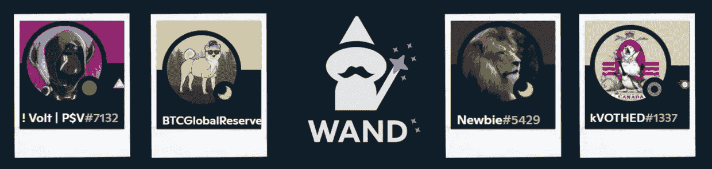

# 社区驱动是什么意思？

> 原文：<https://medium.com/coinmonks/what-does-community-driven-mean-cf3ad7523110?source=collection_archive---------24----------------------->

The Discord handle of our four Governance council members

朋友们好，

治理委员会已经成立，这对我们来说是一个重要的里程碑。四名社区成员由他们的同伴选出。他们四个人都对 WAND 模型有透彻的理解，他们表现出了为项目做贡献和支持社区的真诚愿望。此外，社区通过选举我们重要的合作伙伴 OnlyUp Capital 和 Presale Vanguard (P$V)的两名成员来支持团队的选择。我们有信心与一个强大、有洞察力、足智多谋和诚实的治理委员会一起前进。

**管理委员会是我们社区驱动的精神支柱**

WAND 是一个社区驱动的 DeFi 平台，而治理委员会是这个难题的重要组成部分。它具有以下功能:

*   激活辩论并组织投票
*   帮助社区成员提出他们的建议
*   Doxx 核心团队成员
*   在多重信号上
*   成为团队和社区之间的双向桥梁
*   支持团队的产品开发和合作伙伴关系
*   保持团队的负责和透明

正如你所想象的，这些功能是至关重要的。许多项目将被投票表决，从路线图到投资(超过某个阈值)以及任何可能对协议有重大影响的事情。此外，他们将代表整个社区访问幕后信息，以确保团队的工作和决策始终符合社区的利益。

**民主在 DeFi 是什么？**

在社区决策和团队决策之间，在直接民主和效率之间，有一个必要的平衡。我们的模型实现如下:

*   在治理委员会的支持下，团队自己做出决策，原因有几个:时间敏感，需要一定程度的判断力(例如与第三方谈判)，或者因为决策的重要性不需要投票
*   社区对团队尊重的重要决策进行投票。治理委员会在辩论中支持机构群体，制定要投票表决的决策，并确保团队跟进此事。
*   治理委员会不会自己做出决定，因为它的使命是作为一个推动者，而不是决策者。例外情况是对时间敏感的决策。然而，治理委员会将拥有真正的权力，能够塑造叙事，并成为国库的守护者。

我们将尽最大努力在有效性和机构群体决策过程之间取得正确的平衡。将持续确保透明度和问责制。此外，团队和社区的利益将是一致的，因为根据我们的令牌经济学，团队的钱包只在权杖令牌增值的情况下才会收到钱，并且与 USDC 空投给权杖持有者的数量相关。因此，团队和社区的利益不能对立。

我们的治理模式旨在确保项目决策的有效性，并确保始终将社区的利益放在首位。在一些项目中，给社区供电已经严重影响了项目。治理委员会是避免这个陷阱的一个重要因素。我们相信团队和社区之间正确的权力平衡，以及完全一致的利益和不可协商的透明度。

我们的下一步是:团队 doxxing 到治理委员会(计划在今天)，然后实施 multisig 和核心团队成员 KYC。安全第一，社区驱动。

SGMI！

> *加入 Coinmonks* [*电报频道*](https://t.me/coincodecap) *和* [*Youtube 频道*](https://www.youtube.com/c/coinmonks/videos) *了解加密交易和投资*

# 另外，阅读

*   [3 商业评论](/coinmonks/3commas-review-an-excellent-crypto-trading-bot-2020-1313a58bec92) | [Pionex 评论](https://coincodecap.com/pionex-review-exchange-with-crypto-trading-bot) | [Coinrule 评论](/coinmonks/coinrule-review-2021-a-beginner-friendly-crypto-trading-bot-daf0504848ba)
*   [莱杰 vs n 格拉夫](/coinmonks/ledger-vs-ngrave-zero-7e40f0c1d694) | [莱杰纳诺 s vs x](/coinmonks/ledger-nano-s-vs-x-battery-hardware-price-storage-59a6663fe3b0) | [币安评论](/coinmonks/binance-review-ee10d3bf3b6e)
*   [Bybit Exchange 审查](/coinmonks/bybit-exchange-review-dbd570019b71) | [Bityard 审查](https://coincodecap.com/bityard-reivew) | [Jet-Bot 审查](https://coincodecap.com/jet-bot-review)
*   [3 commas vs crypto hopper](/coinmonks/3commas-vs-pionex-vs-cryptohopper-best-crypto-bot-6a98d2baa203)|[赚取加密利息](/coinmonks/earn-crypto-interest-b10b810fdda3)