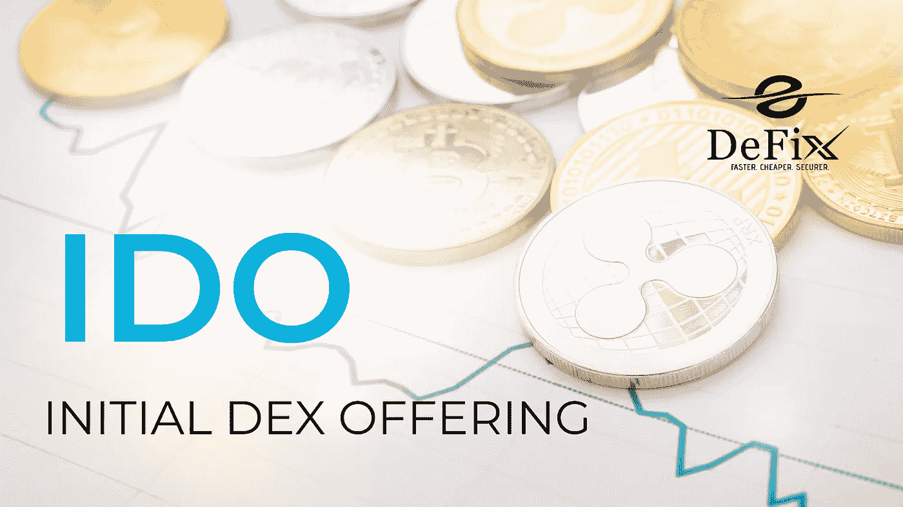
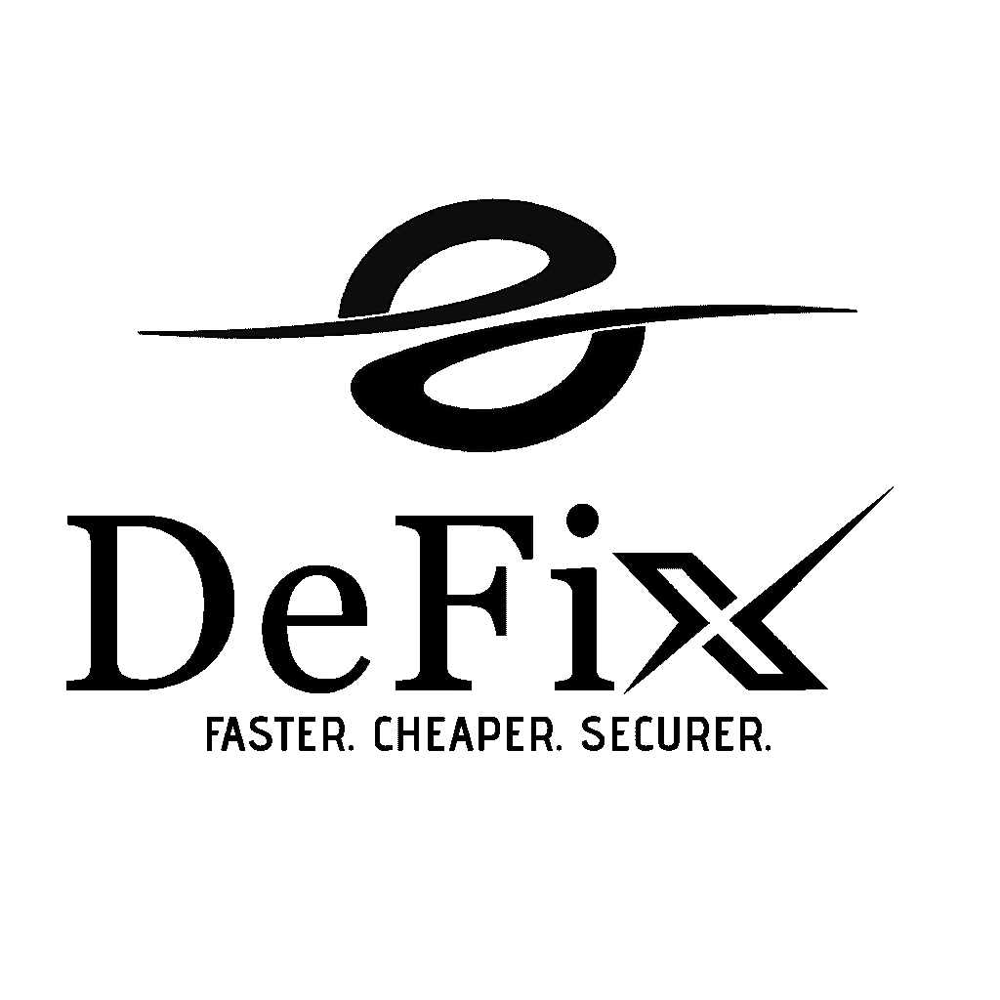

# 首次发行 DEX 意味着什么

> 原文：<https://medium.com/coinmonks/what-does-initial-dex-offering-mean-a9a69fd49cd1?source=collection_archive---------50----------------------->

首次发行 DEX 是指 DEX(分散式交易所)启动并开始交易代币。它通常向加密社区发出信号，表明新的 DEX 已经到来，除了增加交易者的安全性之外，还将提供更多的流动性。有史以来第一次首次发行 DEX 是由 EtherDelta 于 2017 年 11 月 24 日推出的，其所有交易都发生在链外。

## 关于 DEX 产品，您需要了解什么

DEX 允许用户交易他们的加密货币，而不需要依赖像比特币基地或币安这样的中央交易所，因为这些交易所可能会损失客户资金或被网络犯罪分子入侵。相反，它们依赖于区块链技术，因此当你交易加密货币时，没有第三方可以控制你的钱。

通过这种设置，任何人都可以通过移动应用程序轻松访问数字资产，而不必使用复杂的基于网络的平台，因为大多数新手投资者都不习惯使用这些平台。这样，更多的人将比以往任何时候都更容易获得数字货币。

## 在最初的硬币发行适合混合的情况下

当数字代币或加密货币来自初始硬币发行(ICO)时，它被称为 DEX。在过去的几年里，ICO 空间呈指数级增长。随着许多新的加密货币和代币被创造出来，其中一些比另一些更成功。当你看到这些类型的货币在发行后快速上涨，然后突然下跌，这通常是因为他们使用了这种融资策略。

整个过程从创建白皮书开始——白皮书描述了您的公司如何通过基于区块链技术开发分散式应用来解决其行业内的问题。写完文件后，投资者会看一看，然后决定是否投资这种加密货币。

## 为什么 DEX 平台如此重要

DEX 很重要，因为它允许对你的资产进行更多的控制，能够以分散的方式进行买卖。dex 还通过不将信息存储在可能被泄露的第三方服务器上来提供隐私，从而使交易比传统的集中式交易快得多。此外，用户可以使用这些类型的平台来避免费用。

## 最后的想法

在过去的一年里，加密货币的受欢迎程度大幅上升。虽然这是一件好事，但这也意味着许多不熟悉数字货币的人可能会发现自己被大量可用的替代硬币和难以理解的交易所淹没。

DEX 的目标不仅是为那些希望交易加密货币的人提供另一种选择，也是一个将安全性放在第一位，同时对新用户足够友好的交易所。

加密货币是未来，未来就是现在，你必须利用每一个出现的机会。许多人在失去了不是比特币早期采用者的机会后，仍然对自己感到愤怒，但有了 DEX，你将有机会成为第一个获得所有好处的人。

> 加入 Coinmonks [电报频道](https://t.me/coincodecap)和 [Youtube 频道](https://www.youtube.com/c/coinmonks/videos)了解加密交易和投资

# 另外，阅读

*   [币安交易机器人](/coinmonks/binance-trading-bots-d0d57bb62c4c) | [OKEx 评论](/coinmonks/okex-review-6b369304110f) | [阿塔尼评论](https://coincodecap.com/atani-review)
*   [最佳加密交易信号电报](/coinmonks/best-crypto-signals-telegram-5785cdbc4b2b) | [MoonXBT 评论](/coinmonks/moonxbt-review-6e4ab26d037)
*   [如何在 Bitbns 上购买柴犬(SHIB)币？](https://coincodecap.com/buy-shiba-bitbns) | [购买弗洛基](https://coincodecap.com/buy-floki-inu-token)
*   [CoinFLEX 评论](https://coincodecap.com/coinflex-review) | [AEX 交易所评论](https://coincodecap.com/aex-exchange-review) | [UPbit 评论](https://coincodecap.com/upbit-review)
*   [十大最佳加密货币博客](https://coincodecap.com/best-cryptocurrency-blogs) | [YouHodler 评论](https://coincodecap.com/youhodler-review)
*   [AscendEx 保证金交易](https://coincodecap.com/ascendex-margin-trading) | [Bitfinex 赌注](https://coincodecap.com/bitfinex-staking)