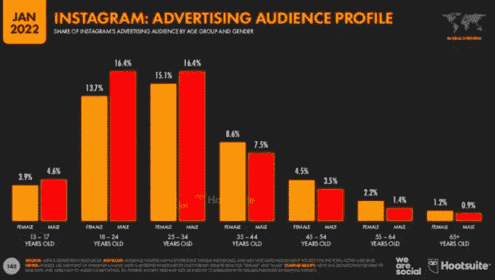
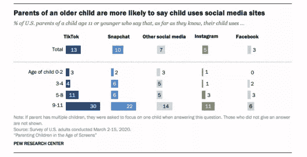
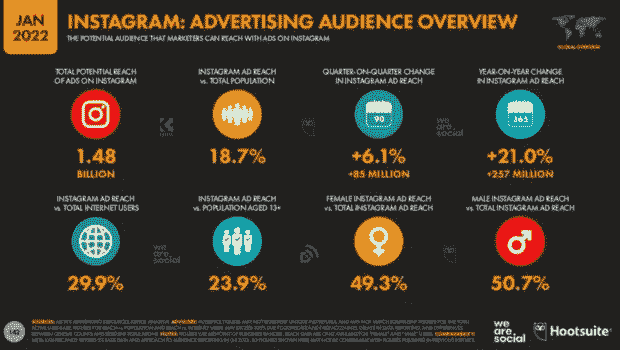
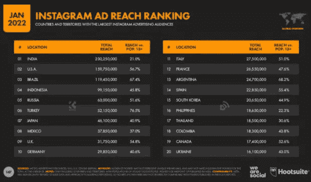
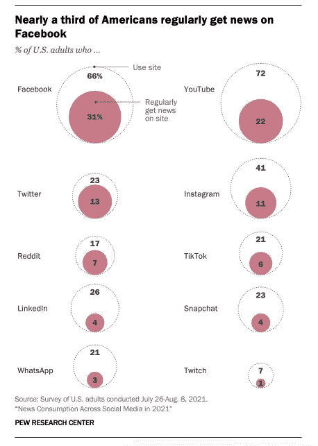
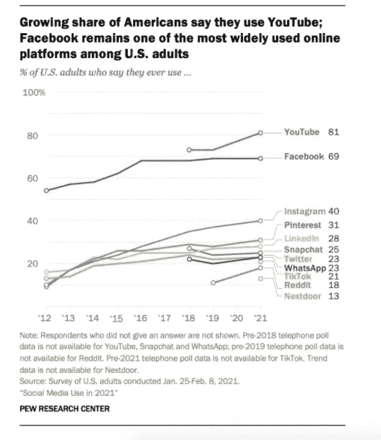
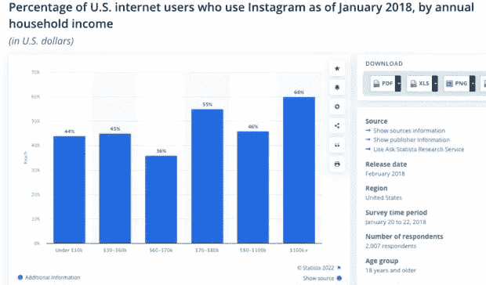
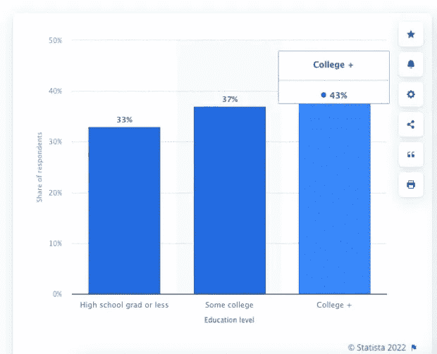

# Instagram Satats 向营销人员展示了什么

> 原文：<https://medium.com/coinmonks/what-does-instagram-satats-show-for-marketers-wobel-post-e541ae6e5315?source=collection_archive---------86----------------------->

日常使用 Instagram 的十亿人是谁？对于聪明的营销人员来说，了解 Instagram 的人口统计数据至关重要。

当然，你知道谁会使用 Instagram:你最好的朋友、你的雇主、你的叔叔，还有物理课坐在你旁边的女孩。毕竟，当你通过应用程序导航时，你每天都会看到他们的日落照片。

然而，为了真正理解 Instagram 的人口统计数据，社交媒体营销人员必须超越个人反馈，挖掘冰冷的硬数据。每个月都有超过 10 亿人使用 Instagram，这使它成为一个全球性的用户自助餐厅。了解他们是谁，他们从哪里来，他们做什么对开发一个能够增加互动的可靠的社会营销计划是至关重要的。

继续阅读，了解谁在这个世界上下载量第二大的应用上发帖、滚动、点赞和分享。

为了全面理解 Instagram 用户统计数据，有必要首先考察 Instagram 年龄统计数据。抖音还像以前一样关注青少年吗？还是它已经吸引了新一代社交媒体用户的注意力，并把它交给了懂技术的老奶奶们？

以下是 Instagram 用户按年龄划分的情况:

*   13-17 岁:8.5%
*   18-24 岁:30.1%
*   25-34 岁:31.5%
*   35-44 岁:16.1%
*   45-54 岁:8%
*   55-64 岁:3.6%
*   65 岁及以上:2.1%

外卖是什么？到 2022 年，Instagram 的大多数用户将是千禧一代或 z 世代。

事实上，Instagram 是 Gen Z 首选的社交媒体网络。Instagram 是全球 16 至 24 岁互联网用户的首选，高于其他社交媒体平台，甚至超过了抖音。如果你想瞄准这个人群(你好，年轻人！)，Instagram 似乎是应该去的地方。

这并不是说 Instagram 没有老年用户:大约 13%的用户年龄在 45 岁以上。然而，如果你的目标市场是婴儿潮一代，Instagram 可能不是接触他们的最佳地点。你会更适合通过不同的方式与这个群体交流。刷新你的脸书营销知识。

关于 x 世代，要记住一件事:他们是应用程序中增长最快的人群。去年，使用 Instagram 的 55 岁至 64 岁男性人数增加了 63.6%。鉴于 X 世代是与讽刺联系在一起的一代，在一个为炫耀而构建的平台上，这是一个巨大的增长。

你关注的是更年轻的用户吗？根据 2018 年的一项民意调查，15%的青少年表示 Instagram 是他们使用最多的应用程序。(另一方面，35%的人说 Snapchat 是他们最喜欢的社交媒体网络，而 32%的人说 Youtube 是他们最喜欢的。)

根据皮尤研究中心的一项研究，11%的美国父母声称他们 9-11 岁的孩子使用 Instagram。“这怎么可能？”你可能会大声质疑。“Instagram 账户持有人必须至少 13 岁，这不是真的吗？”没错，但是父母或监护人可以管理年轻用户的账户，如果你想用你迷人的 Instagram 材料让一些青少年惊叹，这是一个好消息。

**1。Instagram 上的性别统计数据**

Instagram 的性别平衡在社交媒体平台中并不多见；尽管 Twitter 和脸书明显倾向于男性用户，但 Instagram 保持了事实上的平均分配(女士们，你们好！).

男性和女性用户的比例相当，男性用户总数(50.7%)略高于女性用户总数(49.3%)。(然而，并不是每个年龄组都是如此；例如，在 35 岁及以上的用户中，女性多于男性。)

另一方面，Instagram 在 2021 年 5 月增加了在个人资料中声明[首选代词](https://www.theguardian.com/technology/2021/may/12/instagram-pronouns-users-gender-identity)的功能，这可能表明数据中很快会有更多的性别选项。(尽管你永远不知道 Insta HQ 团队下一步会想出什么。)你还记得他们什么时候恢复了按时间顺序排列的提要吗？你们这些疯子，拿定主意吧！)

**2。按地点分列的 Instagram 用户统计数据**

就广告覆盖范围而言，印度、美国、巴西、印度尼西亚和俄罗斯是 Instagram 受众最多的国家和地区。

没错:经过多年的统治地位，印度已经超过美国成为该应用的领导者。

事情发生了多么大的变化！Instagram 显然是营销人员试图接触到积极参与的印度受众的社交渠道。恭喜你，我们祝你一生幸福。

印度拥有超过 2.3 亿用户，是 Instagram 增长最快的市场，观众数量环比增长 16%。

美国排名第二，达 15975 万。然而，尽管 Instagram 是美国第四大最受欢迎的社交媒体网络，但它并不是美国人的主要新闻来源。虽然 [40%的美国人](https://www.pewresearch.org/internet/2021/04/07/social-media-use-in-2021/)使用过 Instagram，但是[只有十分之一的美国人](https://www.pewresearch.org/journalism/2021/09/20/news-consumption-across-social-media-in-2021/)使用该应用程序来了解每日时事，这一比例远远低于那些通过脸书或 YouTube 获取新闻的人。

如果你想和美国观众建立联系，最好保持新鲜感。人们来这个网站是为了娱乐，而不是新闻。

其他惊人的统计数据正在世界其他地方出现。文莱拥有最大的人口覆盖面，92%的公民使用该应用程序。(关岛和开曼群岛分别位居第二和第三。)

**3。Instagram 上的收入统计数据**

我们在这方面的最新数据是 2018 年的，所以在过去几年中事情可能发生了变化，但根据 Statista 的数据，年收入低于 3 万美元的家庭中只有 44%使用 Instagram，而年收入超过 10 万美元的家庭使用该应用的可能性为 60%。

外卖是什么？Instagram 用户来自各行各业(至少在美国)，尽管他们明显更有可能来自高收入家庭。这使它成为一个优秀的电子商务和销售平台，所以润色你的社交媒体呼吁行动，并考虑尝试 Instagram 购物。

**4。Instagram 的教育人口统计数据**

你那些火辣辣的 Instagram 图片是不是让人们用文凭给自己扇扇子？很有可能。2019 年 2 月，[43%的 Instagram 用户拥有大学文凭](https://www.statista.com/statistics/246208/share-of-us-internet-users-who-use-instagram-by-education-level/)，另有 37%的用户接受过大学教育。

只有 33%的 Instagram 用户表示他们拥有高中或更低的文凭。总的来说，我们在这个应用上面对的是一群受过良好教育的用户。如果瞄准这类受众是你社交媒体营销计划的重要组成部分，那你就来对地方了。

**5。按地区划分的 Instagram 人口统计数据**

事实证明，农民们并不热衷于这种谷物。很遗憾，因为我想在我的新闻订阅中看到更多的农场动物。

说真的，根据[皮尤研究中心](https://www.pewresearch.org/internet/fact-sheet/social-media/)的数据，Instagram 在城市和郊区的市场覆盖面比农村地区更大。所以，如果你想用你品牌的新整体设计来打动农夫布朗，你最好用脸书。

对于 Instagram，美国成年人的地区细分如下:

*   45%的城市居民使用过这款应用
*   41%的郊区居民使用过这款应用
*   25%的农村居民使用过该应用程序

**6。对 Instagram 感兴趣的人口统计**

人们使用 Instagram 来探索他们的激情，而不管他们的 Instagram 人口统计。根据脸书委托的研究，91%的受访者表示他们使用 Instagram 来关注兴趣。在印度是 98%。

根据这项研究，Instagram 的最大爱好是旅行(45%)、音乐(44%)和食物和饮料(43%)。印度人逆潮流而动，将技术列为重中之重。电影在阿根廷、巴西、韩国和土耳其名列前三。食物、旅游、时尚、美容，以及可以预见的为人父母是英国父母的五大爱好。

*原载于 2022 年 4 月 18 日*[*https://wobelpost.com*](https://wobelpost.com/what-does-instagram-satats-show-for-marketers/)*。*

> 加入 Coinmonks [电报频道](https://t.me/coincodecap)和 [Youtube 频道](https://www.youtube.com/c/coinmonks/videos)了解加密交易和投资

# 另外，阅读

*   [CoinFLEX 评论](https://coincodecap.com/coinflex-review) | [AEX 交易所评论](https://coincodecap.com/aex-exchange-review) | [UPbit 评论](https://coincodecap.com/upbit-review)
*   [AscendEx 保证金交易](https://coincodecap.com/ascendex-margin-trading) | [Bitfinex 赌注](https://coincodecap.com/bitfinex-staking) | [bitFlyer 点评](https://coincodecap.com/bitflyer-review)
*   [Bitget 回顾](https://coincodecap.com/bitget-review)|[Gemini vs block fi](https://coincodecap.com/gemini-vs-blockfi)cmd |[OKEx 期货交易](https://coincodecap.com/okex-futures-trading)
*   [AscendEx Staking](https://coincodecap.com/ascendex-staking)|[Bot Ocean Review](https://coincodecap.com/bot-ocean-review)|[最佳比特币钱包](https://coincodecap.com/bitcoin-wallets-india)
*   [霍比评论](https://coincodecap.com/huobi-review) | [OKEx 保证金交易](https://coincodecap.com/okex-margin-trading) | [期货交易](https://coincodecap.com/futures-trading)