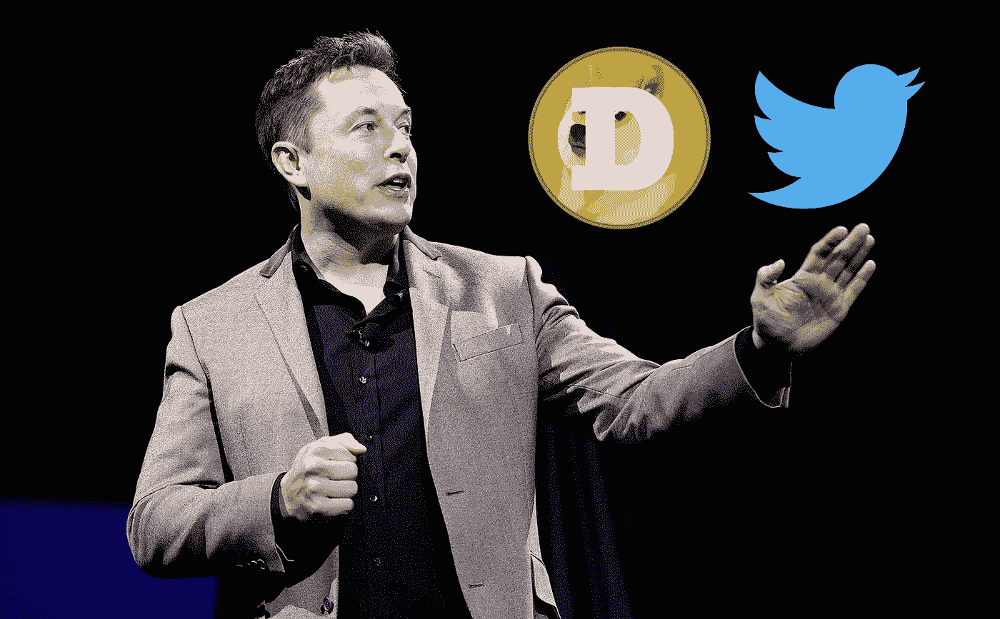

# 埃隆·马斯克收购 Twitter 对 Dogecoin 意味着什么

> 原文：<https://medium.com/coinmonks/what-elon-musk-buying-twitter-means-for-dogecoin-3e4faaf406d3?source=collection_archive---------17----------------------->

埃隆马斯克(Elon Musk)收购了 Twitter，那么这会对 Dogecoin 产生怎样的影响？Dogecoin 在 2021 年达到 0.7 美元的高点，但现在降至 0.15 美元左右。这种下降主要是由于比特币从其历史高点下跌。这种下降的另一个重要方面是因为 DOGE 没有明显的催化剂。埃隆·马斯克出现在 SNL 上是 DOGE 在 2021 年 5 月上升的主要原因。

那么，埃隆·马斯克收购 Twitter 会不会是另一个催化剂呢？一种可能性是，Twitter 可以开始接受用 Dogecoin 支付 Twitter blue，广告商可以开始用 Dogecoin 支付。让我们假设这种情况确实会发生。以下是我认为它如何影响 Dogecoin 的价格。当这个消息出来时，如果整个加密市场相对停滞，甚至不会像现在这样下降。我认为接下来会发生的是 DOGE 峰值可能会增加 50%到 100%甚至更多。然后它会继续下降，因为人们会继续前进。如果比特币/密码像 2021 年一样上涨。那么我认为 Dogecoin 将会飙升并保持相对高位，甚至有可能达到 1 美元。这只是在比特币上涨的情况下，如果没有上涨，那么 Doge 只会在新闻中出现，然后抛售。当整个加密市场下跌，没有一种欣快的感觉，那么积极的催化剂表现比平时差得多。

如果 Elon 不宣布 Twitter 接受 Dogecoin 的支付，那么我认为 DOGE 只会回到 0.13，如果比特币进一步下跌，甚至会更低。

这是我对埃隆收购 Twitter 将如何影响 Dogecoin 的看法，如果你同意或不同意，请在下面评论，我很想知道为什么。感谢阅读。

> 加入 Coinmonks [电报频道](https://t.me/coincodecap)和 [Youtube 频道](https://www.youtube.com/c/coinmonks/videos)了解加密交易和投资

# 另外，阅读

*   [分散交易所](https://coincodecap.com/what-are-decentralized-exchanges) | [比特恩斯 FIP](https://coincodecap.com/bitbns-fip) | [宾邦评论](https://coincodecap.com/bingbon-review)
*   [用信用卡购买密码的 10 个最佳地点](https://coincodecap.com/buy-crypto-with-credit-card)
*   [加拿大最佳加密交易机器人](https://coincodecap.com/5-best-crypto-trading-bots-in-canada) | [Bybit vs 币安](https://coincodecap.com/bybit-binance-moonxbt)
*   [阿联酋 5 大最佳加密交易所](https://coincodecap.com/best-crypto-exchanges-in-uae) | [SimpleSwap 评论](https://coincodecap.com/simpleswap-review)
*   [购买 Dogecoin 的 7 种最佳方式](https://coincodecap.com/ways-to-buy-dogecoin) | [ZebPay 评论](https://coincodecap.com/zebpay-review)