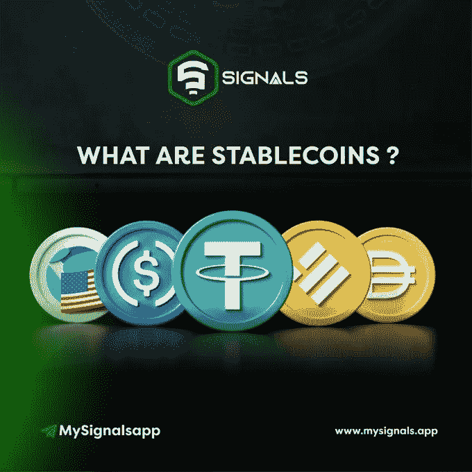

# Crypto 中的 Stablecoins 到底是什么？

> 原文：<https://medium.com/coinmonks/what-exactly-are-stablecoins-in-crypto-c9ffedc48d4c?source=collection_archive---------58----------------------->

# 加密货币是不稳定的。加密资产的价格不稳定，因为它取决于需求和供应，因此不断波动，有高有低，有红有绿。

# 比如说；比特币从 2021 年 11 月的 69000 美元涨到 2022 年 6 月的 29000 美元

交易加密正是利用了这种波动性，以较低的价格买入，以较高的价格卖出，但有一种加密资产的价格不会变化。它被固定在一个特定的价格上。
这些加密货币被称为稳定货币。
稳定的硬币通常与真实世界的资产价值挂钩，如国家货币或贵金属和宝石。

**稳定的类型**
1。算法稳定积分
2。基于菲亚特的稳定硬币
3。加密支持的 Stablecoins

**1。算法稳定积分:**

在这里，两个硬币联系在一起，价格根据供求关系进行调整。
尽管与现实世界资产的价值挂钩，但算法稳定积分并没有现实世界资产的支持。
因此，这些稳定的硬币容易波动。例如，Terra Luna 是一种常规加密货币
TerraUSD(UST)是一种算法稳定的货币，与美元挂钩，但由 Luna 支持，Luna 是一种不稳定的加密货币。

**2。基于法定货币的稳定货币**
最受欢迎的稳定货币是基于法定货币的稳定货币，这些货币与现实生活中的货币或法定货币如美元挂钩，这是因为政府发行的货币是稳定的。
与美元挂钩的稳定货币包括:$USDT，，，，，戴

**3。加密支持的 STABLECOINS:**
这些是与其他加密货币的价值挂钩并由其他加密货币支持的加密货币。
例如，WBTC(包装的比特币)是一种稳定的货币，与一个比特币的价值挂钩，并由一个比特币的价值支持。

**稳定的重要性**
1。Stablecoins 的稳定性和非易失性使其成为节省加密利润的绝佳选择。与使用传统银行系统不同，StableCoins 通过钱包地址转账，使跨境支付变得快捷而便宜。
3。交易要求零文书工作和难以置信的速度。稳定币很容易在交易所与常规加密货币进行交易。
5。稳定的人口给区块链带来稳定。

> 加入 Coinmonks [电报频道](https://t.me/coincodecap)和 [Youtube 频道](https://www.youtube.com/c/coinmonks/videos)了解加密交易和投资

# 另外，阅读

*   [Bitsgap 评审](/coinmonks/bitsgap-review-a-crypto-trading-bot-that-makes-easy-money-a5d88a336df2) | [Quadency 评审](/coinmonks/quadency-review-a-crypto-trading-automation-platform-3068eaa374e1) | [Bitbns 评审](/coinmonks/bitbns-review-38256a07e161)
*   [加密复制交易平台](/coinmonks/top-10-crypto-copy-trading-platforms-for-beginners-d0c37c7d698c) | [Coinmama 审核](/coinmonks/coinmama-review-ace5641bde6e)
*   [印度的加密交易所](/coinmonks/bitcoin-exchange-in-india-7f1fe79715c9) | [比特币储蓄账户](/coinmonks/bitcoin-savings-account-e65b13f92451)
*   [OKEx vs KuCoin](https://coincodecap.com/okex-kucoin) | [摄氏替代品](https://coincodecap.com/celsius-alternatives) | [如何购买 VeChain](https://coincodecap.com/buy-vechain)
*   [币安期货交易](https://coincodecap.com/binance-futures-trading)|[3 comas vs Mudrex vs eToro](https://coincodecap.com/mudrex-3commas-etoro)