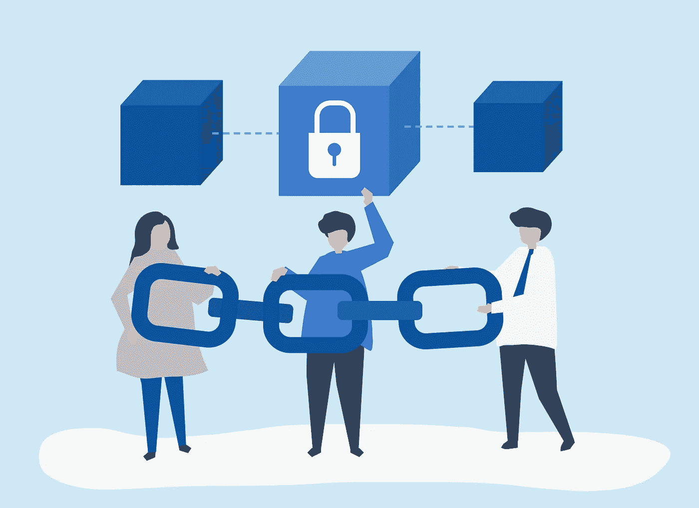
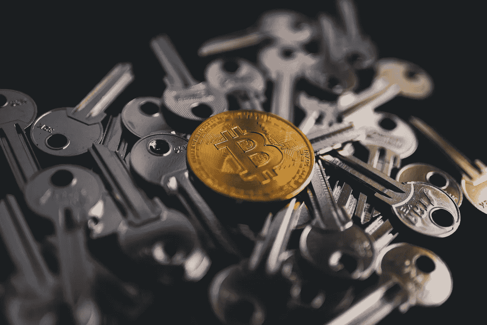

# 对 Noobs 来说，区块链到底是什么

> 原文：<https://medium.com/coinmonks/what-exactly-is-blockchain-for-noobs-b99ea6a0fb00?source=collection_archive---------14----------------------->

img source -<a href=”[https://www.freepik.com/vectors/blockchain](https://www.freepik.com/vectors/blockchain)">Blockchain vector created by rawpixel.com — [www.freepik.com](http://www.freepik.com)</a>

# 概观

如果你是在混乱中试图理解 web3 和区块链，那么不要担心，当我试图理解这种新的著名的时髦技术时，我也在互联网上经历了同样的混乱，其中有一些花哨的术语和一些针对非技术甚至技术人员的行话。所以在这篇博客中，我将分享我对区块链技术的基本理解。

这个话题如此有趣和广阔，你必须继续研究这个问题。

我只会让你意识到区块链来的原因和方式，以及它是什么。

首先，让我们来看看这个定义，我们在研究这项技术的时候一定都见过这个定义。

# 区块链

所以*区块链是一个去中心化的、分布式的、交易的数字账本，它被复制并分布在世界范围内区块链(* ***，它们被称为节点*** *)的所有计算机系统中，而不是存储在一个单一的中央组织或服务器中。*

**这到底是什么意思？**

为此，你必须知道什么是集权和分权，什么是分权的需要。

# 集中和分散

众所周知，银行、政府和各种由中央政府控制的组织。这只是意味着这个特定的组织正在访问和控制我们的数据，而任何人要改变或操纵我们的任何数据都简单得可笑，因为这些数据存储在一个地方或服务器上。

也太容易黑这个单台服务器了。

就像这样，互联网也被一些著名的公司所集中。你可能会认为互联网是分散的，是的，但现在大部分都被一些科技巨头控制了。

现在再来谈谈金融方面的事情，因为区块链的技术主要围绕着金融。

目前，一个国家或世界的整个金融都依赖于这些中央集权，这使得金融变得非常关键，并且很容易被篡改。

你可能知道委内瑞拉的恶性通货膨胀，它是 20 世纪 80 年代和 90 年代阿根廷、T2、玻利维亚、T4、巴西、尼加拉瓜和秘鲁的通货膨胀中最严重的，也是 2000 年代末津巴布韦的通货膨胀。

现在，我们都同意这一点，即这是中央政府管理货币流动和货币铸造率的失败。

类似的事情发生在 2007 年至 2008 年，当时整个世界都面临着金融危机，不仅如此，在这场危机之前，20 世纪在 1929 年至 39 年之间也发生了类似的严重事件，这被称为**“大萧条”**。这些都是要讨论的其他话题，我不会太关注这些，所以我把链接放在这里，这样你可以做一些研究。

[2007-2008 年的金融危机——维基百科](https://en.wikipedia.org/wiki/Financial_crisis_of_2007%E2%80%932008)

谈论这些的主要原因是区块链的崛起。为什么有人会想到这样一个革命性的步骤，即去中心化？

在 2009 年，也就是金融危机震撼世界的同一时间，一位匿名开发者或一群开发者发布了一份八页长的白皮书，提出:**一个纯粹的点对点版本的电子现金将允许在线支付直接从一方发送到另一方，而不经过金融机构。**即众所周知的比特币。

这是什么意思？这怎么可能？

这是可能的，因为区块链。现在这里的主要话题是“区块链技术”。

如果你认为比特币是区块链的发明。不，不是，区块链早在比特币之前就被提出来了。那为什么比特币是炒作的对象？因为到那时为止，比特币是迄今为止区块链的最佳实施方式，人们因为比特币而了解了区块链。

区块链不是一个人或者一个组织在发明的东西。这本身就是一个全新的想法。人们不断地进行实验，并将这个想法提升到一个新的高度。

# 区块链历史

区块链的历史大概是这样的:

# 1991

Stuart Haber 和 W Scott Stornetta 首次描述了密码安全的块链

# 1998

计算机科学家尼克·萨伯(Nick Szabo)研究“比特黄金”(bit gold)，一种去中心化的数字货币。

# 2000

斯特凡·孔斯特发表了他的加密安全链理论，以及实现的想法。

# 2008

化名为中本聪的开发人员发布了一份白皮书，建立了区块链的模型。

# 2009

中本聪实现了第一个区块链，作为使用比特币进行交易的公共分类账。

# 2014

区块链技术与货币及其对其他金融的潜力相分离，并探索跨组织的交易。区块链 2.0 诞生(以太坊)，指货币之外的应用。

如你所见，1991 年是区块链概念被引入的时间，这比比特币早得多。

斯图尔特·哈伯和 W·斯科特·斯托纳塔是如何做到这一切的，这本身就是一个完整的故事。我将只把重点放在能使你理解区块链的工作的几点上。

如果你想知道整个故事，你可以参考这个博客:

[https://www . Forbes . com/sites/vipinbharathan/2020/06/01/the-区块链-出生-20 年前-比特币/？sh=374e01c65d71](https://www.forbes.com/sites/vipinbharathan/2020/06/01/the-blockchain-was-born-20-years-before-bitcoin/?sh=374e01c65d71)

Stornetta 对数据保存感到担忧，因为他目睹了一些数据操纵的丑闻。他也意识到数据存储的未来将是数字化的，所以他担心数据的保护。

因为他是一个理论物理学家，所以他不太了解数字文件以及如何保护它们。但后来他遇到了密码学家哈伯，他们都同意致力于解决这个问题，防止数据被篡改。

他们使用现有的加密技术来散列数据，并使用 DLT(分布式账本技术)在不同的系统中存储相同的数据。

然后，数据被简化并以哈希的形式存储，哈希是通过加密技术获得的，只有几个字节长，然后，哈希而不是数据被发送到时间戳服务以获得时间戳和认证。

这就是区块链的想法。尽管那时这还不叫区块链。如果你想学习这个实验或研究，你可以点击上面的链接。

在这之后，Nick Szabo，1998 年试图建立一个名为“比特黄金”的数字货币，是的，类似于比特币，这也是人们怀疑 Szabo 是中本聪但他否认的原因。

Bit gold 类似于比特币，但两者之间略有不同，具体如下:

*   Szabo 表示，Bit 金矿开采将会出现波动，但从未具体说明是会变得更容易还是更困难。另一方面，随着时间的推移，比特币的开采将变得更加困难，而且比特币的铸造数量有限，只有 2100 万枚。
*   第二个区别是，比特黄金不应该是电子货币，相反，它是一种储备，一种可以支持电子货币的储备，类似于在法定货币时代之前支持货币的实物资源。

Nick Szabo 还提出了智能合约的想法，当时智能合约还不存在。现在智能合约已经存在，我们将在稍后的以太坊博客中讨论。

经过所有这些实验和科学家们的辛勤工作，2008 年 9 月，比特币被发明出来。

这是一种货币，一种分散的货币，一个人可以在不信任任何中间人的情况下与另一个人分享比特币，交易将存储在区块链的分布式账本中。

现在让我描述一下区块链的工作原理和概念。

首先，要非常清楚区块链和加密货币的区别。

加密货币是在区块链技术的基础上制造的，这意味着区块链不仅仅限于加密货币，他们还有许多其他的用例，我们将在本博客的后面讨论。

顾名思义，区块链是一系列区块，这些区块包含加密形式(哈希)的数据。

区块链中的每个区块都通过包含前一个区块的哈希来连接到前一个区块，这就是它被链接和连接的方式，也使它变得安全。

这里可能会出现一个问题，我说过每个块都包含前一个块的散列，那么第一个块呢？它包含什么作为前一个块的散列？

答案是第一个块包含零，作为前一个块的散列。这第一个块被称为起源块，它不包含任何事务。

那么，接下来呢？一个新的区块如何添加到链中？

新块是通过挖掘添加的，挖掘是将数据转换成散列并证明或满足所需的难度。为了确保该数据是可信的，该数据块必须由所有节点通过共识机制来验证，该共识机制是在添加数据块时必须履行的一组协议。

比特币使用 PoW(工作证明)有不同的共识算法。其他的是:

**股权证明(PoS)**

**烧伤证明(PoB)**

**能力证明**

**经过时间的证明**

你可以在网上了解更多的共识机制，但就目前而言，这足以理解区块链。

这就是区块链工作方式。

现在可以有不同种类的数据存储在不同的区块链。例如，比特币区块链将只包含交易数据，而以太坊区块链将包含更多的交易数据和部署在区块链上的智能合约。

现在，让我们更深入地了解一下单个块的结构。例如，让我们看一个比特币块

# 区块链中块的结构

现在积木里面的东西很有趣。单个块包含块头，即该块的元数据和要存储的数据(在比特币的情况下是交易)。

标题包含

1.  以前的哈希
2.  难度目标
3.  时间戳
4.  Merkle 根
5.  目前

什么是哈希，它是一个长字符串，以密码方式获得，大小为 256 位，改变数据中的任何小东西都会极大地改变哈希。这就像一个数字标志。有不同的算法来产生散列，但加密货币在 SHA256 上工作。

现在，让我们看看块标题的不同组成部分。

1.  前一个哈希—您应该知道，在区块链中，每个区块都与前一个区块相连，这使得更改数据更加困难。因此，每个块都有前一个块的哈希，如果您更改了链中的任何数据，就必须更改每个块的哈希。
2.  难度目标——这是一个需要确保 PoW 共识的领域。有不同类型的共识机制，其中，PoW 更著名，因为它用于比特币。矿工必须使用高计算能力和时间来获得目标。第一个到达目标的矿工获胜，他的区块被验证，这是矿工之间的竞争。
3.  时间戳—该字段说明了块的创建时间，这从名称本身就可以清楚地看出。
4.  Merkle Root —这是所有事务的组合散列。这种方法被称为 Merkle tree，其中每个事务数据都被转换为散列，然后将它们的散列组合在一起，产生一个公共散列。如此反复，我们得到的是一个根散列，它在块中占用的空间更少。
5.  nonce——这是随机的，矿工使用它来产生一个与难度匹配的散列。矿工们不断地在杂凑中加入一个满足难度等级的随机数。这个计算是由他们的高功率计算机完成的。并且满足难度等级的数字作为随机数存储在块中。

同样，这些主题本身就是整个主题。我不会深入探讨这些话题。

块中还有一个版本号，用于标识正在使用的区块链版本。

正如我已经说过的，这项技术是一个完整的课题。我只会给你最基本的理解

现在，您了解了块内部的内容，以及矿工如何执行计算以将该块添加到链中。

# 区块链的安全性

您也知道区块链是如何防止数据操纵的。由于每个数据块都与前一个数据块相连，如果有人更改了任何数据，他们就必须更改后面每个数据块的哈希，这将需要大量的时间和精力。即使他们成功做到了，挑战还没有结束。在使用了大量的计算能力和花费了大量的时间之后，让我们假设他们改变了后面每个块的散列。由于区块链存储在网络上的每台计算机中，其他节点会将该链识别为已更改，并且不会添加任何块，这意味着该链是无用的，因为每个人都有区块链的真实副本。为了克服这个问题，这个人需要获得网络 51%的信任，你知道这几乎是不可能的。

这就是即使在公众拥有所有控制权之后，区块链也是如何得到保护的。

现在让我们来谈谈区块链的类型。

# 区块链的类型

首先，我们可以说有两种类型的区块链，即**公共区块链和私有区块链，**，但还有两种变体，即**财团区块链和混合区块链。**

我不会进入财团和混合，而是我们将了解公共和私人区块链，因为这些被广泛使用和更受欢迎。

# 私有区块链

这可能很奇怪，但是区块链是中央集权的。因为它们是由单一权威机构许可和控制的。不允许任何人随意进入区块链。只有授权的节点才能访问和执行挖掘，这使得它比公共区块链更快，因为节点数量更少，网络中的流量更少。

来自 Linux 基金会的 Hyperledger 是著名的私有区块链之一。

# 公共区块链

公共区块链是无权限的区块链，这意味着任何人都可以加入网络并执行网络维护和赚取报酬。没有一个权力机构能够控制网络。整个区块链网络基于共识协议运行，任何人都可以参与其中。目前比特币是最大的公开区块链。以太坊是另一个非常受欢迎的大型公共区块链。

# 公共和私人区块链的一些要点

*   两个区块链都只追加分类帐，即数据只能添加到网络中，并且以后不能更改。
*   两个区块链都依赖众多用户对网络进行编辑。
*   网络中的每个参与者在两个区块链都有一个完整的总账复制品。
*   私有区块链比公共区块链更具可扩展性。
*   公共区块链比私有区块链消耗更多的能量。

最后，你对区块链有了完整的了解，可能会想到它的用例。正如我前面所说，除了加密货币，还有其他用例。

# 区块链的使用案例

1.  国际支付——区块链的实施降低了国际支付的成本，因为它减少了中介机构的数量，也提高了支付过程的效率。
2.  供应链——供应链包括公司或组织为向消费者提供任何产品而开展的所有活动。它包括制造产品、运输产品和最终到达消费者手中的所有过程。在现代，供应链机制是不充分和不兼容的。这非常慢而且容易出错。因此，区块链可以在这一过程中实施，这将加快这一进程，而且区块链是不可变的和透明的，不存在数据操纵的威胁。
3.  医疗保健领域——区块链可用于医疗保健领域，意义重大。因为它可以存储患者的健康信息，不同的医院也可以共享这些信息，以便更好地治疗。此外，数据将是安全的和不可变的。爱沙尼亚是首个在医疗领域全面实施区块链技术的国家。一些公司在这个领域做得很好，比如 Chronicled、Medical chain、Block Pharma 等等
4.  公共身份记录——如今身份盗窃令人担忧，这已经成为我们所有人的问题。区块链可以通过存储所有公共数据来解决这个问题，如他们的身份，健康信息，出生证明，死亡证明，婚姻状况，营业执照，犯罪活动，以及许多其他事情。这将使数据比以前更加安全，因为将有一个人员网络来验证这些数据，并且每一次更改都需要网络的许可
5.  投票系统——目前投票是通过电子机器进行的，这些机器容易受到任何威胁、攻击和故障的影响。有了区块链，我们可以保护这些投票数据，因为这些数据将在网络中分发，不能被更改或篡改。

这还不是全部。

区块链有更多的使用案例。人们仍在探索和创新与区块链的新想法，因为这项技术是一个新出现的革命在整个世界。

image source -<a href=’[https://www.freepik.com/vectors/info-graph'](https://www.freepik.com/vectors/info-graph')>Info graph vector created by freepik — [www.freepik.com](http://www.freepik.com)</a>

**总结**:-所以区块链是一个分布式的数据数字账本，由一个人的网络维护，而不是任何单一的权力机构。数据存储在网络的每一个系统中，而不是只存储在一台服务器中。区块链是一个不可信的、只附加的账本。维护网络的人会自动获得奖励。所有这些过程都基于应用共识机制的原理，该机制防止数据篡改并使其安全。

> 加入 Coinmonks [电报频道](https://t.me/coincodecap)和 [Youtube 频道](https://www.youtube.com/c/coinmonks/videos)了解加密交易和投资

现在你知道什么是区块链了吧？区块链什么时候来，为什么来？区块链是如何工作的？区块链是如何保护的？以及区块链的一些使用案例。

我关于区块链的第一篇博客到此为止。希望你清楚了:)。

评论一下你对区块链的看法。衷心接受赞赏和批评。