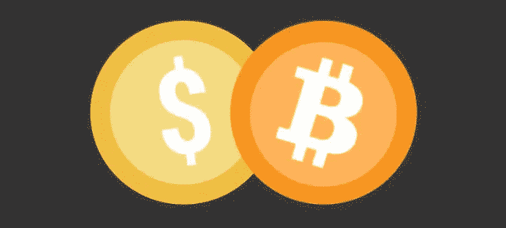

# 加密货币到底是什么，比普通货币好吗？

> 原文：<https://medium.com/coinmonks/what-exactly-is-cryptocurrency-and-is-it-better-than-regular-currency-9876103b695e?source=collection_archive---------35----------------------->

定义加密货币，它的用途，各种加密货币，最后与法定货币进行比较。

# 在本文中，我们将讨论

*   什么是加密货币
*   什么是钱包
*   加密货币背后的技术
*   各种可用的加密货币
*   小案例研究:卢布

# 什么是加密货币

如你所知，货币在我们的生活中起着至关重要的作用。做任何事情都需要货币。现在，我们知道每个国家都有自己的货币。我们有美元，欧元，印度卢比等。类似地，加密货币也是一种货币。那么有什么不同呢？

让我们以美元为例。我们用美元购买商品和服务。通常我们把钱存在银行里。为了在商店里购买诸如食品杂货之类的东西，我们从银行账户向店主的银行账户汇款。这可以使用银行提供的应用程序或其他应用程序，如 GPay、Paypal 等。买卖商品的行为被称为交易。

同样，你也可以交易加密货币。但是在这里，我们没有银行。相反，我们把货币存放在钱包里。每个发送者和接收者都应该有一个钱包，通过钱包我们发送我们的货币。

# 关于钱包的更多信息

加密货币钱包基本上是一个用于存储、发送和接收加密货币的应用程序。一个**钱包**由一个**私钥**和一个**公钥**组成。你需要了解一些密码学的基础知识来理解它。私钥就像密码一样。任何人都可以进入你的钱包，如果他们拥有你的钱包的私人钥匙。所以，不要把它分享给任何人或储存在网上任何地方，这一点非常重要。最好离线保存，保证安全。接下来，我们有一个公钥。顾名思义，它可以是公共的，但没有必要共享。

接下来，我们有一个钱包地址，它是我们公钥的散列版本。**钱包地址**是发送或接收加密货币时唯一需要分享的信息。

# 加密货币交易安全吗？

通常，银行会保存一个所有交易的数据库。但在这里，所有与加密货币相关的交易都记录在区块链上。众所周知，区块链技术是安全可靠的。要了解更多关于区块链科技的信息，[点击这里](/@infomalhaut/explaining-the-whole-blockchain-concept-in-5-minutes-b0b9b206ae)

# 不同类型的加密货币

加密空间中有各种加密货币。截至 2022 年 3 月，几乎有**18400 种加密货币**可用。但并不是所有的都是积极的，有价值的。最受欢迎的加密货币是比特币。在写这篇文章的时候，BTC 硬币的价值是**38700 美元**。首先，这是一个巨大的数字，你可能想知道我们如何使用 BTC 的资金转移。任何加密货币都可以被分割成更小的部分。例如，你可以在钱包里放价值 2 美元的比特币，也就是 0.000052 BTC。BTC 的最小单位是 **1 Satoshi** 相当于 **0.00000001 比特币。**同样，我们还有其他流行的加密货币，如 **ETH** 、 **SOL** 、 **ADA** 等。

另一件要注意的事情是，加密市场是高度不稳定的。今天，BTC 的高价值和低价值之间的差异几乎是 1000 美元。这取决于加密货币。为了应对这种波动，稳定的硬币被引入。USDC 就是一个模仿美元的例子。USDC 的价值将永远接近 1 美元。

# 加密货币比普通货币好吗？

我更喜欢加密货币，认为它们比法定货币好，有两个原因。首先，加密货币的价值是由供求决定的，只有有限的供应。而法定货币的价值是由市场和规则决定的，而且是无限的。政府可以根据需要印刷法定货币。

下一个也是最重要的原因是，我和每个人都喜欢加密空间，因为它是分散的。这意味着，它不受任何一个权力机构的控制，是透明的。你可能想知道这真的重要吗？我们来看看这个小案例。

## 案例研究:卢布

促使我写这篇文章的主要原因是俄罗斯货币卢布发生的事情。我们都见证了俄罗斯经济的发展。俄罗斯面临严厉的制裁，导致其货币贬值。**曾经有一个点，一个卢布的价值还不如一张卫生纸**。由于制裁，外国公司停止了在俄罗斯的业务。因此，万事达卡、维萨卡等发行的银行卡。停止工作。随着 GPay、Apple Pay 和 PayPal 停止运营，人们甚至无法使用他们存在俄罗斯银行的钱。甚至国际交易也被 S.W.I.F.T .(环球银行金融电信协会)禁止。

从上面的学习中，你可以理解分权的力量。所以，我想现在你已经对加密货币有了全面的了解。

感谢您阅读这篇文章。我将在未来持续写更多的文章，所以你可能会想关注。

你可以在推特上关注我:-[https://twitter.com/infomalhaut](https://twitter.com/infomalhaut)还有媒体: [Infomalhaut](https://medium.com/u/a06206a57098?source=post_page-----9876103b695e--------------------------------)

> 加入 Coinmonks [电报频道](https://t.me/coincodecap)和 [Youtube 频道](https://www.youtube.com/c/coinmonks/videos)了解加密交易和投资

# 另外，阅读

*   [比诺莫评论](https://coincodecap.com/binomo-review) | [斯多葛派 vs 3Commas vs TradeSanta](https://coincodecap.com/stoic-vs-3commas-vs-tradesanta)
*   [Capital.com 评论](https://coincodecap.com/capital-com-review) | [香港的加密借贷平台](https://coincodecap.com/crypto-lending-hong-kong)
*   [如何在 Uniswap 上交换加密？](https://coincodecap.com/swap-crypto-on-uniswap) | [A-Ads 审查](https://coincodecap.com/a-ads-review)
*   [WazirX vs coin dcx vs bit bns](/coinmonks/wazirx-vs-coindcx-vs-bitbns-149f4f19a2f1)|[block fi vs coin loan vs Nexo](/coinmonks/blockfi-vs-coinloan-vs-nexo-cb624635230d)
*   [本地比特币评论](/coinmonks/localbitcoins-review-6cc001c6ed56) | [加密货币储蓄账户](https://coincodecap.com/cryptocurrency-savings-accounts)
*   什么是融资融券交易